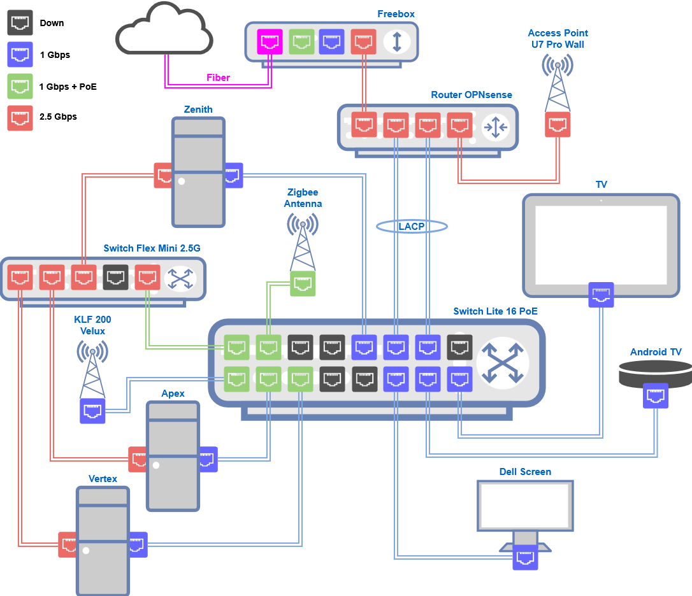
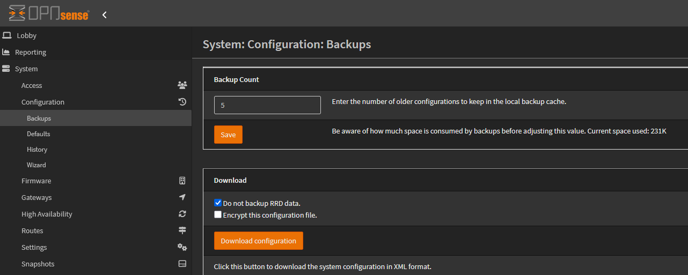

## Intro

Cette semaine, j’ai vécu mon premier vrai problème dans mon homelab, qui a fait tomber tout mon réseau à la maison.

Mon routeur OPNsense a crash et, après plusieurs tentatives de récupération ratées, j’ai finalement dû le réinstaller from scratch. Heureusement, presque toute la configuration est revenue grâce à un simple fichier XML. Dans cette histoire, je vais raconter ce qui s’est passé, ce que j’ai fait pour m’en sortir, et aussi ce que je n’aurais pas dû faire.

Ce genre d’exercice est la pire chose que vous souhaitez voir arriver, parce que ce n’est jamais amusant de voir tout exploser. Mais c’est de loin la meilleure façon d’apprendre.

## Le Calme Avant la Tempête

Ma box OPNsense tournait parfaitement depuis des mois. Routeur, pare-feu, DNS, DHCP, VLANs, VPN, reverse proxy et même contrôleur UniFi : toutes les pièces de mon homelab passe par elle. Mais pas seulement, elle fournit aussi Internet à la maison.



Cette box est le cœur de mon réseau, sans elle, je ne peux quasiment rien faire. J’ai détaillé son fonctionnement dans ma section [Homelab](). Tout “fonctionnait juste”, et je ne m’en inquiétait pas. J’étais confiant, sa sauvegarde vivait uniquement à l’intérieur de la machine…

Peut-être trop confiant.

## Le Redémarrage Inattendu

Sans prévenir, la box a redémarré toute seule, juste avant minuit. Par chance, je passais à côté de mon rack en allant me coucher. J’ai su qu’elle avait redémarré car j’ai entendu son petit bip de démarrage.

Je me suis demandé pourquoi le routeur avait redémarré sans mon accord. Dans mon lit, j’ai rapidement vérifié si Internet fonctionnait : oui. Mais aucun de mes services n’était disponible, ni la domotique, ni ce blog. J’étais fatigué, je réglerais ça le lendemain…

Au matin, en regardant les logs, j’ai trouvé le coupable :
```
panic: double fault
```

Un kernel panic. Mon routeur avait littéralement planté au niveau matériel.

## Premières Tentatives de Dépannage

Au début, l’impact semblait mineur. Un seul service ne redémarrait pas : Caddy, mon reverse proxy. Ce qui expliquait pourquoi mes services n’étaient pas accessibles.

En fouillant dans les logs, j’ai trouvé l’erreur :
```
caching certificate: decoding certificate metadata: unexpected end of JSON input
```

Un des certificats mis en cache avait été corrompu pendant le crash. En supprimant son dossier de cache, Caddy est reparti et, d’un coup, tous mes services HTTPS étaient de retour.

Je pensais avoir esquivé la balle. Je n’ai pas cherché plus loin sur la cause réelle : les logs du kernel étaient pollués par une interface qui “flappait”, j’ai cru à un simple bug. À la place, je me suis lancé dans une mise à jour, ma première erreur.

Mon instance OPNsense était en version 25.1, et la 25.7 venait de sortir. Allons-y gaiement !

La mise à jour s’est déroulée correctement, mais quelque chose clochait. En cherchant de nouvelles updates, j’ai vu une corruption dans `pkg`, la base de données du gestionnaire de paquets :
```
pkg: sqlite error while executing iterator in file pkgdb_iterator.c:1110: database disk image is malformed
```

🚨 Mon alarme interne s'est déclenchée. J’ai pensé aux sauvegardes et j’ai immédiatement téléchargé la dernière :  


En cliquant sur le bouton `Download configuration`, j’ai récupéré le `config.xml` en cours d’utilisation. Je pensais que ça suffirait.

## Corruption du Système de Fichiers

J’ai tenté de réparer la base `pkg` de la pire façon possible : j’ai sauvegardé le dossier `/var/db/pkg` puis essayé de refaire un `bootstrap` :
```bash
cp -a /var/db/pkg /var/db/pkg.bak
pkg bootstrap -f
```
```
The package management tool is not yet installed on your system.
Do you want to fetch and install it now? [y/N]: y
Bootstrapping pkg from https://pkg.opnsense.org/FreeBSD:14:amd64/25.7/latest, please wait...
[...]
pkg-static: Fail to extract /usr/local/lib/libpkg.a from package: Write error
Failed to install the following 1 package(s): /tmp//pkg.pkg.scQnQs
[...]
A pre-built version of pkg could not be found for your system.
```

J’ai vu un `Write error`. Je soupçonnais un problème disque. J’ai lancé `fsck` et reçu un flot d’incohérences :
```bash
fsck -n
```
```
[...]
INCORRECT BLOCK COUNT I=13221121 (208384 should be 208192)
INCORRECT BLOCK COUNT I=20112491 (8 should be 0)
INCORRECT BLOCK COUNT I=20352874 (570432 should be 569856)
[...]
FREE BLK COUNT(S) WRONG IN SUPERBLK
[...]
SUMMARY INFORMATION BAD
[...]
BLK(S) MISSING IN BIT MAPS
[...]
***** FILE SYSTEM IS LEFT MARKED AS DIRTY *****
```

Le système de fichiers root était en mauvais état.

N’ayant que SSH et pas de console, j’ai forcé un `fsck` au prochain redémarrage :
```bash
sysrc fsck_y_enable="YES"
sysrc background_fsck="NO"
reboot
```

Au redémarrage, le système a été réparé suffisamment pour relancer `pkg bootstrap`. Mais la moitié des paquets système avaient disparu. Ma mise à jour précédente sur un disque corrompu m’avait laissé avec un système bancal, à moitié installé, à moitié manquant.

## Quand ça empire

J’ai découvert l’utilitaire `opnsense-bootstrap`, censé remettre le système à plat :
- Suppression de tous les paquets installés
- Téléchargement et installation d’un nouveau noyau/base 25.7
- Réinstallation des paquets standards

Parfait !
```
opnsense-bootstrap
```
```
This utility will attempt to turn this installation into the latest OPNsense 25.7 release. All packages will be deleted, the base system and kernel will be replaced, and if all went well the system will automatically reboot. Proceed with this action? [y/N]:
```

J’ai dit `y`. Ça commencé bien, puis… plus rien. Plus de signal. Plus d’Internet. Je croyais que ce bootstrap allait me sauver. En fait, il m’a enterré.

🙈 Oups.

Après un moment, j'ai tenté de le redémarré, mais impossible de me reconnecter en SSH. Pas le choix, j'ai du sortir le routeur du rack, le poser sur mon bureau, brancher écran et clavier et voir ce qui se passait.

## Repartir de zéro

C’était mauvais signe :
```
Fatal error: Uncaught Error: Class "OPNsense\Core\Config" not found
in /usr/local/etc/inc/config.inc:143
```

Et les logs du bootstrap étaient pires :
```
bad dir ino … mangled entry
Input/output error
```

Le disque était pas en forme. Je ne pouvais plus rien sauver. Il était temps de repartir de zéro. Heureusement, j’avais une sauvegarde… non ?

J’ai téléchargé l’ISO OPNsense 25.7, créé une clé USB bootable, et réinstallé par-dessus, en laissant les paramètres par défaut.

## Le sauveur : `config.xml`

OPNsense garde toute sa configuration dans un seul fichier : `/conf/config.xml`. Ce fichier a été ma bouée de sauvetage.

J'ai copié le `config.xml` sauvegardé avant dans ma clé USB. Quand je l'ai connectée sur la machine nouvellement installée, j'ai remplacé le fichier :
```bash
mount -t msdosfs /dev/da0s1 /mnt
cp /mnt/config.xml /conf/config.xml
```

J’ai remis le routeur dans le rack, croisé les doigts… *bip !* 🎉

Le DHCP m’a donné une adresse, bon signe. Je pouvais accéder à l’interface web, super. Ma configuration était là, à peu près tout sauf les plugins, comme prévu. Je ne peux pas les installer immédiatement, car ils nécessitent une autre mise à jour. Mettons à jour !

Ce fichier XML à lui seul m'a permis de reconstruire mon routeur sans perdre la raison.

Sans DNS (AdGuard non installé), j’ai temporairement pointé le DNS pour le système vers `1.1.1.1`.

## Le Dernier Souffle

Lors de la mise à jour suivante, rebelote : erreurs, reboot, crash. La machine de nouveau plus accessible...

Je pouvais officiellement déclarer mon disque NVMe mort. 

🪦 Repose en paix, merci pour tes loyaux services.

Par chance, j’avais un NVMe Kingston 512 Go encore neuf, livré avec cette machine.  Je ne l'avais jamais utilisé car j'avais préféré réutiliser celui à l'intérieur de mon serveur *Vertex*.

J’ai refait l’installation d'OPNsense dessus, et cette fois tout a fonctionné : passage en 25.7.1 et réinstallation des plugins officiels que j'utilisais.

Pour les plugins custom (AdGuard Home et UniFi), il a fallu ajouter le repo tiers dans `/usr/local/etc/pkg/repos/mimugmail.conf` (documentation [ici](https://www.routerperformance.net/opnsense-repo/)) 
```json
mimugmail: {
  url: "https://opn-repo.routerperformance.net/repo/${ABI}",
  priority: 5,
  enabled: yes
}
```

Après un dernier reboot, le routeur était presque prêt, mais je n'avais toujours pas de DNS. C'était à cause de AdGuard Home qui n'était pas configuré

⚠️ La configuration des plugins tiers ne sont pas sauvegardés dans `config.xml`.

Reconfigurer AdGuard Home n'était pas bien compliqué, finalement mon DNS fonctionne et t out était revenu à la normale… sauf le contrôleur UniFi.

## Leçons Apprises à la Dure

- **Les sauvegardes comptent** : Je me retrouve toujours à penser que les sauvegardes ne sont pas fondamentales... jusqu'à ce qu'on ait besoin de restaurer et qu'il est trop tard.
- **Gardez-les sauvegardes hors de la machine** : j’ai eu de la chance de récupérer le `config.xml` avant que mon disque me lâche. J'aurais vraiment passer un mauvais moment à tout restaurer entièrement.
- **Vérifier la santé après un crash** : ne pas ignorer un kernel panic.
- **Erreurs I/O = alerte rouge** : j’ai perdu des heures à batailler avec un disque condamné.
- **Les plugins non-officiels ne sont pas sauvegardés** : La configuration d'OPNsense et de ces plugins officiels sont sauvegardés, ce n'est pas le cas pour les autres.
- **Mon routeur est un SPOF** (*Un point de défaillance unique*) : Dans mon homelab, je voulais avoir le maximum d'éléments hautement disponible, il me faut trouver une meilleure solution.

## Aller de l’Avant

Je dois sérieusement repenser ma stratégie de sauvegarde. J’ai toujours repoussé, jusqu’à ce qu’il soit trop tard. Ça faisait longtemps que je n’avais pas subi une panne matérielle. Quand ça arrive, ça pique.

Au départ, je pensais qu’un routeur sur son propre hardware était plus sûr. J’avais tort. Je vais réfléchir à une virtualisation sous Proxmox pour l’avoir en haute dispo. Un beau projet en perspective !

## Conclusion

Mon routeur OPNsense est passé d’un simple redémarrage aléatoire à un disque mort, avec un vrai rollercoaster de dépannage. Au final, je suis presque content que ça soit arrivé : j’ai appris bien plus qu’avec une mise à jour sans accroc.

Si vous utilisez OPNsense (ou n’importe quel routeur), retenez ça :  
**Gardez une sauvegarde hors de la machine.**

Parce que quand ça casse, et ça finira par casser, c’est ce petit fichier XML qui peut sauver tout votre homelab.

Restez safe, faites des sauvegardes.