## Intro

J’ai récemment rencontré mon premier vrai problème, ma box **OPNsense** physique a planté à cause d’un _kernel panic_. J’ai détaillé ce qu'il s'est passé dans [cet article]().

Cette panne m’a fait repenser mon installation. Un seul pare-feu est un point de défaillance unique, donc pour améliorer la résilience j’ai décidé de prendre une nouvelle approche : **virtualiser OPNsense**.

Évidemment, faire tourner une seule VM ne suffirait pas. Pour obtenir une vraie redondance, il me faut deux instances OPNsense en **Haute Disponibilité**, l’une active et l’autre en attente.

Avant de déployer ça sur mon réseau, j’ai voulu valider l’idée dans mon homelab. Dans cet article, je vais détailler la preuve de concept : déployer deux VM OPNsense dans un cluster **Proxmox VE** et les configurer pour fournir un pare-feu hautement disponible.

---
## Infrastructure Actuelle

Au sommet de mon installation, mon modem FAI, une _Freebox_ en mode bridge, relié directement à l’interface `igc0` de ma box OPNsense, servant d’interface **WAN**. Sur `igc1`, le **LAN** est connecté à mon switch principal via un port trunk, avec le VLAN 1 comme VLAN natif pour mon réseau de management.

Ce switch relie également mes trois nœuds Proxmox, chacun sur un port trunk avec le même VLAN natif. Chaque nœud dispose de deux cartes réseau : une pour le trafic général, et l’autre dédiée au réseau de stockage Ceph, connecté à un switch séparé de 2,5 Gbps.

Depuis le crash d’OPNsense, j’ai simplifié l’architecture en supprimant le lien LACP, qui n’apportait pas de réelle valeur :
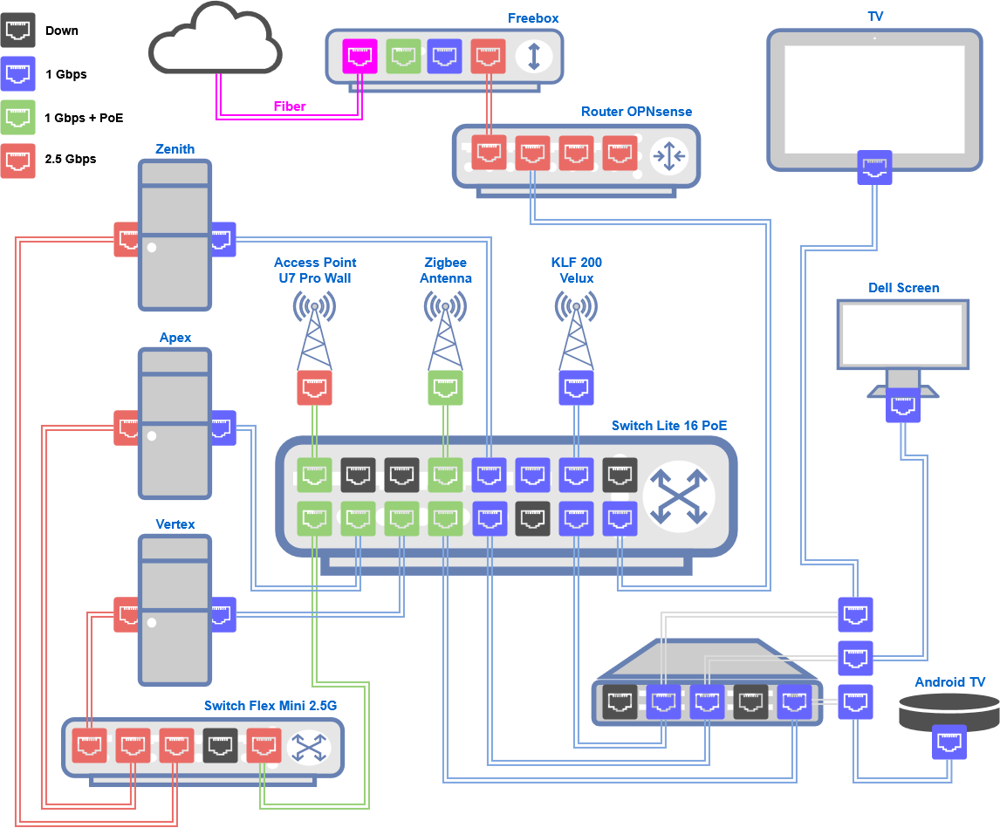

Jusqu’à récemment, le réseau Proxmox de mon cluster était très basique : chaque nœud était configuré individuellement sans véritable logique commune. Cela a changé après la découverte du SDN Proxmox, qui m’a permis de centraliser les définitions de VLAN sur l’ensemble du cluster. J’ai décrit cette étape dans [cet article]().

---
## Preuve de Concept

Place au lab. Voici les étapes principales :
1. Ajouter quelques VLANs dans mon homelab
2. Créer un faux routeur FAI
3. Construire deux VMs OPNsense
4. Configurer la haute disponibilité
5. Tester la bascule

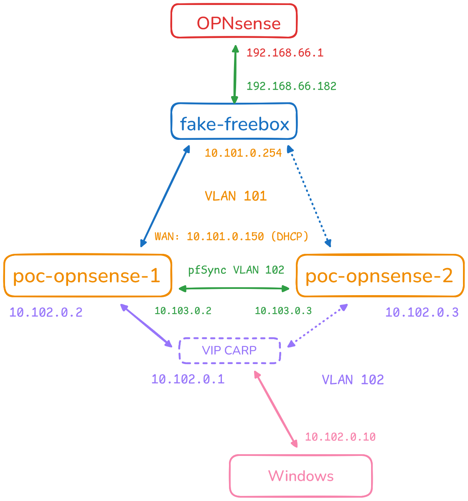

### Ajouter des VLANs dans mon homelab

Pour cette expérimentation, je crée trois nouveaux VLANs :
- **VLAN 101** : _POC WAN_
- **VLAN 102** : _POC LAN_
- **VLAN 103** : _POC pfSync_

Dans l’interface Proxmox, je vais dans `Datacenter` > `SDN` > `VNets` et je clique sur `Create` :
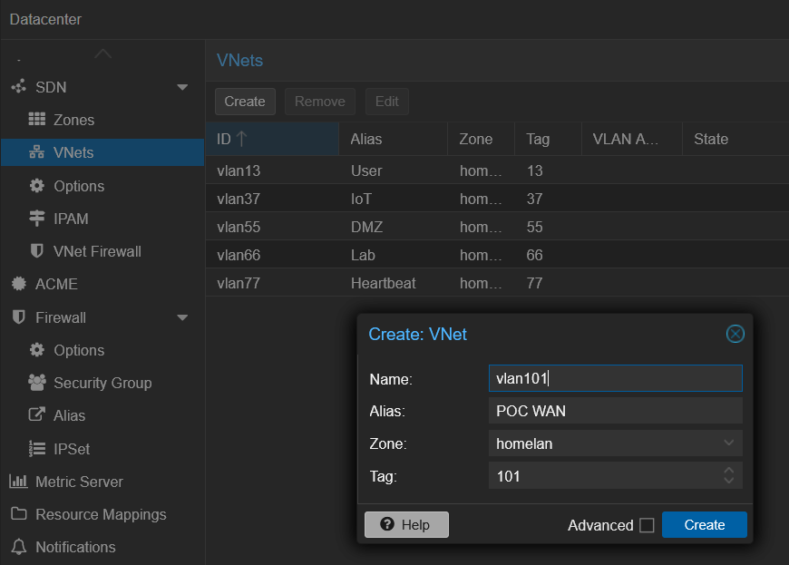

Une fois les trois VLANs créés, j’applique la configuration.

J’ajoute ensuite ces trois VLANs dans mon contrôleur UniFi. Ici, seul l’ID et le nom sont nécessaires, le contrôleur se charge de les propager via les trunks connectés à mes nœuds Proxmox VE.

### Créer une VM “Fausse Box FAI”

Pour simuler mon modem FAI actuel, j’ai créé une VM appelée `fake-freebox`. Cette VM route le trafic entre les réseaux _POC WAN_ et _Lab_, et fait tourner un serveur DHCP qui ne délivre qu’un seul bail, exactement comme ma vraie Freebox en mode bridge.

Cette VM dispose de 2 cartes réseau, que je configure avec Netplan :
- `eth0` (_POC WAN_ VLAN 101) : adresse IP statique `10.101.0.254/24`
- `enp6s19` (Lab VLAN 66) : adresse IP obtenue en DHCP depuis mon routeur OPNsense actuel, en amont
```yaml
network:
  version: 2
  ethernets:
    eth0:
      addresses:
        - 10.101.0.254/24
    enp6s19:
      dhcp4: true
```

J’active ensuite le routage IP pour permettre à cette VM de router le trafic :
```bash
echo "net.ipv4.ip_forward=1" | sudo tee -a /etc/sysctl.conf
sudo sysctl -p
```

Puis je configure du masquage (NAT) afin que les paquets sortant via le réseau Lab ne soient pas rejetés par mon OPNsense actuel :
```bash
sudo iptables -t nat -A POSTROUTING -o enp6s19 -j MASQUERADE
sudo apt install iptables-persistent -y
sudo netfilter-persistent save
```

J’installe `dnsmasq` comme serveur DHCP léger :
```bash
sudo apt install dnsmasq -y
```

Dans `/etc/dnsmasq.conf`, je configure un bail unique (`10.101.0.150`) et je pointe le DNS vers mon OPNsense actuel, sur le VLAN _Lab_ :
```
interface=eth0
bind-interfaces
dhcp-range=10.101.0.150,10.101.0.150,255.255.255.0,12h
dhcp-option=3,10.101.0.254      # default gateway = this VM
dhcp-option=6,192.168.66.1      # DNS server  
```

Je redémarre le service `dnsmasq` pour appliquer la configuration :
```bash
sudo systemctl restart dnsmasq
```

La VM `fake-freebox` est maintenant prête à fournir du DHCP sur le VLAN 101, avec un seul bail disponible.

### Construire les VMs OPNsense

Je commence par télécharger l’ISO d’OPNsense et je l’upload sur un de mes nœuds Proxmox :  
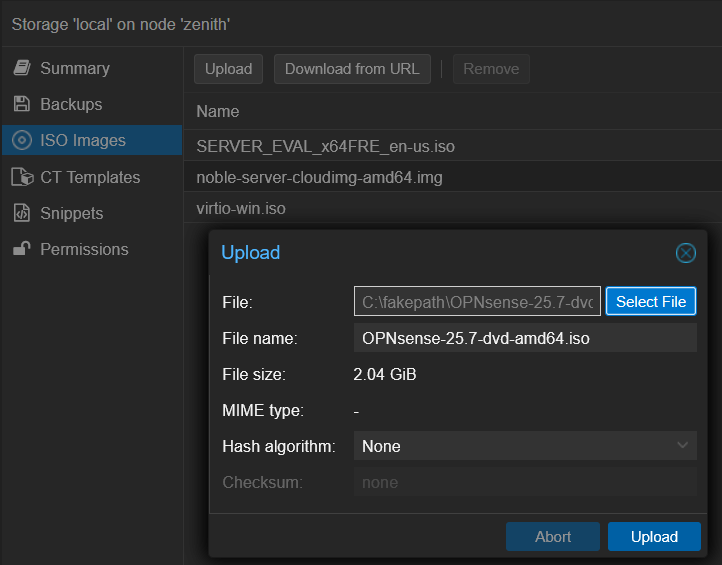

#### Création de la VM

Je crée la première VM `poc-opnsense-1` avec les paramètres suivants :
- Type d’OS : Linux (même si OPNsense est basé sur FreeBSD)
- Type de machine : `q35`
- BIOS : `OVMF (UEFI)`, stockage EFI sur mon pool Ceph
- Disque : 20 Go sur Ceph
- CPU/RAM : 2 vCPU, 2 Go de RAM
- Cartes réseau :
    1. VLAN 101 (_POC WAN_)
    2. VLAN 102 (_POC LAN_)
    3. VLAN 103 (_POC pfSync_)
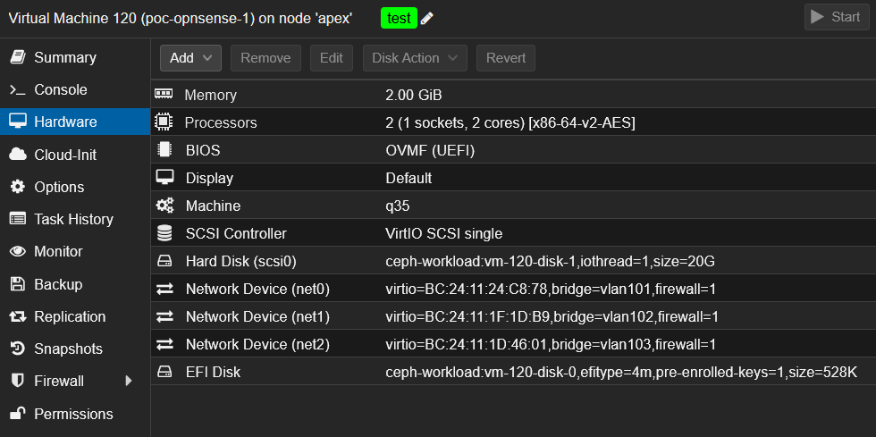

ℹ️ Avant de la démarrer, je clone cette VM pour préparer la seconde : `poc-opnsense-2`

Au premier démarrage, je tombe sur une erreur “access denied”. Pour corriger, j’entre dans le BIOS, **Device Manager > Secure Boot Configuration**, je décoche _Attempt Secure Boot_ et je redémarre :  
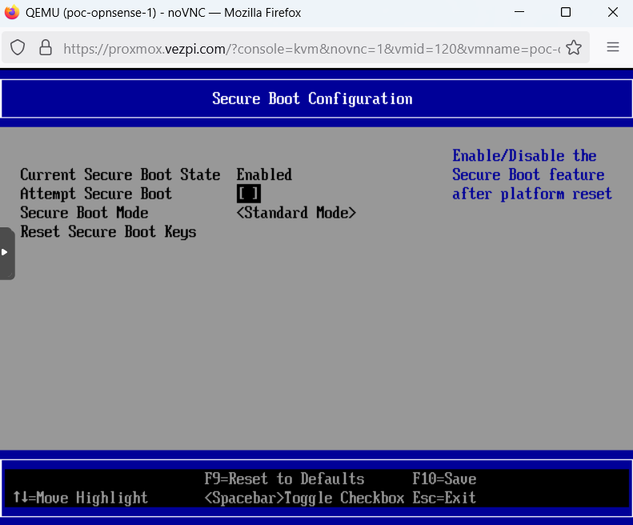

#### Installation d’OPNsense

La VM démarre sur l’ISO, je ne touche à rien jusqu’à l’écran de login :  
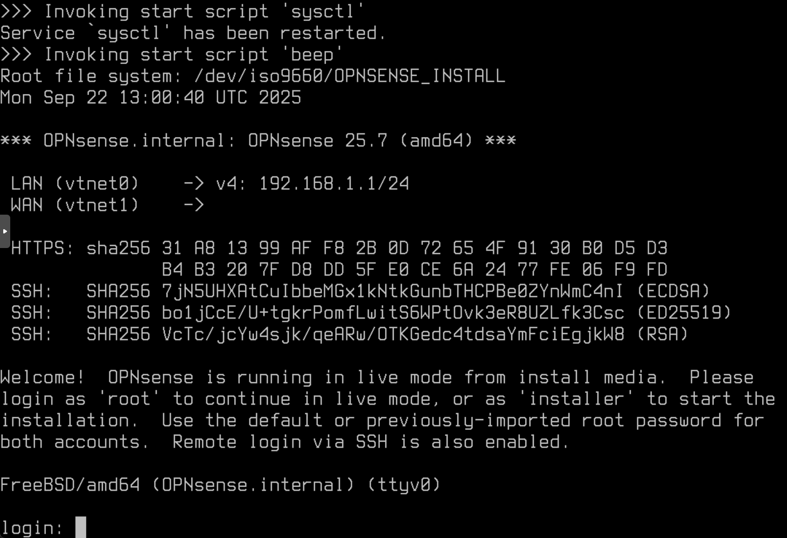

Je me connecte avec `installer` / `opnsense` et je lance l’installateur. Je sélectionne le disque QEMU de 20 Go comme destination et je démarre l’installation :  
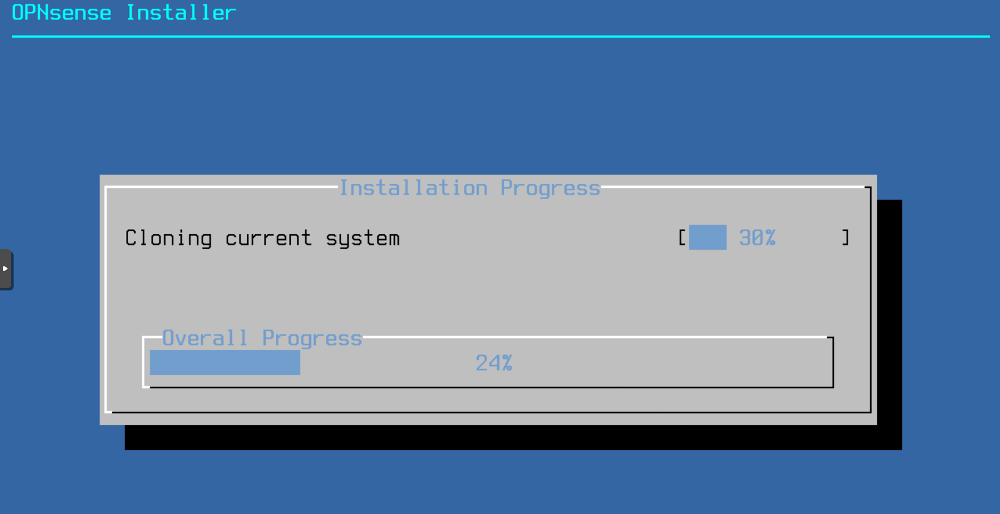

Une fois terminé, je retire l’ISO du lecteur et je redémarre la machine.

#### Configuration de Base d’OPNsense

Au redémarrage, je me connecte avec `root` / `opnsense` et j’arrive au menu CLI :  
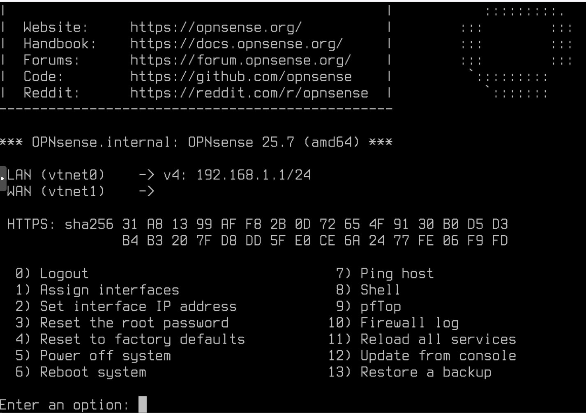

Avec l’option 1, je réassigne les interfaces :  
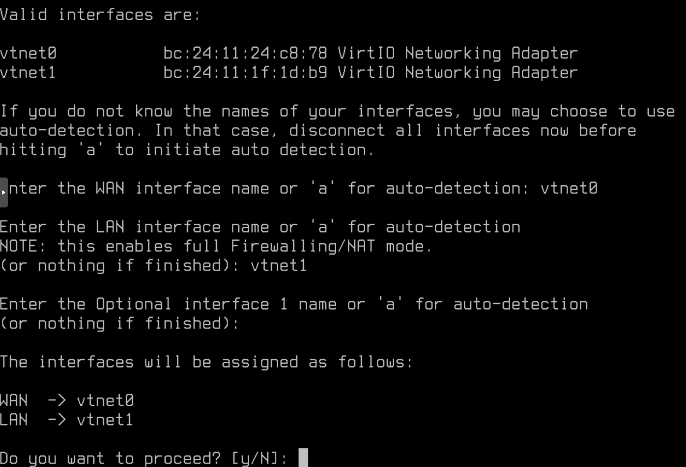

L’interface WAN récupère bien `10.101.0.150/24` depuis la `fake-freebox`. Je configure le LAN sur `10.102.0.2/24` et j’ajoute un pool DHCP de `10.102.0.10` à `10.102.0.99` :  


✅ La première VM est prête, je reproduis l’opération pour la seconde OPNsense `poc-opnsense-2`, qui aura l’IP `10.102.0.3`.

### Configurer OPNsense en Haute Disponibilité

Avec les deux VMs OPNsense opérationnelles, il est temps de passer à la configuration via le WebGUI. Pour y accéder, j’ai connecté une VM Windows au VLAN _POC LAN_ et ouvert l’IP de l’OPNsense sur le port 443 :  
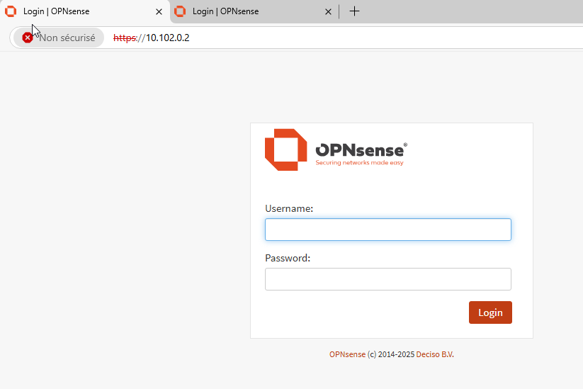

#### Ajouter l’Interface pfSync

La troisième carte réseau (`vtnet2`) est assignée à l’interface _pfSync_. Ce réseau dédié permet aux deux firewalls de synchroniser leurs états via le VLAN _POC pfSync_ :  
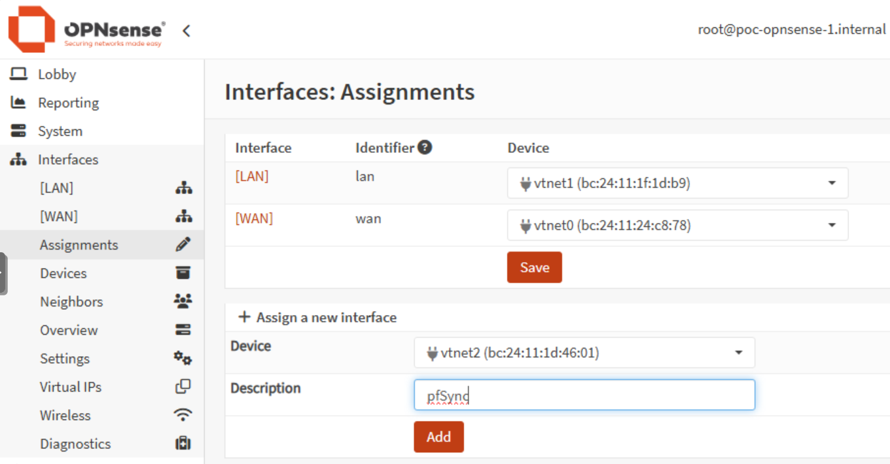

J’active l’interface sur chaque instance et je leur attribue une IP statique :
- **poc-opnsense-1** : `10.103.0.2/24`
- **poc-opnsense-2** : `10.103.0.3/24`

Puis, j’ajoute une règle firewall sur chaque nœud pour autoriser tout le trafic provenant de ce réseau sur l’interface _pfSync_ :  
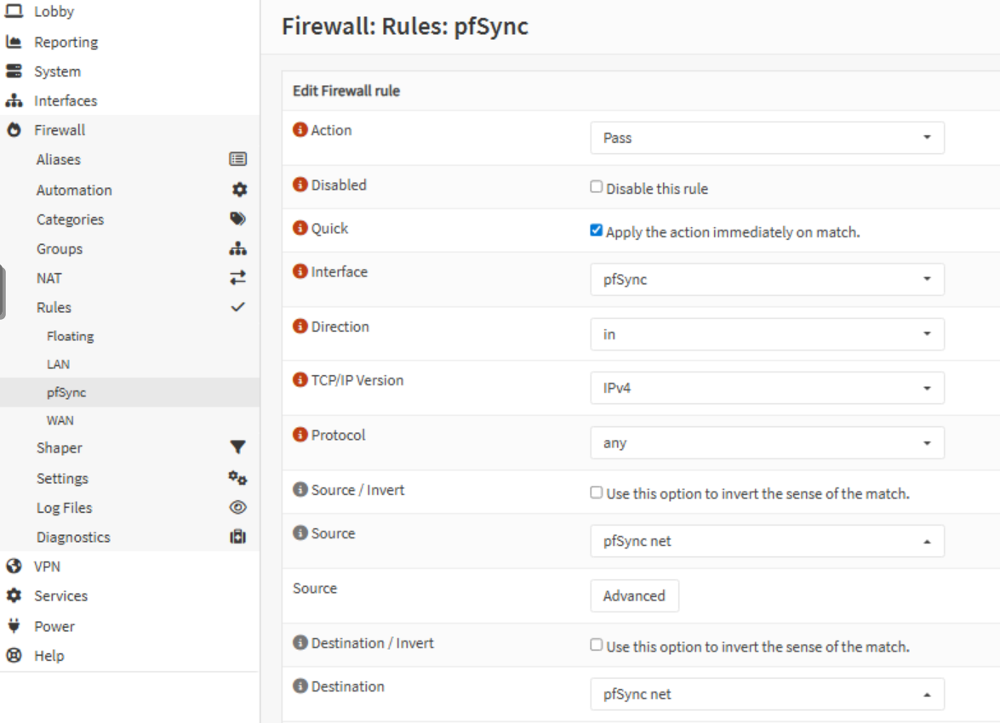

#### Configurer la Haute Disponibilité

Direction `System` > `High Availability` > `Settings`.
- Sur le master (`poc-opnsense-1`), je configure les `General Settings` et les `Synchronization Settings`.
- Sur le backup (`poc-opnsense-2`), seuls les `General Settings` suffisent (on ne veut pas qu’il écrase la config du master).  
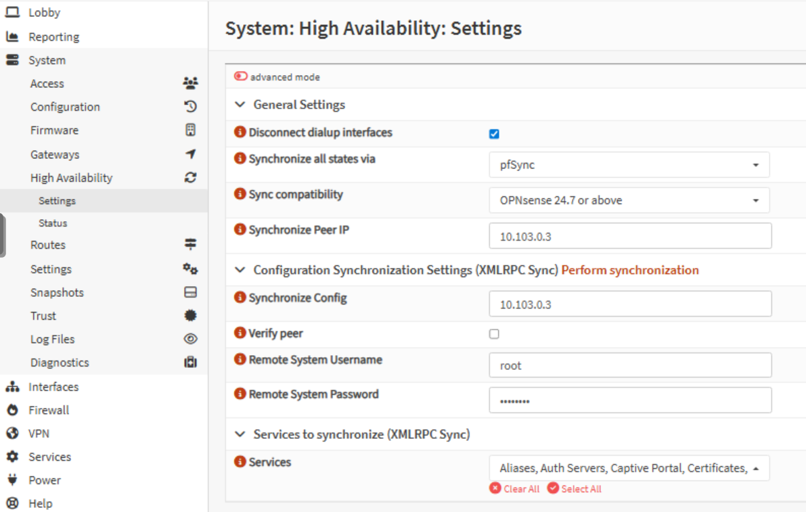

Une fois appliqué, je vérifie la synchro dans l’onglet `Status` :  
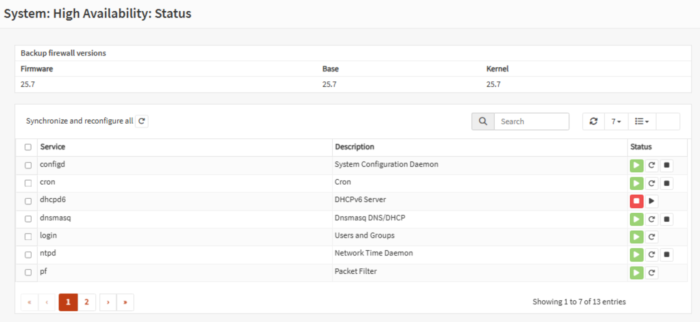

#### Créer une IP Virtuelle

Pour fournir une passerelle partagée aux clients, je crée une IP virtuelle (VIP) en **CARP** (Common Address Redundancy Protocol) sur l’interface LAN. L’IP est portée par le nœud actif et bascule automatiquement en cas de failover.

Menu : `Interfaces` > `Virtual IPs` > `Settings` :  
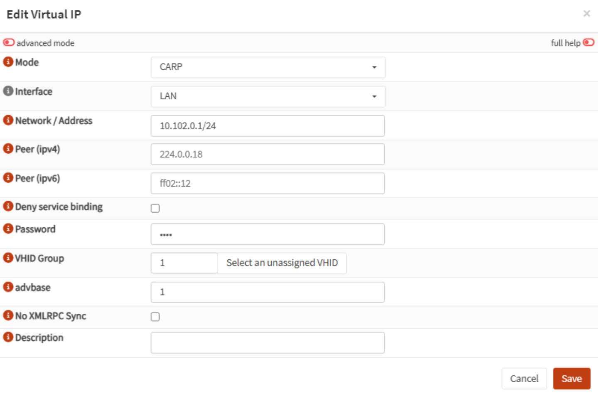

Je réplique ensuite la config depuis `System > High Availability > Status` avec le bouton `Synchronize and reconfigure all`.

Sur `Interfaces > Virtual IPs > Status`, le master affiche la VIP en `MASTER` et le backup en `BACKUP`.

#### Reconfigurer le DHCP

Pour la HA, il faut adapter le DHCP. Comme **Dnsmasq** ne supporte pas la synchro des baux, chaque instance doit répondre indépendamment.

Sur le master :
- `Services` > `Dnsmasq DNS & DHCP` > `General` : cocher `Disable HA sync`
- `DHCP ranges` : cocher aussi `Disable HA sync`
- `DHCP options` : ajouter l’option `router [3]` avec la valeur `10.102.0.1` (VIP LAN)
- `DHCP options` : cloner la règle pour `dns-server [6]` vers la même VIP.  
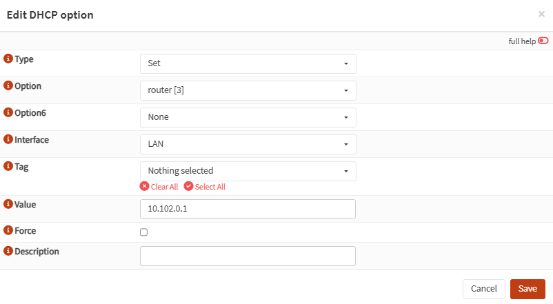

Sur le backup :
- `Services` > `Dnsmasq DNS & DHCP` > `General` : cocher `Disable HA sync`
- Régler `DHCP reply delay` à `5` secondes (laisser la priorité au master)
- `DHCP ranges` : définir un autre pool, plus petit (`10.102.0.200 -> 220`).

Ainsi, seules les **options** DHCP sont synchronisées, les plages restant distinctes.

#### Interface WAN

Mon modem FAI n’attribue qu’une seule IP en DHCP, je ne veux pas que mes 2 VMs entrent en compétition. Pour gérer ça :
1. Dans Proxmox, je copie l’adresse MAC de `net0` (WAN) de `poc-opnsense-1` et je l’applique à `poc-opnsense-2`. Ainsi, le bail DHCP est partagé.  
⚠️ Si les deux VMs activent la même MAC en même temps, cela provoque des conflits ARP et peut casser le réseau. Seul le MASTER doit activer son WAN.
2. Un hook event CARP procure la possibilité de lancer des scripts. J’ai déployé ce [script Gist](https://gist.github.com/spali/2da4f23e488219504b2ada12ac59a7dc#file-10-wancarp) dans `/usr/local/etc/rc.syshook.d/carp/10-wan` sur les deux nœuds. Ce script active le WAN uniquement sur le MASTER.
```php
#!/usr/local/bin/php
<?php

require_once("config.inc");
require_once("interfaces.inc");
require_once("util.inc");
require_once("system.inc");

$subsystem = !empty($argv[1]) ? $argv[1] : '';
$type = !empty($argv[2]) ? $argv[2] : '';

if ($type != 'MASTER' && $type != 'BACKUP') {
    log_error("Carp '$type' event unknown from source '{$subsystem}'");
    exit(1);
}

if (!strstr($subsystem, '@')) {
    log_error("Carp '$type' event triggered from wrong source '{$subsystem}'");
    exit(1);
}

$ifkey = 'wan';

if ($type === "MASTER") {
    log_error("enable interface '$ifkey' due CARP event '$type'");
    $config['interfaces'][$ifkey]['enable'] = '1';
    write_config("enable interface '$ifkey' due CARP event '$type'", false);
    interface_configure(false, $ifkey, false, false);
} else {
    log_error("disable interface '$ifkey' due CARP event '$type'");
    unset($config['interfaces'][$ifkey]['enable']);
    write_config("disable interface '$ifkey' due CARP event '$type'", false);
    interface_configure(false, $ifkey, false, false);
}
```

### Tester le Failover

Passons aux tests !

OPNsense propose un _CARP Maintenance Mode_. Avec le master actif, seul lui avait son WAN monté. En activant le mode maintenance, les rôles basculent : le master devient backup, son WAN est désactivé et celui du backup est activé :  
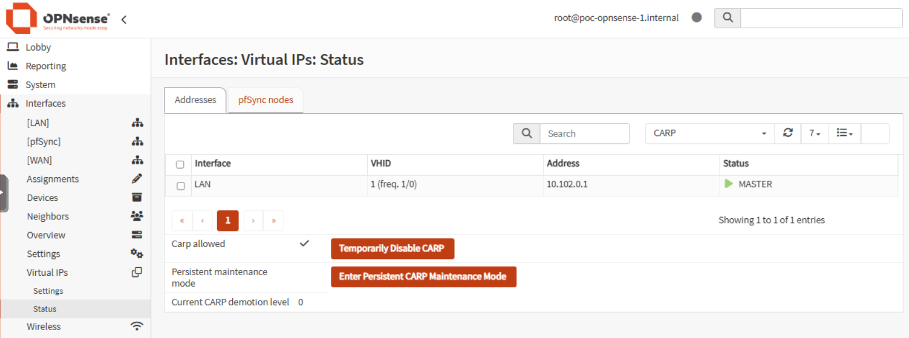

Pendant mes pings vers l’extérieur, aucune perte de paquets au moment du basculement.

Ensuite, j’ai simulé un crash en éteignant le master. Le backup a pris le relais de façon transparente, seulement un paquet perdu, et grâce à la synchro des états, même ma session SSH est restée ouverte. 🎉

## Conclusion

Cette preuve de concept démontre qu’il est possible de faire tourner **OPNsense en haute dispo sous Proxmox VE**, même avec une seule IP WAN. Les briques nécessaires :
- Segmentation VLAN
- Réseau dédié pfSync
- IP virtuelle partagée (CARP)
- Script pour gérer l’interface WAN

Le résultat est à la hauteur : failover transparent, synchro des états, et connexions actives qui survivent à un crash.  Le point le plus délicat reste la gestion du bail WAN, mais le hook CARP règle ce problème.

🚀 Prochaine étape : préparer un nouveau cluster OPNsense HA sur Proxmox en vue de remplacer complètement ma box physique actuel. Restez à l'écoute !