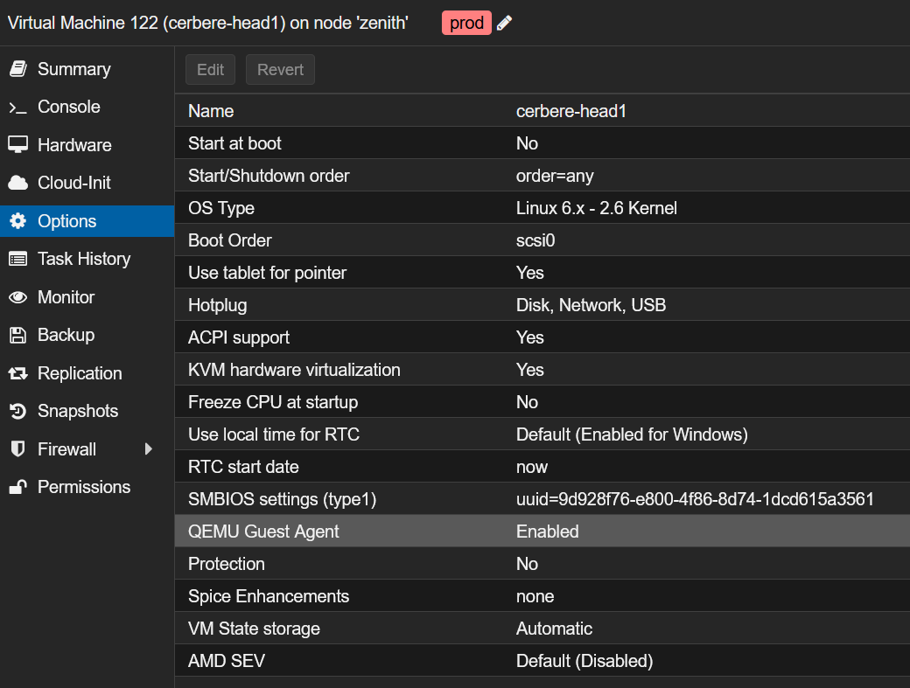
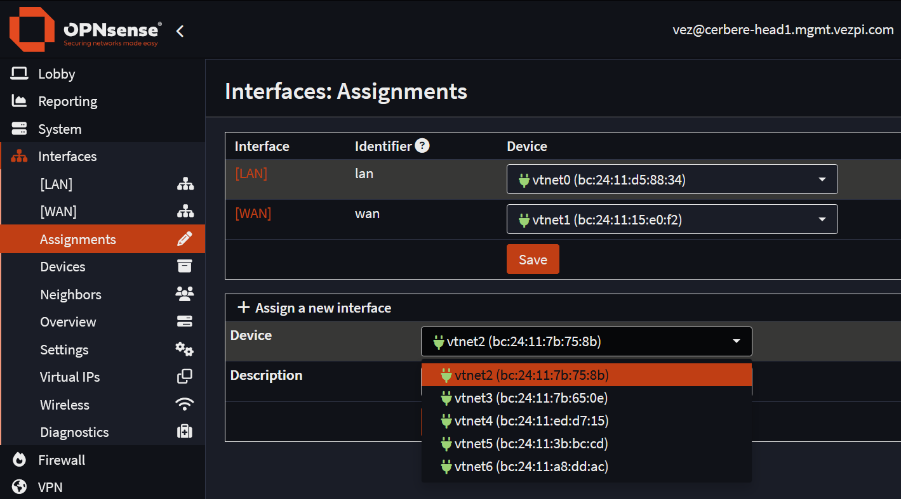
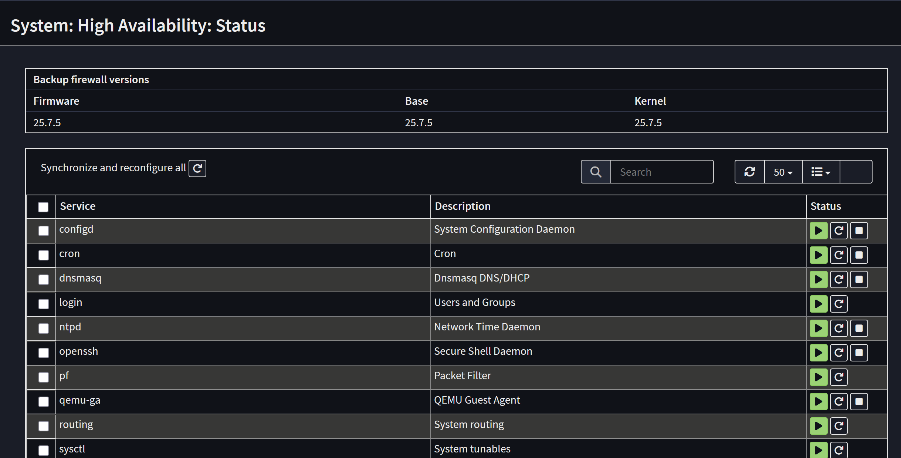
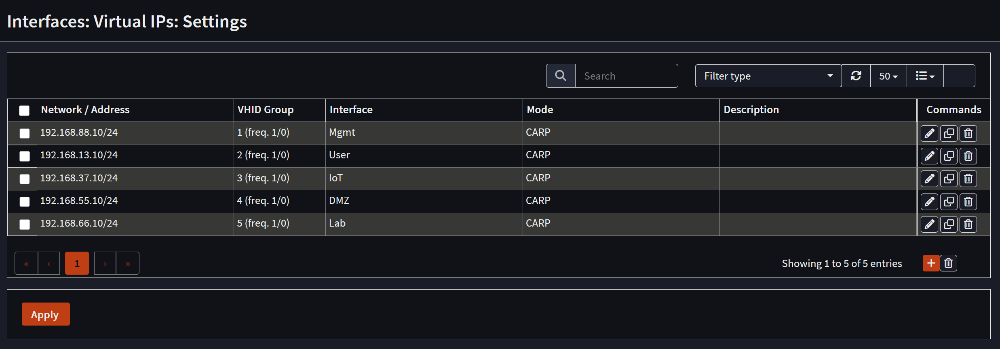
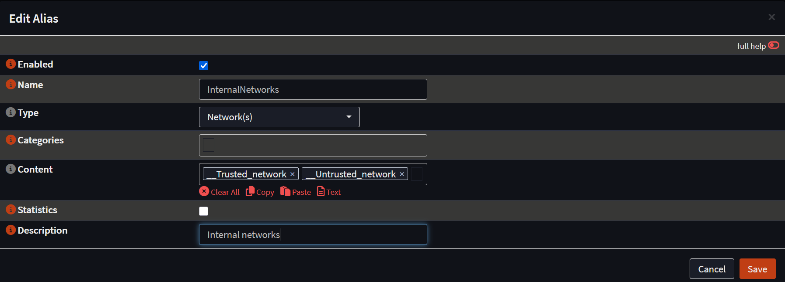
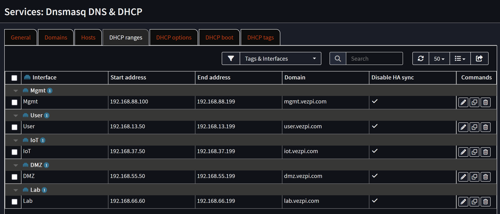
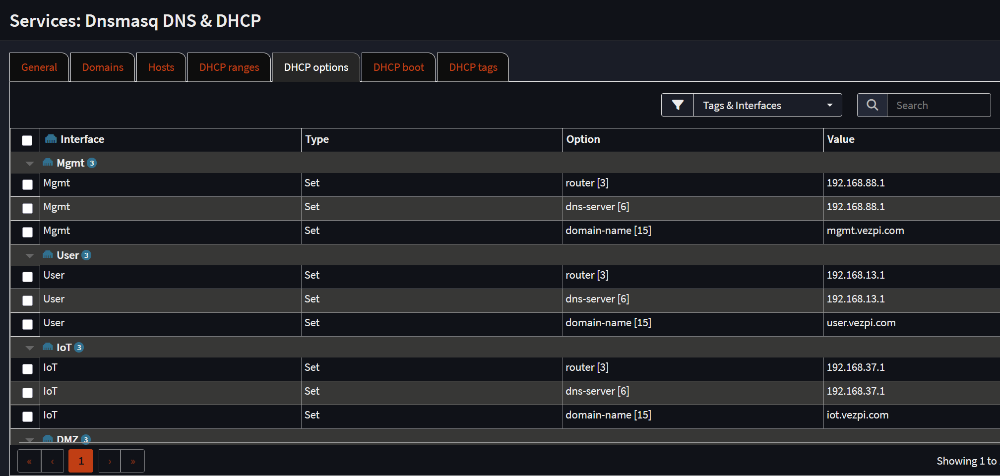
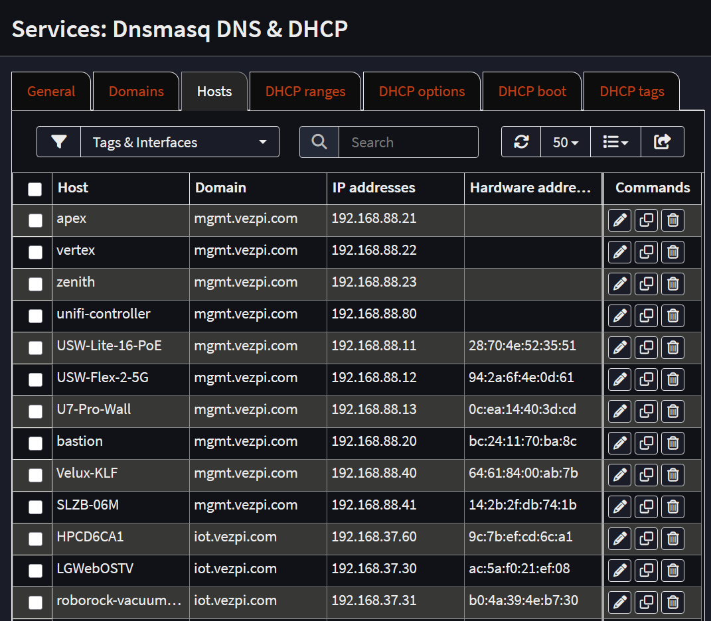
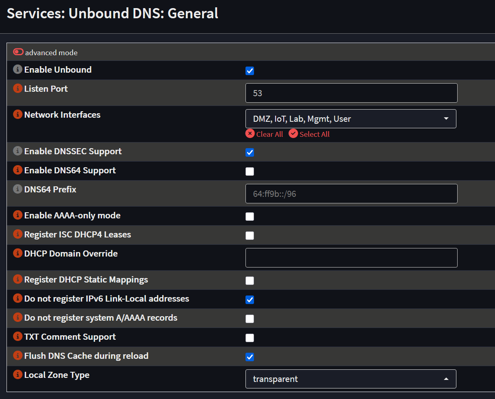
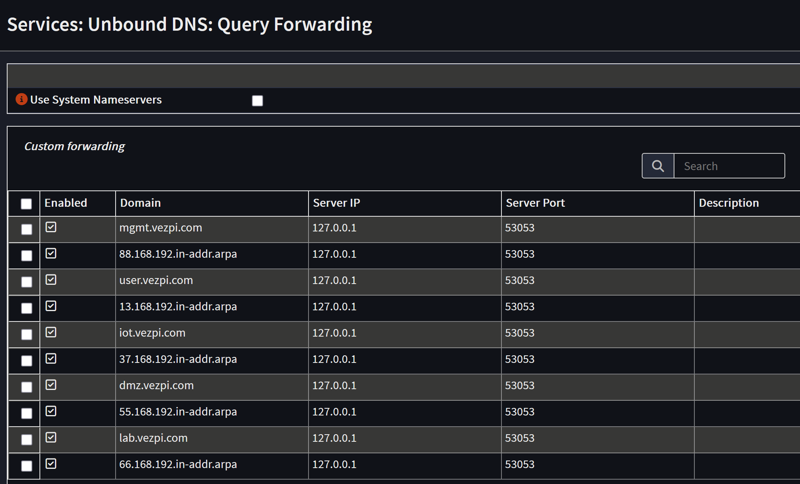

## Intro

Dans mon précédent [article]() j'ai mis en place un PoC pour valider la construction d'un cluster de deux VM **OPNsense** dans **Proxmox VE** afin de rendre le pare‑feu hautement disponible.

Maintenant je prépare la mise en œuvre dans mon homelab, cet article documente ma configuration réelle du cluster OPNsense, depuis de nouvelles installations jusqu'à la HA, le DNS, le DHCP, le VPN et le reverse proxy.
### Contexte

Avant d'entrer dans la configuration d'OPNsense, un peu de contexte pour comprendre les choix que j'ai faits.

Dans mon cluster Proxmox VE, j'ai créé 2 VM et installé OPNsense. L'objectif est de remplacer ma unique machine physique par ce cluster. Chaque VM possède 7 NICs pour les réseaux suivants :
- **vmbr0** : _Mgmt_
- **vlan20** : _WAN_
- **vlan13** : _User_
- **vlan37** : _IoT_
- **vlan44** : _pfSync_
- **vlan55** : _DMZ_
- **vlan66** : _Lab_

Initialement je pensais simplement restaurer ma configuration actuelle sur la VM fraîchement installée. Mais j'ai réalisé que je n'avais pas vraiment documenté comment j'avais assemblé les éléments la première fois. C'est le moment parfait pour remettre les choses en ordre.

⚠️ Je ne peux disposer que d'une seule IP WAN, partagée entre les nœuds, fournie par le DHCP de ma box opérateur. Pour cette raison je n'aurai pas de VIP pour le WAN et je dois trouver une solution pour partager cette unique IP.

J'espère que, dans le prochain article, si ce projet arrive sur mon réseau de production, je couvrirais aussi la création des VM dans Proxmox et la façon dont je prépare la migration de ma box OPNsense physique vers ce cluster HA en VM. Allons‑y !

---
## Système

### Général

Je commence par les bases, dans `System` > `Settings` > `General` :
- **Hostname** : `cerbere-head1` (`cerbere-head2` pour la seconde).
- **Domain** : `mgmt.vezpi.com`.
- **Time zone** : `Europe/Paris`.
- **Language** : `English`.
- **Theme** : `opnsense-dark`.
- **Prefer IPv4 over IPv6** : cocher la case pour préférer IPv4.

### Utilisateurs

Ensuite, dans `System` > `Access` > `Users`, je crée un nouvel utilisateur plutôt que d'utiliser `root`, l'ajoute au groupe `admins`, et retire `root` de ce groupe.

### Administration

Dans `System` > `Settings` > `Administration`, je modifie plusieurs éléments :
- **Web GUI**
    - **TCP port** : de `443` à `4443`, pour libérer le port 443 pour le reverse proxy à venir.
    - **HTTP Redirect** : Désactivé, pour libérer le port 80 pour le reverse proxy.
    - **Alternate Hostnames** : `cerbere.vezpi.com` qui sera l'URL pour atteindre le pare‑feu via le reverse proxy.
    - **Access log** : Activé.
- **Secure Shell**
    - **Secure Shell Server** : Activé.
    - **Root Login** : Désactivé.
    - **Authentication Method :** Autoriser la connexion par mot de passe (pas de login `root`).
    - **Listen Interfaces** : _Mgmt_
- **Authentication**
    - **Sudo** : `No password`.

Une fois que je clique sur `Save`, je suis le lien fourni pour atteindre la WebGUI sur le port `4443`.

### Mises à Jour

Il est temps de mettre à jour, dans `System` > `Firmware` > `Status`, je vérifie les mises à jour du firmware et les applique (nécessite un redémarrage).

### QEMU Guest Agent

Une fois mis à jour et redémarré, je vais dans `System` > `Firmware` > `Plugins`, je coche l'option pour afficher les plugins communautaires. J'installe que le **QEMU Guest Agent**, `os-qemu-guest-agent`, pour permettre la communication entre la VM et l'hôte Proxmox.

Cela nécessite un arrêt. Dans Proxmox, j'active le `QEMU Guest Agent` dans les options de la VM :  


Finalement je redémarre la VM. Une fois démarrée, depuis la WebGUI de Proxmox, je peux voir les IPs de la VM ce qui confirme que le guest agent fonctionne.

---
## Interfaces

Sur les deux pare‑feu, j'assigne les NIC restantes à de nouvelles interfaces en ajoutant une description. Les VMs ont 7 interfaces, je compare attentivement les adresses MAC pour éviter de mélanger les interfaces :


Au final, la configuration des interfaces ressemble à ceci :

| Interface | Mode        | `cerbere-head1` | `cerbere-head2` |
| --------- | ----------- | --------------- | --------------- |
| *Mgmt*    | Static IPv4 | 192.168.88.2/24 | 192.168.88.3/24 |
| *WAN*     | DHCPv4/6    | Enabled         | Disabled        |
| *User*    | Static IPv4 | 192.168.13.2/24 | 192.168.13.3/24 |
| *IoT*     | Static IPv4 | 192.168.37.2/24 | 192.168.37.3/24 |
| *pfSync*  | Static IPv4 | 192.168.44.1/30 | 192.168.44.2/30 |
| *DMZ*     | Static IPv4 | 192.168.55.2/24 | 192.168.55.3/24 |
| *Lab*     | Static IPv4 | 192.168.66.2/24 | 192.168.66.3/24 |

Je ne configure pas encore les Virtual IPs, je m'en occuperai une fois la haute disponibilité mise en place.

---
## Haute Disponibilité

### Règle Pare-feu pour pfSync

À partir d'ici nous pouvons associer les deux instances pour créer un cluster. La dernière chose que je dois faire est d'autoriser la communication sur l'interface _pfSync_. Par défaut, aucune communication n'est autorisée sur les nouvelles interfaces.

Dans `Firewall` > `Rules` > `pfSync`, je crée une nouvelle règle sur chaque pare‑feu :

| Field                      | Value                                 |
| -------------------------- | ------------------------------------- |
| **Action**                 | Pass                                  |
| **Quick**                  | Apply the action immediately on match |
| **Interface**              | *pfSync*                              |
| **Direction**              | in                                    |
| **TCP/IP Version**         | IPv4                                  |
| **Protocol**               | any                                   |
| **Source**                 | *pfSync* net                          |
| **Destination**            | *pfSync* net                          |
| **Destination port range** | from: any - to: any                   |
| **Log**                    | Log packets                           |
| **Category**               | OPNsense                              |
| **Description**            | pfSync                                |

### Configurer la HA

OPNsense HA utilise pfSync pour la synchronisation des états du pare‑feu (en temps réel) et XMLRPC Sync pour pousser la configuration et les services du master → backup (sens unique).

La HA est configurée dans `System` > `High Availability` > `Settings`
#### Master

- **General Settings**
    - **Synchronize all states via**: _pfSync_
    - **Synchronize Peer IP**: `192.168.44.2`, l'IP du nœud backup
- **Configuration Synchronization Settings (XMLRPC Sync)**
    - **Synchronize Config**: `192.168.44.2`
    - **Remote System Username**: `<username>`
    - **Remote System Password**: `<password>`
- **Services to synchronize (XMLRPC Sync)**
    - **Services**: Select All

#### Backup

- **General Settings**
    - **Synchronize all states via**: _pfSync_
    - **Synchronize Peer IP**: `192.168.44.1`, l'IP du nœud master

⚠️ Ne remplissez pas les champs XMLRPC Sync sur le nœud backup, ils doivent uniquement être remplis sur le master.

### Statut de la HA

Dans `System` > `High Availability` > `Status`, je peux vérifier si la synchronisation fonctionne. Sur cette page je peux répliquer un ou tous les services du master vers le nœud backup :


---
## IPs Virtuelles

Maintenant que la HA est configurée, je peux attribuer à mes réseaux une IP virtuelle partagée entre mes nœuds. Dans `Interfaces` > `Virtual IPs` > `Settings`, je crée un VIP pour chacun de mes réseaux en utilisant **CARP** (Common Address Redundancy Protocol). L'objectif est de réutiliser les adresses IP utilisées par mon instance OPNsense actuelle, mais comme elle route encore mon réseau, j'utilise des IP différentes pour la phase de configuration :


ℹ️ OPNsense permet CARP par défaut, aucune règle de pare‑feu spéciale requise

---
## Script de Bascule CARP

Dans ma configuration, je n'ai qu'une seule adresse WAN fournie par le DHCP de ma box opérateur. OPNsense ne propose pas nativement de moyen de gérer ce scénario. Pour s'en occuper, j'implémente la même astuce que j'ai utilisée dans le [PoC]().
### Copier l'Adresse MAC

Je copie la MAC de l'interface `net1` de `cerbere-head1` et la colle sur la même interface de `cerbere-head2`. Ainsi, le bail DHCP pour l'adresse WAN peut être partagé entre les nœuds.

⚠️ Attention : Avoir deux machines sur le réseau avec la même MAC peut provoquer des conflits ARP et casser la connectivité. Une seule VM doit garder son interface active.

### Script d'Evènement CARP

Sous le capot, dans OPNsense, un événement CARP déclenche certains scripts (lorsque le master meurt). Ils sont situés dans `/usr/local/etc/rc.syshook.d/carp/`.

Pour gérer l'interface WAN sur chaque nœud, j'implémente ce script PHP `10-wan` sur les deux nœuds, via SSH (n'oubliez pas de le rendre exécutable). Selon leur rôle (master ou backup), il activera ou désactivera leur interface WAN :
```php
#!/usr/local/bin/php
<?php

require_once("config.inc");
require_once("interfaces.inc");
require_once("util.inc");
require_once("system.inc");

$subsystem = !empty($argv[1]) ? $argv[1] : '';
$type = !empty($argv[2]) ? $argv[2] : '';

if ($type != 'MASTER' && $type != 'BACKUP') {
    log_error("Carp '$type' event unknown from source '{$subsystem}'");
    exit(1);
}

if (!strstr($subsystem, '@')) {
    log_error("Carp '$type' event triggered from wrong source '{$subsystem}'");
    exit(1);
}

$ifkey = 'wan';

if ($type === "MASTER") {
    log_error("enable interface '$ifkey' due CARP event '$type'");
    $config['interfaces'][$ifkey]['enable'] = '1';
    write_config("enable interface '$ifkey' due CARP event '$type'", false);
    interface_configure(false, $ifkey, false, false);
} else {
    log_error("disable interface '$ifkey' due CARP event '$type'");
    unset($config['interfaces'][$ifkey]['enable']);
    write_config("disable interface '$ifkey' due CARP event '$type'", false);
    interface_configure(false, $ifkey, false, false);
}
```

Dans `Interfaces` > `Virtual IPs` > `Status`, je peux forcer un événement CARP en entrant en `Persistent maintenance mode`. Le déclenchement permet de tester ce script, qui désactive l'interface WAN sur le master tout en l'activant sur le backup.

---
## Pare-feu

Configurons la fonctionnalité principale d'OPNsense, le pare‑feu. Je ne veux pas multiplier les règles inutilement. Je n'ai besoin de configurer que le master, grâce à la réplication.

### Groupes d'Interface 

Globalement j'ai 2 types de réseaux : ceux en qui j'ai confiance et ceux en qui je n'ai pas confiance. Dans cette optique, je vais créer deux zones.

En règle générale, mes réseaux non fiables n'ont accès qu'au DNS et à Internet. Les réseaux fiables peuvent atteindre les autres VLANs.

Pour commencer, dans `Firewall` > `Groups`, je crée 2 zones pour regrouper mes interfaces :
- **Trusted** : _Mgmt_, _User_
- **Untrusted** : _IoT_, _DMZ_, _Lab_

### Network Aliases

Ensuite, dans `Firewall` > `Aliases`, je crée un alias `InternalNetworks` pour regrouper tous mes réseaux internes :


### Règles de Pare-feu Rules

Pour tous mes réseaux, je veux autoriser les requêtes DNS vers le DNS local. Dans `Firewall` > `Rules` > `Floating`, créons la première règle

| Field                      | Value                                 |
| -------------------------- | ------------------------------------- |
| **Action**                 | Pass                                  |
| **Quick**                  | Apply the action immediately on match |
| **Interface**              | Trusted, Untrusted                    |
| **Direction**              | in                                    |
| **TCP/IP Version**         | IPv4                                  |
| **Protocol**               | TCP/UDP                               |
| **Source**                 | InternalNetworks                      |
| **Destination**            | This Firewall                         |
| **Destination port range** | from: DNS - to: DNS                   |
| **Log**                    | Log packets                           |
| **Category**               | DNS                                   |
| **Description**            | DNS query                             |

Ensuite je veux autoriser les connexions vers Internet. Au même endroit je crée une seconde règle :

| Field                      | Value                                 |
| -------------------------- | ------------------------------------- |
| **Action**                 | Pass                                  |
| **Quick**                  | Apply the action immediately on match |
| **Interface**              | Trusted, Untrusted                    |
| **Direction**              | in                                    |
| **TCP/IP Version**         | IPv4+IPv6                             |
| **Protocol**               | any                                   |
| **Source**                 | InternalNetworks                      |
| **Destination / Invert**   | Invert the sense of the match         |
| **Destination**            | InternalNetworks                      |
| **Destination port range** | from: any - to: any                   |
| **Log**                    | Log packets                           |
| **Category**               | Internet                              |
| **Description**            | Internet                              |

Enfin, je veux autoriser tout depuis mes réseaux fiables. Dans `Firewall` > `Rules` > `Trusted`, je crée la règle :

| Field                      | Value                                 |
| -------------------------- | ------------------------------------- |
| **Action**                 | Pass                                  |
| **Quick**                  | Apply the action immediately on match |
| **Interface**              | Trusted                               |
| **Direction**              | in                                    |
| **TCP/IP Version**         | IPv4+IPv6                             |
| **Protocol**               | any                                   |
| **Source**                 | Trusted net                           |
| **Destination**            | any                                   |
| **Destination port range** | from: any - to: any                   |
| **Log**                    | Log packets                           |
| **Category**               | Trusted                               |
| **Description**            | Trusted                               |

Parfait, avec ces 3 règles, je couvre les bases. Les règles restantes serviront à autoriser certains équipements à atteindre d'autres services. Par exemple, mon instance Home Assistant veut se connecter à ma TV, les deux sont sur des VLANs différents, donc j'ai besoin d'une règle pour l'autoriser :

| Field                      | Value                                 |
| -------------------------- | ------------------------------------- |
| **Action**                 | Pass                                  |
| **Quick**                  | Apply the action immediately on match |
| **Interface**              | Lab                                   |
| **Direction**              | in                                    |
| **TCP/IP Version**         | IPv4                                  |
| **Protocol**               | TCP                                   |
| **Source**                 | 192.168.66.50/32                      |
| **Destination**            | 192.168.37.30/32                      |
| **Destination port range** | from: 3000 - to: 3001                 |
| **Log**                    | Log packets                           |
| **Category**               | Home Assistant                        |
| **Description**            | Home assistant to TV                  |

---
## DHCP

Pour le DHCP, je choisis **Dnsmasq**. Dans mon installation actuelle j'utilise ISC DHCPv4, mais comme il est maintenant déprécié, je préfère le remplacer. Dnsmasq agira aussi comme DNS, mais seulement pour mes zones locales.

Dnsmasq ne synchronise pas les baux. Pour éviter les conflits, les deux nœuds servent le DHCP mais avec un délai de réponse décalé et des plages différentes. Le master couvre le pool principal, le backup un petit pool de secours.

### Configuration Générale de Dnsmasq

Dans `Services` > `Dnsmasq DNS & DHCP` > `General`, je configure le pare‑feu master comme suit :
- **Default**
	- **Enable**: Oui
	- **Interface**: *Mgmt*, *User*, *IoT*, *DMZ* et *Lab*
- **DNS**
	- **Listen port**: 53053
- **DNS Query Forwarding** 
	- **Do not forward to system defined DNS servers**: Activé
- **DHCP**
	- **DHCP FQDN**: Activé
	- **DHCP local domain**: Activé
	- **DHCP authoritative**: Activé
	- **DHCP reply delay**: 0
	- **DHCP register firewall rules**: Activé
	- **Disable HA sync**: Activé

Sur le nœud backup, je le configure de la même manière, la seule différence sera le **DHCP reply delay** que je règle à **10**. Cela donne au master le temps de répondre aux requêtes DHCP avant que le backup n'intervienne.

### Plages DHCP

Ensuite je configure les plages DHCP. Les deux pare‑feu auront des plages différentes, le nœud backup aura des plages plus petites (10 baux devraient suffire). Sur le master, elles sont configurées comme suit :


### Options DHCP

Puis je définis quelques options DHCP pour chaque domaine : le `router`, le `dns-server` et le `domain-name`. Je pointe les adresses IP vers la VIP de l'interface :


### Hôtes

Enfin, dans l'onglet `Hosts`, je définis des mappings DHCP statiques mais aussi des IP statiques non gérées par le DHCP, pour qu'elles soient enregistrées dans le DNS :


---
## DNS

Pour le DNS, j'utilise **Unbound**. C'est un résolveur DNS récursif, validant et cacheur intégré à OPNsense, qui peut :
- Résoudre les requêtes depuis les serveurs racine.
- Mettre en cache les résultats pour des réponses plus rapides.
- Vérifier l'authenticité des domaines avec DNSSEC.
- Bloquer des domaines via une liste noire.
- Ajouter des enregistrements personnalisés.

Unbound est le résolveur récursif, pour les zones locales j'effectue un forward vers Dnsmasq.

### Paramètres Généraux d'Unbound

Configurons-le, dans `Services` > `Unbound DNS` > `General` :


### Liste de Blocage DNS 

 Ensuite je configure la blocklist dans `Services` > `Unbound DNS` > `Blocklist`. Je l'active et sélectionne la liste `[hagezi] Multi PRO mini`. Initialement j'utilisais AdGuard Home, mais je veux donner une chance à cette fonctionnalité de blocklist.

Pour maintenir le service à jour, dans `System` > `Settings` > `Cron`, j'ajoute mon premier job qui s'exécute chaque nuit à 2h pour `Update Unbound DNSBLs`.

### Transfert de Requêtes

Enfin je configure le transfert de requêtes pour mes domaines locaux vers Dnsmasq. Dans `Services` > `Unbound DNS` > `Query Forwarding`, j'ajoute chacun de mes domaines locaux avec leurs reverse lookups (enregistrements PTR) :


---
## VPN

Quand je ne suis pas chez moi, je veux toujours pouvoir atteindre mes services et profiter de mon bloqueur DNS. Pour cela je configure un VPN avec **WireGuard**. C'est rapide, sécurisé et simple à mettre en place.

### Configuration de l'Instance WireGuard

Dans `VPN` > `WireGuard` > `Instances`, je crée une nouvelle instance :
- **Enabled**: Oui
- **Name**: *Homelan*
- **Public/Private keys**: Paire de clés générée
- **Listen port**: `61337`
- **Tunnel address**: `10.13.37.1/24`
- **Depend on (CARP)**: on *lan* (vhid 1)

Une fois configuré, j'active WireGuard et j'applique la configuration.

### Configuration d'un Peer

Ensuite, dans l'onglet `Peer generator`, je remplis les champs pour mon premier appareil :
- **Endpoint** : `vezpi.com`
- **Name** : _S25Ultra_
- **DNS Servers** : `10.13.37.1`

Avant de cliquer sur `Store and generate next`, depuis mon appareil je configure le peer en capturant le QR code. Enfin je peux sauvegarder ce peer et recommencer pour les suivants.

### Créer l'Interface VPN

Cette étape n'est pas obligatoire, mais facilite la gestion des règles de pare‑feu. Sur les deux pare‑feu, dans `Interfaces` > `Assignments`, j'assigne l'interface `wg0 (WireGuard - Homelan)` et la nomme _VPN_.

Puis dans `Interfaces` > `VPN`, j'active cette interface.

Enfin, dans `Firewall` > `Groups`, j'ajoute cette interface au groupe _Trusted_.
### Règle de Pare-feu

Pour autoriser les connexions depuis l'extérieur, je dois créer une règle de pare‑feu sur l'interface WAN :

| Field                      | Value                                 |
| -------------------------- | ------------------------------------- |
| **Action**                 | Pass                                  |
| **Quick**                  | Apply the action immediately on match |
| **Interface**              | WAN                                   |
| **Direction**              | in                                    |
| **TCP/IP Version**         | IPv4                                  |
| **Protocol**               | UDP                                   |
| **Source**                 | any                                   |
| **Destination**            | WAN address                           |
| **Destination port range** | from: 61337 - to: 61337               |
| **Log**                    | Log packets                           |
| **Category**               | VPN                                   |
| **Description**            | WireGuard                             |

---
## Reverse Proxy

La fonctionnalité suivante dont j’ai besoin est un **reverse proxy**, pour rediriger les requêtes HTTPS entrantes vers mes services, comme ce blog par exemple.  
Pour cela, j’utilise **Caddy**. Il écoute sur les ports 80 et 443, c’est la raison pour laquelle j’ai déplacé l’interface WebGUI d’OPNsense vers d’autres ports au début.

Ce service n’est pas installé par défaut, il faut ajouter un plugin.  
Sur les deux pare-feux, dans `System` > `Firmware` > `Plugins`, je coche l’option pour afficher les plugins communautaires et j’installe **`os-caddy`**.

### Paramètres Généraux de Caddy

Je rafraîchis ensuite la page et, sur le nœud maître, je vais dans `Services` > `Caddy` > `General Settings` :
- **Enable Caddy** : Oui
- **Enable Layer4 Proxy** : Oui
- **ACME** : `<adresse email>`
- **Auto HTTPS** : On (default)

Il existe deux types de redirections : le `Reverse Proxy` et le `Layer4 Proxy`. Le premier est réservé au HTTPS, où Caddy gère le chiffrement SSL lui-même.

### Reverse Proxy

Dans `Services` > `Caddy` > `Reverse Proxy`, je définis les services directement gérés par Caddy.

Ces services ne doivent pas être accessibles à tout le monde.  
Dans l’onglet **Access**, je crée une liste appelée `Internal`, qui regroupe mes réseaux autorisés, notamment le LAN et le VPN.

Puis, dans l’onglet `Domains`, j’ajoute mes domaines. Par exemple, c’est ici que je définis `cerbere.vezpi.com`, l’URL pour accéder à mon interface WebGUI OPNsense :
- **Enable** : Oui
- **Frontend**
    - **Protocol** : `https://`
    - **Domain** : `cerbere.vezpi.com`
    - **Port** : laisser vide
    - **Certificate** : Auto HTTPS
    - **HTTP-01 Challenge Redirection** : `192.168.44.2` (pour la haute disponibilité)
    - **Description** : OPNsense
- **Access**
    - **Access List** : `Internal`
    - **HTTP Access Log** : Activé

Enfin, dans l’onglet `Handlers`, je définis la destination vers laquelle ces domaines doivent être redirigés. Pour `cerbere.vezpi.com`,
j’ajoute :
- **Enabled** : Oui
- **Frontend**
    - **Domain** : `https://cerbere.vezpi.com`
    - **Subdomain** : None
- **Handler**
    - **Path** : any
- **Access**
    - **Access List** : None
- **Directive**
    - **Directive** : `reverse_proxy`
- **Upstream**
    - **Protocol** : `https://`
    - **Upstream Domain** : `127.0.0.1`
    - **Upstream Port** : `4443`
    - **TLS Insecure Skip Verify** : Activé
    - **Description** : OPNsense

### Layer4 Proxy

La plupart de mes services sont déjà derrière un autre reverse proxy sur mon réseau, **Traefik**. Pour lui permettre de gérer directement ses domaines, je les redirige à l’aide de `Layer4 Routes`. Cela évite que Caddy termine le SSL, le flux HTTPS reste donc intact.

Dans `Services` > `Caddy` > `Layer4 Proxy`, je crée 3 routes.

La première concerne les services exposés sur Internet, comme ce blog ou mon instance Gitea :
- **Enabled** : Oui
- **Sequence** : 1
- **Layer 4**
    - **Routing Type** : listener_wrappers
- **Layer 7**
    - **Matchers** : TLS (SNI Client Hello)
    - **Domain** : `blog.vezpi.com` `git.vezpi.com`
    - **Terminate SSL** : No
- **Upstream**
    - **Upstream Domain** : `192.168.66.50`
    - **Upstream Port** : `443`
    - **Proxy Protocol** : `v2` (si supporté par l’upstream)
    - **Description** : External Traefik HTTPS dockerVM

La deuxième route est dédiée aux services internes uniquement. Elle est configurée de manière similaire, mais avec une liste de contrôle d’accès :
- **Sequence** : 2
- **Access**
    - **Remote IP** : `192.168.13.0/24` `192.168.88.0/24` `10.13.37.0/24`

La troisième route gère les challenge HTTP de Traefik pour Let's Encrypt :
- **Sequence** : 3
- **Layer 7**
    - **Matchers** : HTTP (Host Header)
    - **Domain** : `blog.vezpi.com` `git.vezpi.com` etc.
- **Upstream**
    - **Upstream Port** : 80
    - **Proxy Protocol** : Off (default)

### Règles du pare-feu

Enfin, je dois autoriser les connexions sur ces ports sur le pare-feu.  
Je crée donc une règle pour le HTTPS (et une autre pour le HTTP) :

| Field                      | Value                                 |
| -------------------------- | ------------------------------------- |
| **Action**                 | Pass                                  |
| **Quick**                  | Apply the action immediately on match |
| **Interface**              | WAN                                   |
| **Direction**              | in                                    |
| **TCP/IP Version**         | IPv4                                  |
| **Protocol**               | TCP                                   |
| **Source**                 | any                                   |
| **Destination**            | WAN address                           |
| **Destination port range** | from: HTTPS - to: HTTPS               |
| **Log**                    | Log packets                           |
| **Category**               | Caddy                                 |
| **Description**            | Caddy HTTPS                           |

---
## Répéteur mDNS

Le dernier service que je souhaite configurer dans OPNsense est un répéteur mDNS. Il est utile pour certains appareils qui annoncent leur présence sur le réseau, lorsqu’ils ne sont pas sur le même VLAN, comme mon imprimante ou mon Chromecast. Le répéteur mDNS reçoit les annonces d’une interface et les transmet sur une autre.

Ce service n’est pas installé par défaut. Sur les deux pare-feux, dans `System` > `Firmware` > `Plugins`, je coche l’option pour afficher les plugins communautaires et j’installe **`os-mdns-repeater`**.

Ensuite, dans `Services` > `mDNS Repeater`, la configuration est très simple :
- **Enable** : Oui
- **Enable CARP Failover** : Oui
- **Listen Interfaces** : _IoT_, _User_

---
## Synchronisation des services

La dernière étape consiste à synchroniser tous les services entre le maître et le nœud de secours du cluster. D’abord, dans `System` > `High Availability` > `Status`, je clique sur le bouton **Synchronize and reconfigure all**.

Puis, je veux m’assurer que les futurs changements soient synchronisés même si j’oublie de les répliquer. Dans `System` > `Settings` > `Cron`, j’ajoute une tâche planifiée chaque nuit pour **HA update and reconfigure backup**.

---

## Conclusion

🚀 Mon cluster **OPNsense** est désormais configuré et prêt à être mis en production !

J’espère que cette configuration complète d’OPNsense pour mon propre réseau t’aidera à construire la tienne.

La prochaine étape sera de planifier la migration depuis mon ancienne box OPNsense vers ces deux pare-feu en haute disponibilité.  
Cette nouvelle infrastructure renforcera la sécurité de mes opérations tout en éliminant le SPOF (Single Point Of Failure) de mon réseau.

À très vite pour te raconter comment cette opération s’est déroulée !


