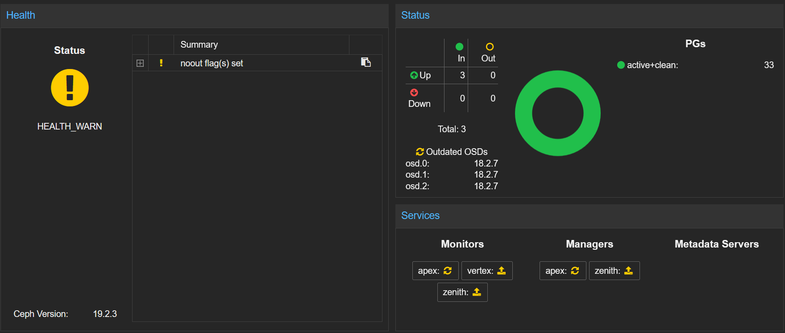
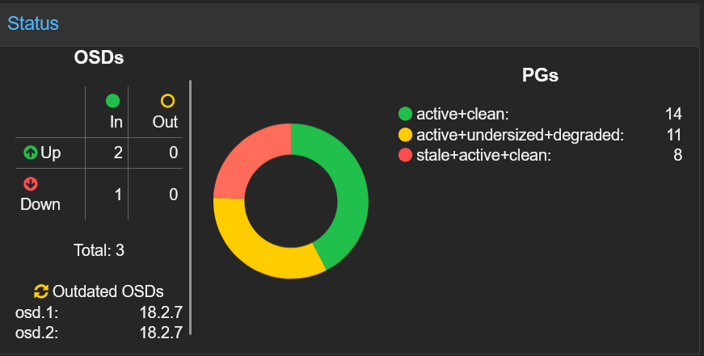

## Intro

Mon **cluster Proxmox VE** a presque un an maintenant, et je n’ai pas tenu les nœuds complètement à jour. Il est temps de m’en occuper et de le passer en Proxmox VE **9**.

Je recherche principalement les nouvelles règles d’affinité HA, mais voici les changements utiles apportés par cette version :
- Debian 13 "Trixie".
- Snapshots pour le stockage LVM partagé thick-provisioned.
- Fonctionnalité SDN fabrics.
- Interface mobile améliorée.
- Règles d’affinité dans le cluster HA.

Le cluster est composée de 3 nœuds, hautement disponible, avec une configuration hyper‑convergée, utilisant Ceph pour le stockage distribué.

Dans cet article, je décris les étapes de mise à niveau de mon cluster Proxmox VE, de la version 8 vers 9, tout en gardant les ressources actives. [Documentation officielle](https://pve.proxmox.com/wiki/Upgrade_from_8_to_9).

---
## Prérequis

Avant de se lancer dans la mise à niveau, passons en revue les prérequis :

1. Tous les nœuds mis à jour vers la dernière version Proxmox VE `8.4`.
2. Cluster Ceph mis à niveau vers Squid (`19.2`).
3. Proxmox Backup Server mis à jour vers la version 4.
4. Accès fiable au nœud.
5. Cluster en bonne santé.
6. Sauvegarde de toutes les VM et CT.
7. Au moins 5 Go libres sur `/`.

Remarques sur mon environnement :

- Les nœuds PVE sont en `8.3.2`, donc une mise à jour mineure vers 8.4 est d’abord requise.
- Ceph tourne sous Reef (`18.2.4`) et sera mis à niveau vers Squid après PVE 8.4.
- Je n’utilise pas PBS dans mon homelab, donc je peux sauter cette étape.
- J’ai plus de 10 Go disponibles sur `/` sur mes nœuds, c’est suffisant.
- Je n’ai qu’un accès console SSH, si un nœud ne répond plus je pourrais avoir besoin d’un accès physique.
- Une VM a un passthrough CPU (APU). Le passthrough empêche la migration à chaud, donc je supprime ce mapping avant la mise à niveau.
- Mettre les OSD Ceph en `noout` pendant la mise à niveau pour éviter le rebalancing automatique :
```bash
ceph osd set noout
```

### Mettre à Jour Proxmox VE vers 8.4.14

Le plan est simple, pour tous les nœuds, un par un :

1. Activer le mode maintenance
```bash
ha-manager crm-command node-maintenance enable $(hostname)
```

2. Mettre à jour le nœud
```bash
apt-get update
apt-get dist-upgrade -y
```

À la fin de la mise à jour, on me propose de retirer booloader, ce que j’exécute :
```plaintext
Removable bootloader found at '/boot/efi/EFI/BOOT/BOOTX64.efi', but GRUB packages not set up to update it!
Run the following command:

echo 'grub-efi-amd64 grub2/force_efi_extra_removable boolean true' | debconf-set-selections -v -u

Then reinstall GRUB with 'apt install --reinstall grub-efi-amd64'
```

3. Redémarrer la machine
```bash
reboot
```

4. Désactiver le mode maintenance
```bash
ha-manager crm-command node-maintenance disable $(hostname)
```

Entre chaque nœud, j’attends que le statut Ceph soit clean, sans alertes.

✅ À la fin, le cluster Proxmox VE est mis à jour vers `8.4.14`

### Mettre à Niveau Ceph de Reef vers Squid

Je peux maintenant passer à la mise à niveau de Ceph, la documentation Proxmox pour cette procédure est [ici](https://pve.proxmox.com/wiki/Ceph_Reef_to_Squid).

Mettre à jour les sources de paquets Ceph sur chaque nœud :
```bash
sed -i 's/reef/squid/' /etc/apt/sources.list.d/ceph.list
```

Mettre à niveau les paquets Ceph :
```
apt update
apt full-upgrade -y
```

Après la mise à niveau sur le premier nœud, la version Ceph affiche maintenant `19.2.3`, je peux voir mes OSD apparaître comme obsolètes, les moniteurs nécessitent soit une mise à niveau soit un redémarrage :


Je poursuis et mets à niveau les paquets sur les 2 autres nœuds.

J’ai un moniteur sur chaque nœud, donc je dois redémarrer chaque moniteur, un nœud à la fois :
```bash
systemctl restart ceph-mon.target
```

Je vérifie le statut Ceph entre chaque redémarrage :
```bash
ceph status
```

Une fois tous les moniteurs redémarrés, ils rapportent la dernière version, avec `ceph mon dump` :
- Avant : `min_mon_release 18 (reef)`
- Après : `min_mon_release 19 (squid)`

Je peux maintenant redémarrer les OSD, toujours un nœud à la fois. Dans ma configuration, j’ai un OSD par nœud :
```bash
systemctl restart ceph-osd.target
```

Je surveille le statut Ceph avec la WebGUI Proxmox. Après le redémarrage, elle affiche quelques couleurs fancy. J’attends juste que les PG redeviennent verts, cela prend moins d’une minute :


Un avertissement apparaît : `HEALTH_WARN: all OSDs are running squid or later but require_osd_release < squid`

Maintenant tous mes OSD tournent sous Squid, je peux fixer la version minimum à celle‑ci :
```bash
ceph osd require-osd-release squid
```

ℹ️ Je n’utilise pas actuellement CephFS donc je n’ai pas à me soucier du daemon MDS (MetaData Server).

✅ Le cluster Ceph a été mis à niveau avec succès vers Squid (`19.2.3`).

---
## Vérifications

Les prérequis pour mettre à niveau le cluster vers Proxmox VE 9 sont maintenant complets. Suis‑je prêt à mettre à niveau ? Pas encore.

Un petit programme de checklist nommé **`pve8to9`** est inclus dans les derniers paquets Proxmox VE 8.4. Le programme fournit des indices et des alertes sur les problèmes potentiels avant, pendant et après la mise à niveau. Pratique non ?

Lancer l’outil la première fois me donne des indications sur ce que je dois faire. Le script vérifie un certain nombre de paramètres, regroupés par thème. Par exemple, voici la section sur les Virtual Guest :
```plaintext
= VIRTUAL GUEST CHECKS =

INFO: Checking for running guests..
WARN: 1 running guest(s) detected - consider migrating or stopping them.
INFO: Checking if LXCFS is running with FUSE3 library, if already upgraded..
SKIP: not yet upgraded, no need to check the FUSE library version LXCFS uses
INFO: Checking for VirtIO devices that would change their MTU...
PASS: All guest config descriptions fit in the new limit of 8 KiB
INFO: Checking container configs for deprecated lxc.cgroup entries
PASS: No legacy 'lxc.cgroup' keys found.
INFO: Checking VM configurations for outdated machine versions
PASS: All VM machine versions are recent enough
```

À la fin, vous avez le résumé. L’objectif est de corriger autant de `FAILURES` et `WARNINGS` que possible :
```plaintext
= SUMMARY =

TOTAL:    57
PASSED:   43
SKIPPED:  7
WARNINGS: 2
FAILURES: 2
```

Passons en revue les problèmes qu’il a trouvés :

```
FAIL: 1 custom role(s) use the to-be-dropped 'VM.Monitor' privilege and need to be adapted after the upgrade
```

Il y a quelque temps, pour utiliser Terraform avec mon cluster Proxmox, j'ai créé un rôle dédié. C'était détaillé dans cet [article]().

Ce rôle utilise le privilège `VM.Monitor`, qui a été supprimé dans Proxmox VE 9. De nouveaux privilèges, sous `VM.GuestAgent.*`, existent à la place. Je supprime donc celui-ci et j'ajouterai les nouveaux une fois le cluster mis à niveau.

```
FAIL: systemd-boot meta-package installed. This will cause problems on upgrades of other boot-related packages. Remove 'systemd-boot' See https://pve.proxmox.com/wiki/Upgrade_from_8_to_9#sd-boot-warning for more information.
```

 Proxmox VE utilise généralement `systemd-boot` pour le démarrage uniquement dans certaines configurations gérées par proxmox-boot-tool. Le méta-paquet `systemd-boot` doit être supprimé. Ce paquet était automatiquement installé sur les systèmes de PVE 8.1 à 8.4, car il contenait `bootctl` dans Bookworm.

Si le script de la checklist pve8to9 le suggère, vous pouvez supprimer le méta-paquet `systemd-boot` sans risque, sauf si vous l'avez installé manuellement et que vous utilisez `systemd-boot` comme bootloader :
```bash
apt remove systemd-boot -y
```


```
WARN: 1 running guest(s) detected - consider migrating or stopping them.
```

Dans une configuration HA, avant de mettre à jour un nœud, je le mets en mode maintenance. Cela déplace automatiquement les ressources ailleurs. Quand ce mode est désactivé, la machine revient à son emplacement précédent.

```
WARN: The matching CPU microcode package 'amd64-microcode' could not be found! Consider installing it to receive the latest security and bug fixes for your CPU.
        Ensure you enable the 'non-free-firmware' component in the apt sources and run:
        apt install amd64-microcode
```

Il est recommandé d’installer le microcode processeur pour les mises à jour qui peuvent corriger des bogues matériels, améliorer les performances et renforcer la sécurité du processeur.

J’ajoute la source `non-free-firmware` aux sources actuelles :
```bash
sed -i '/^deb /{/non-free-firmware/!s/$/ non-free-firmware/}' /etc/apt/sources.list
```

Puis installe le paquet `amd64-microcode` :
```bash
apt update
apt install amd64-microcode -y
```

Après ces petits ajustements, suis‑je prêt ? Vérifions en relançant le script `pve8to9`.

⚠️ N’oubliez pas de lancer `pve8to9` sur tous les nœuds pour vous assurer que tout est OK.

---
## Mise à Niveau

🚀 Maintenant tout est prêt pour le grand saut ! Comme pour la mise à jour mineure, je procéderai nœud par nœud, en gardant mes VM et CT actives.

### Mettre le Mode Maintenance

D’abord, j’entre le nœud en mode maintenance. Cela déplacera la charge existante sur les autres nœuds :
```bash
ha-manager crm-command node-maintenance enable $(hostname)
```

Après avoir exécuté la commande, j’attends environ une minute pour laisser le temps aux ressources de migrer.

### Changer les Dépôts Sources vers Trixie

Depuis Debian Trixie, le format `deb822` est désormais disponible et recommandé pour les sources. Il est structuré autour d’un format clé/valeur. Cela offre une meilleure lisibilité et sécurité.

#### Sources Debian
```bash
cat > /etc/apt/sources.list.d/debian.sources << EOF
Types: deb deb-src
URIs: http://deb.debian.org/debian/
Suites: trixie trixie-updates
Components: main contrib non-free-firmware
Signed-By: /usr/share/keyrings/debian-archive-keyring.gpg

Types: deb deb-src
URIs: http://security.debian.org/debian-security/
Suites: trixie-security
Components: main contrib non-free-firmware
Signed-By: /usr/share/keyrings/debian-archive-keyring.gpg
EOF
```

#### Sources Proxmox (sans subscription)
```bash
cat > /etc/apt/sources.list.d/proxmox.sources << EOF
Types: deb 
URIs: http://download.proxmox.com/debian/pve
Suites: trixie
Components: pve-no-subscription
Signed-By: /usr/share/keyrings/proxmox-archive-keyring.gpg
EOF
```

#### Sources Ceph Squid (sans subscription)
```bash
cat > /etc/apt/sources.list.d/ceph.sources << EOF
Types: deb
URIs: http://download.proxmox.com/debian/ceph-squid
Suites: trixie
Components: no-subscription
Signed-By: /usr/share/keyrings/proxmox-archive-keyring.gpg
EOF
```

#### Supprimer les Anciennes Listes Bookworm

Les listes pour Debian Bookworm au format ancien doivent être supprimées :
```bash
rm -f /etc/apt/sources.list{,.d/*.list}
```

### Mettre à Jour les Dépôts `apt` Configurés

Rafraîchir les dépôts :  
```bash
apt update
```
```plaintext
Get:1 http://security.debian.org/debian-security trixie-security InRelease [43.4 kB]
Get:2 http://deb.debian.org/debian trixie InRelease [140 kB]                                                                       
Get:3 http://download.proxmox.com/debian/ceph-squid trixie InRelease [2,736 B]        
Get:4 http://download.proxmox.com/debian/pve trixie InRelease [2,771 B]               
Get:5 http://deb.debian.org/debian trixie-updates InRelease [47.3 kB]
Get:6 http://security.debian.org/debian-security trixie-security/main Sources [91.1 kB]
Get:7 http://security.debian.org/debian-security trixie-security/non-free-firmware Sources [696 B]
Get:8 http://security.debian.org/debian-security trixie-security/main amd64 Packages [69.0 kB]
Get:9 http://security.debian.org/debian-security trixie-security/main Translation-en [45.1 kB]
Get:10 http://security.debian.org/debian-security trixie-security/non-free-firmware amd64 Packages [544 B]
Get:11 http://security.debian.org/debian-security trixie-security/non-free-firmware Translation-en [352 B]
Get:12 http://download.proxmox.com/debian/ceph-squid trixie/no-subscription amd64 Packages [33.2 kB]
Get:13 http://deb.debian.org/debian trixie/main Sources [10.5 MB] 
Get:14 http://download.proxmox.com/debian/pve trixie/pve-no-subscription amd64 Packages [241 kB]
Get:15 http://deb.debian.org/debian trixie/non-free-firmware Sources [6,536 B]
Get:16 http://deb.debian.org/debian trixie/contrib Sources [52.3 kB]
Get:17 http://deb.debian.org/debian trixie/main amd64 Packages [9,669 kB]
Get:18 http://deb.debian.org/debian trixie/main Translation-en [6,484 kB]
Get:19 http://deb.debian.org/debian trixie/contrib amd64 Packages [53.8 kB]
Get:20 http://deb.debian.org/debian trixie/contrib Translation-en [49.6 kB]
Get:21 http://deb.debian.org/debian trixie/non-free-firmware amd64 Packages [6,868 B]
Get:22 http://deb.debian.org/debian trixie/non-free-firmware Translation-en [4,704 B]
Get:23 http://deb.debian.org/debian trixie-updates/main Sources [2,788 B]
Get:24 http://deb.debian.org/debian trixie-updates/main amd64 Packages [5,412 B]
Get:25 http://deb.debian.org/debian trixie-updates/main Translation-en [4,096 B]
Fetched 27.6 MB in 3s (8,912 kB/s)              
Reading package lists... Done
Building dependency tree... Done
Reading state information... Done
666 packages can be upgraded. Run 'apt list --upgradable' to see them.
```

😈 666 paquets, je suis condamné !

### Mise à Niveau vers Debian Trixie et Proxmox VE 9

Lancer la mise à niveau :
```bash
apt-get dist-upgrade -y
```

Pendant le processus, vous serez invité à approuver des changements de fichiers de configuration et certains redémarrages de services. Il se peut aussi que vous voyiez la sortie de certains changements, vous pouvez simplement en sortir en appuyant sur `q` :
- `/etc/issue` : Proxmox VE régénérera automatiquement ce fichier au démarrage -> `No`
- `/etc/lvm/lvm.conf` : Changements pertinents pour Proxmox VE seront mis à jour -> `Yes`
- `/etc/ssh/sshd_config` : Selon votre configuration -> `Inspect`
- `/etc/default/grub` : Seulement si vous l’avez modifié manuellement -> `Inspect`
- `/etc/chrony/chrony.conf` : Si vous n’avez pas fait de modifications supplémentaires -> `Yes`

La mise à niveau a pris environ 5 minutes, selon le matériel.

À la fin de la mise à niveau, redémarrez la machine :
```bash
reboot
```
### Sortir du Mode Maintenance

Enfin, quand le nœud (espérons‑le) est revenu, vous pouvez désactiver le mode maintenance. La charge qui était localisée sur cette machine reviendra :
```bash
ha-manager crm-command node-maintenance disable $(hostname)
```

### Validation Après Mise à Niveau

- Vérifier la communication du cluster :
```bash
pvecm status
```

- Vérifier les points de montage des stockages

- Vérifier la santé du cluster Ceph :
```bash
ceph status
```

- Confirmer les opérations VM, les sauvegardes et les groupes HA

Les groupes HA ont été retirés au profit des règles d’affinité HA. Les groupes HA sont automatiquement migrés en règles HA.  

- Désactiver le dépôt PVE Enterprise

Si vous n’utilisez pas le dépôt `pve-enterprise`, vous pouvez le désactiver :   `` ```
```bash
sed -i 's/^/#/' /etc/apt/sources.list.d/pve-enterprise.sources
```

🔁 Ce nœud est maintenant mis à niveau vers Proxmox VE 9. Procédez aux autres nœuds.

## Actions Postérieures

Une fois que tout le cluster a été mis à niveau, procédez aux actions postérieures :

- Supprimer le flag `noout` du cluster Ceph :
```bash
ceph osd unset noout
```

- Recréer les mappings PCI passthrough

Pour la VM pour laquelle j’ai retiré le mapping hôte au début de la procédure, je peux maintenant recréer le mapping.

- Ajouter les privilèges pour le rôle Terraform

Pendant la phase de vérification, il m’a été conseillé de supprimer le privilège `VM.Monitor` de mon rôle personnalisé pour Terraform. Maintenant que de nouveaux privilèges ont été ajoutés avec Proxmox VE 9, je peux les attribuer à ce rôle :
- VM.GuestAgent.Audit
- VM.GuestAgent.FileRead
- VM.GuestAgent.FileWrite
- VM.GuestAgent.FileSystemMgmt
- VM.GuestAgent.Unrestricted

## Conclusion

🎉 Mon cluster Proxmox VE est maintenant en version 9 !

Le processus de mise à niveau s’est déroulé assez tranquillement, sans aucune interruption pour mes ressources.

J’ai maintenant accès aux règles d’affinité HA, dont j’avais besoin pour mon cluster OPNsense.

Comme vous avez pu le constater, je ne maintiens pas mes nœuds à jour très souvent. Je pourrais automatiser cela la prochaine fois, pour les garder à jour sans effort.


