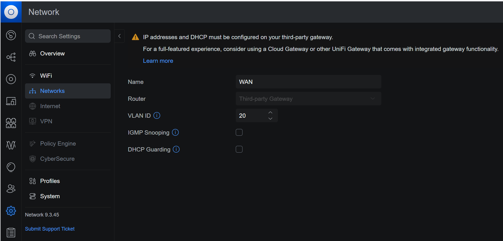
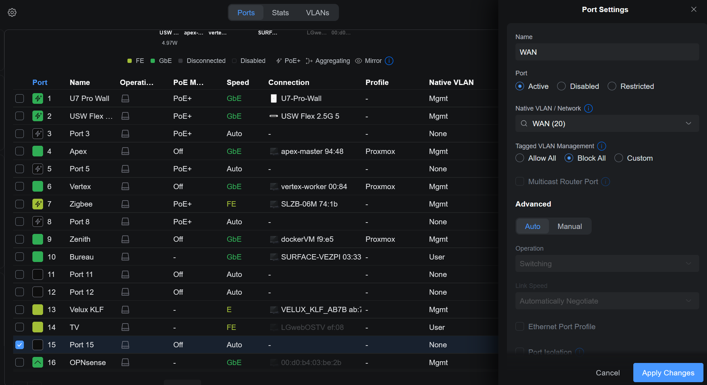
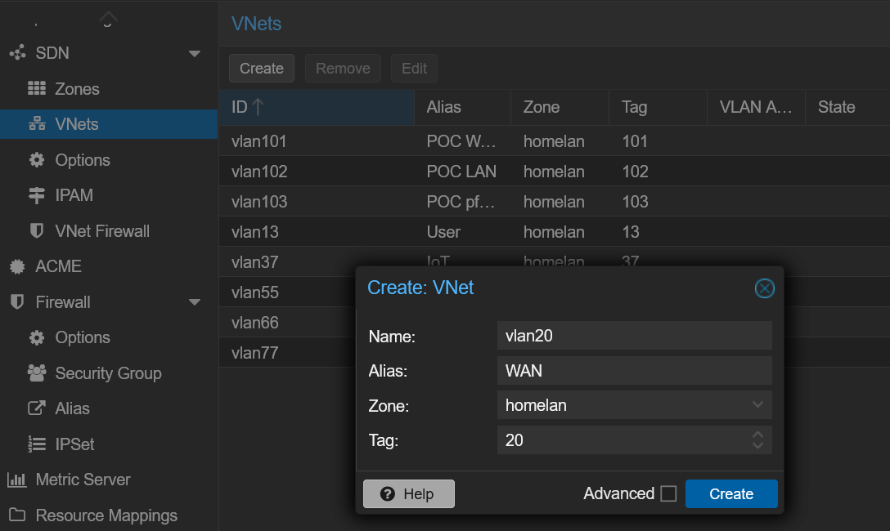
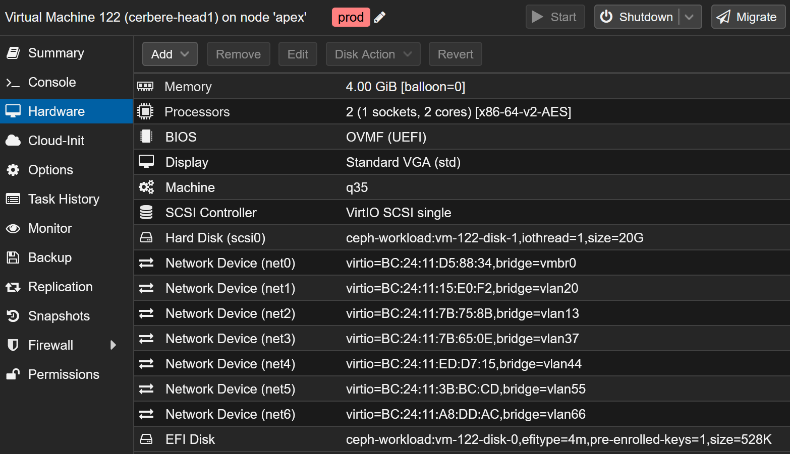
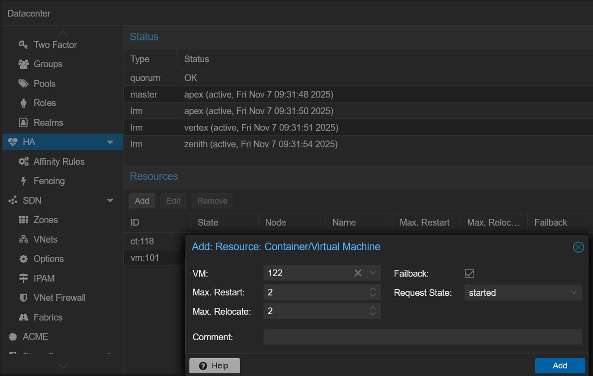
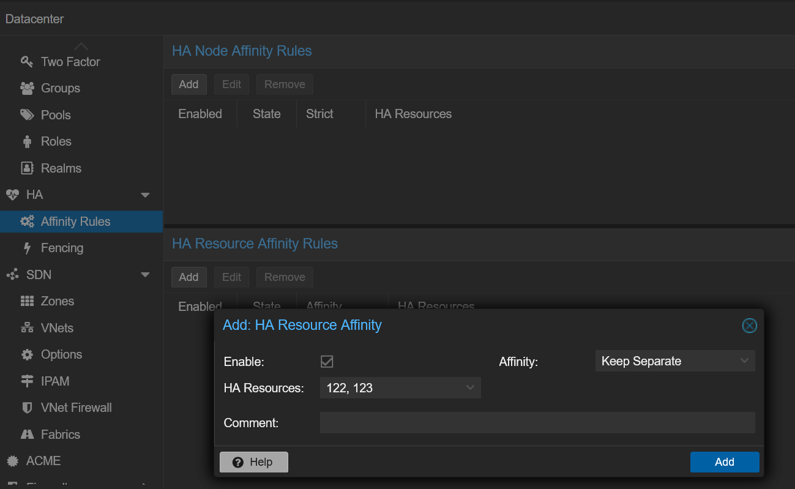
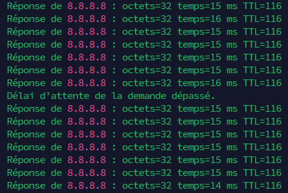

## Intro

C'est la dernière étape de mon aventure de virtualisation d'**OPNsense**.

Il y a quelques mois, ma [box OPNsense physique a crash]() à cause d'une défaillance matérielle. Cela a plongé ma maison dans le noir, littéralement. Pas de réseau, pas de lumières.

💡 Pour éviter de me retrouver à nouveau dans cette situation, j'ai imaginé un plan pour virtualiser mon pare-feu OPNsense dans mon cluster **Proxmox VE**. La dernière fois, j'avais mis en place un [proof of concept]() pour valider cette solution : créer un cluster de deux VM **OPNsense** dans Proxmox et rendre le firewall hautement disponible.

Cette fois, je vais couvrir la création de mon futur cluster OPNsense depuis zéro, planifier la bascule et finalement migrer depuis ma box physique actuelle. C'est parti !

---
## La Configuration VLAN

Pour mes plans, je dois connecter le WAN, provenant de ma box FAI, à mon switch principal. Pour cela je crée un VLAN dédié pour transporter ce flux jusqu'à mes nœuds Proxmox.

### UniFi

D'abord, je configure mon réseau de couche 2 qui est géré par UniFi. Là, je dois créer deux VLANs :

- _WAN_ (20) : transporte le WAN entre ma box FAI et mes nœuds Proxmox.
- _pfSync_ (44), communication entre mes nœuds OPNsense.

Dans le contrôleur UniFi, dans `Paramètres` > `Réseaux`, j'ajoute un `New Virtual Network`. Je le nomme `WAN` et lui donne l'ID VLAN 20 :


Je fais la même chose pour le VLAN `pfSync` avec l'ID VLAN 44.

Je prévois de brancher ma box FAI sur le port 15 de mon switch, qui est désactivé pour l'instant. Je l'active, définis le VLAN natif sur le nouveau `WAN (20)` et désactive le trunking :


Une fois ce réglage appliqué, je m'assure que seules les ports où sont connectés mes nœuds Proxmox propagent ces VLANs sur leur trunk.

J'ai fini la configuration UniFi.

### Proxmox SDN

Maintenant que le VLAN peut atteindre mes nœuds, je veux le gérer dans le SDN de Proxmox. J'ai configuré le SDN dans [cet article]().

Dans `Datacenter` > `SDN` > `VNets`, je crée un nouveau VNet, je l'appelle `vlan20` pour suivre ma propre convention de nommage, je lui donne l'alias _WAN_ et j'utilise le tag (ID VLAN) 20 :


Je crée aussi le `vlan44` pour le VLAN _pfSync_, puis j'applique cette configuration et nous avons terminé avec le SDN.

---
## Création des VMs

Maintenant que la configuration VLAN est faite, je peux commencer à construire les machines virtuelles sur Proxmox.

La première VM s'appelle `cerbere-head1` (je ne vous l'ai pas dit ? Mon firewall actuel s'appelle `cerbere`, ça a encore plus de sens maintenant !). Voici les réglages :
- **Type d'OS** : Linux (même si OPNsense est basé sur FreeBSD)
- **Type de machine** : `q35`
- **BIOS** : `OVMF (UEFI)`
- **Disque** : 20 Go sur stockage Ceph distribué
- **RAM** : 4 Go, ballooning désactivé
- **CPU** : 2 vCPU
- **NICs**, pare-feu désactivé :
    1. `vmbr0` (_Mgmt_)
    2. `vlan20` (_WAN_)
    3. `vlan13` _(User)_
    4. `vlan37` _(IoT)_
    5. `vlan44` _(pfSync)_
    6. `vlan55` _(DMZ)_
    7. `vlan66` _(Lab)_



ℹ️ Maintenant je clone cette VM pour créer `cerbere-head2`, puis je procède à l'installation d'OPNsense. Je ne veux pas entrer trop dans les détails de l'installation d'OPNsense, je l'ai déjà documentée dans le [proof of concept]().

Après l'installation des deux instances OPNsense, j'attribue à chacune leur IP sur le réseau _Mgmt_ :
- `cerbere-head1` : `192.168.88.2/24`
- `cerbere-head2` : `192.168.88.3/24`

Tant que ces routeurs ne gèrent pas encore les réseaux, je leur donne comme passerelle mon routeur OPNsense actuel (`192.168.88.1`) pour me permettre de les atteindre depuis mon portable dans un autre VLAN.

---
## Configuration d'OPNsense

Initialement, j'envisageais de restaurer ma configuration OPNsense existante et de l'adapter à l'installation.

Puis j'ai décidé de repartir de zéro pour documenter et partager la procédure. Cette partie devenant trop longue, j'ai préféré créer un article dédié.

📖 Vous pouvez trouver les détails de la configuration complète d'OPNsense dans cet [article](), couvrant HA, DNS, DHCP, VPN et reverse proxy.

---
## VM Proxmox Hautement Disponible

Les ressources (VM ou LXC) dans Proxmox VE peuvent être marquées comme hautement disponibles, voyons comment les configurer.

### Prérequis pour la HA Proxmox

D'abord, votre cluster Proxmox doit le permettre. Il y a quelques exigences :

- Au moins 3 nœuds pour avoir le quorum
- Stockage partagé pour vos ressources
- Horloge synchronisée
- Réseau fiable

Un mécanisme de fencing doit être activé. Le fencing est le processus d'isoler un nœud de cluster défaillant pour s'assurer qu'il n'accède plus aux ressources partagées. Cela évite les situations de split-brain et permet à Proxmox HA de redémarrer en toute sécurité les VM affectées sur des nœuds sains. Par défaut, il utilise le watchdog logiciel Linux, _softdog_, suffisant pour moi.

Dans Proxmox VE 8, il était possible de créer des groupes HA, en fonction de leurs ressources, emplacements, etc. Cela a été remplacé, dans Proxmox VE 9, par des règles d'affinité HA. C'est la raison principale derrière la mise à niveau de mon cluster Proxmox VE, que j'ai détaillée dans ce [post]().

### Configurer la HA pour les VM

Le cluster Proxmox est capable de fournir de la HA pour les ressources, mais vous devez définir les règles.

Dans `Datacenter` > `HA`, vous pouvez voir le statut et gérer les ressources. Dans le panneau `Resources` je clique sur `Add`. Je dois choisir la ressource à configurer en HA dans la liste, ici `cerbere-head1` avec l'ID 122. Puis dans l'infobulle je peux définir le maximum de redémarrages et de relocations, je laisse `Failback` activé et l'état demandé à `started` :


Le cluster Proxmox s'assurera maintenant que cette VM est démarrée. Je fais de même pour l'autre VM OPNsense, `cerbere-head2`.

### Règles d'Affinité HA

Super, mais je ne veux pas qu'elles tournent sur le même nœud. C'est là qu'intervient la nouvelle fonctionnalité des règles d'affinité HA de Proxmox VE 9. Proxmox permet de créer des règles d'affinité de nœud et de ressource. Peu m'importe sur quel nœud elles tournent, mais je ne veux pas qu'elles soient ensemble. J'ai besoin d'une règle d'affinité de ressource.

Dans `Datacenter` > `HA` > `Affinity Rules`, j'ajoute une nouvelle règle d'affinité de ressource HA. Je sélectionne les deux VMs et choisis l'option `Keep Separate` :


✅ Mes VMs OPNsense sont maintenant entièrement prêtes !

---
## Migration

🚀 Il est temps de rendre cela réel !

Je ne vais pas mentir, je suis assez excité. Je travaille pour ce moment depuis des jours.

### Le Plan de Migration

Ma box OPNsense physique est directement connectée à ma box FAI. Je veux la remplacer par le cluster de VM. (Pour éviter d'écrire le mot OPNsense à chaque ligne, j'appellerai simplement l'ancienne instance "la box" et la nouvelle "la VM" )

Voici le plan :
1. Sauvegarde de la configuration de la box.
2. Désactiver le serveur DHCP sur la box.
3. Changer les adresses IP de la box.
4. Changer les VIP sur la VM.
5. Désactiver la passerelle sur la VM.
6. Configurer le DHCP sur les deux VMs.
7. Activer le répéteur mDNS sur la VM.
8. Répliquer les services sur la VM.
9. Déplacement du câble Ethernet.

### Stratégie de Retour Arrière

Aucune. 😎

Je plaisante, le retour arrière consiste à restaurer la configuration de la box, arrêter les VMs OPNsense et rebrancher le câble Ethernet dans la box.

### Plan de vérification

Pour valider la migration, je dresse une checklist :
1. Bail DHCP WAN dans la VM.
2. Ping depuis mon PC vers le VIP du VLAN User.
3. Ping entre les VLANs.
4. SSH vers mes machines.
5. Renouveler le bail DHCP.
6. Vérifier `ipconfig`
7. Tester l'accès à des sites internet.
8. Vérifier les logs du pare-feu.
9. Vérifier mes services web.
10. Vérifier que mes services internes ne sont pas accessibles depuis l'extérieur.
11. Tester le VPN.
12. Vérifier tous les appareils IoT.
13. Vérifier les fonctionnalités Home Assistant.
14. Vérifier que la TV fonctionne.
15. Tester le Chromecast.
16. Imprimer quelque chose.
17. Vérifier la blocklist DNS.
18. Speedtest.
19. Bascule.
20. Failover.
21. Reprise après sinistre.
22. Champagne !

Est-ce que ça va marcher ? On verra bien !

### Étapes de Migration

1. **Sauvegarde de la configuration de la box.**

Sur mon instance OPNsense physique, dans `System` > `Configuration` > `Backups`, je clique sur le bouton `Download configuration` qui me donne le précieux fichier XML. Celui qui m'a sauvé la mise la [dernière fois]().

2. **Désactiver le serveur DHCP sur la box.**

Dans `Services` > `ISC DHCPv4`, et pour toutes mes interfaces, je désactive le serveur DHCP. Je ne fournis que du DHCPv4 dans mon réseau.

3. **Changer les adresses IP de la box.**

Dans `Interfaces`, et pour toutes mes interfaces, je modifie l'IP du firewall, de `.1` à `.253`. Je veux réutiliser la même adresse IP comme VIP, et garder cette instance encore joignable si besoin.

Dès que je clique sur `Apply`, je perds la communication, ce qui est attendu.

4. **Changer les VIP sur la VM.**

Sur ma VM maître, dans `Interfaces` > `Virtual IPs` > `Settings`, je change l'adresse VIP pour chaque interface et la mets en `.1`.

5. **Désactiver la passerelle sur la VM.**

Dans `System` > `Gateways` > `Configuration`, je désactive `LAN_GW` qui n'est plus nécessaire.

6. **Configurer le DHCP sur les deux VMs.**

Sur les deux VMs, dans `Services` > `Dnsmasq DNS & DHCP`, j'active le service sur mes 5 interfaces.

7. **Activer le répéteur mDNS sur la VM.**

Dans `Services` > `mDNS Repeater`, j'active le service et j'active aussi le `CARP Failover`.

Le service ne démarre pas. Je verrai ce problème plus tard.

8. **Répliquer les services sur la VM.**

Dans `Système` > `High Availability` > `Status`, je clique sur le bouton `Synchronize and reconfigure all`.

9. **Déplacement du câble Ethernet.**

Physiquement dans mon rack, je débranche le câble Ethernet du port WAN (`igc0`) de ma box OPNsense physique et je le branche sur le port 15 de mon switch UniFi.

---
## Vérification

😮‍💨 Je prends une grande inspiration et commence la phase de vérification.

### Checklist

- ✅ Bail DHCP WAN dans la VM.
- ✅ Ping depuis mon PC vers le VIP du VLAN User.
- ⚠️ Ping entre VLANs.  
    Les pings fonctionnent, mais j'observe quelques pertes, environ 10 %.
- ✅ SSH vers mes machines.
- ✅ Renouvellement du bail DHCP.
- ✅ Vérifier `ipconfig`
- ❌ Tester un site internet. → ✅  
Quelques sites fonctionnent, tout est incroyablement lent... Ça doit être le DNS. J'essaie de résoudre un domaine au hasard, ça marche. Mais je ne peux pas résoudre `google.com`. Je redémarre le service Unbound DNS, tout fonctionne maintenant. C'est toujours le DNS...
- ⚠️ Vérifier les logs du pare-feu.  
Quelques flux sont bloqués, pas critique.
- ✅ Vérifier mes services web.
- ✅ Vérifier que mes services internes ne sont pas accessibles depuis l'extérieur.
- ✅ Tester le VPN.
- ✅ Vérifier tous les appareils IoT.
- ✅ Vérifier les fonctionnalités Home Assistant.
- ✅ Vérifier que la TV fonctionne.
- ❌ Tester le Chromecast.  
C'est lié au service mDNS qui ne parvient pas à démarrer. Je peux le démarrer si je décoche l'option `CARP Failover`. Le Chromecast est visible maintenant. → ⚠️
- ✅ Imprimer quelque chose.
- ✅ Vérifier la blocklist DNS.
- ✅ Speedtest.  
J'observe environ 15 % de diminution de bande passante (de 940Mbps à 825Mbps).
- ❌ Bascule.  
La bascule fonctionne difficilement, beaucoup de paquets perdus pendant la bascule. Le service rendu n'est pas génial : plus d'accès internet et mes services web sont inaccessibles.
- ⌛ Failover.
- ⌛ Reprise après sinistre.  
À tester plus tard.

📝 Bon, les résultats sont plutôt bons, pas parfaits, mais satisfaisants !
### Résolution des Problèmes

Je me concentre sur la résolution des problèmes restants rencontrés lors des tests.

1. **DNS**

Lors de la bascule, la connexion internet ne fonctionne pas. Pas de DNS, c'est toujours le DNS.

C'est parce que le nœud de secours n'a pas de passerelle lorsqu'il est en mode passif. L'absence de passerelle empêche le DNS de résoudre. Après la bascule, il conserve des domaines non résolus dans son cache. Ce problème conduit aussi à un autre souci : quand il est passif, je ne peux pas mettre à jour le système.

**Solution** : Définir une passerelle pointant vers l'autre nœud, avec un numéro de priorité plus élevé que la passerelle WAN (un numéro plus élevé signifie une priorité plus basse). Ainsi, cette passerelle n'est pas active tant que le nœud est maître.

2. **Reverse Proxy**

Lors de la bascule, tous les services web que j'héberge (reverse proxy/proxy couche 4) renvoient cette erreur : `SSL_ERROR_INTERNAL_ERROR_ALERT`. Après vérification des services synchronisés via XMLRPC Sync, Caddy et mDNS repeater n'étaient pas sélectionnés. C'est parce que ces services ont été installés après la configuration initiale du HA.

**Solution** : Ajouter Caddy à XMLRPC Sync.

3. **Pertes de paquets**

J'observe environ 10 % de pertes de paquets pour les pings depuis n'importe quel VLAN vers le VLAN _Mgmt_. Je n'ai pas ce problème pour les autres VLANs.

Le VLAN _Mgmt_ est le VLAN natif dans mon réseau, cela pourrait être la raison de ce problème. C'est le seul réseau non défini dans le SDN Proxmox. Je ne veux pas avoir à tagger ce VLAN.

**Solution** : Désactiver le pare-feu Proxmox de cette interface pour la VM. En réalité, je les ai tous désactivés et mis à jour la documentation ci-dessus. Je ne sais pas exactement pourquoi cela causait ce type de problème, mais la désactivation a résolu mon souci (j'ai pu reproduire le comportement en réactivant le pare-feu).

4. **Script CARP**

Lors de la bascule, le script d'événement CARP est déclenché autant de fois qu'il y a d'interfaces. J'ai 5 IPs virtuelles, le script reconfigure mon interface WAN 5 fois.

**Solution** : Retravailler le script pour récupérer l'état de l'interface WAN et ne reconfigurer l'interface que lorsque c'est nécessaire :
```php
#!/usr/local/bin/php
<?php
/**
 * OPNsense CARP event script
 * - Enables/disables the WAN interface only when needed
 * - Avoids reapplying config when CARP triggers multiple times
 */

require_once("config.inc");
require_once("interfaces.inc");
require_once("util.inc");
require_once("system.inc");

// Read CARP event arguments
$subsystem = !empty($argv[1]) ? $argv[1] : '';
$type = !empty($argv[2]) ? $argv[2] : '';

// Accept only MASTER/BACKUP events
if (!in_array($type, ['MASTER', 'BACKUP'])) {
    // Ignore CARP INIT, DEMOTED, etc.
    exit(0);
}

// Validate subsystem name format, expected pattern: <ifname>@<vhid>
if (!preg_match('/^[a-z0-9_]+@\S+$/i', $subsystem)) {
    log_error("Malformed subsystem argument: '{$subsystem}'.");
    exit(0);
}

// Interface key to manage
$ifkey = 'wan';
// Determine whether WAN interface is currently enabled
$ifkey_enabled = !empty($config['interfaces'][$ifkey]['enable']) ? true : false;

// MASTER event
if ($type === "MASTER") {
    // Enable WAN only if it's currently disabled
    if (!$ifkey_enabled) {
        log_msg("CARP event: switching to '$type', enabling interface '$ifkey'.", LOG_WARNING);
        $config['interfaces'][$ifkey]['enable'] = '1';
        write_config("enable interface '$ifkey' due CARP event '$type'", false);
        interface_configure(false, $ifkey, false, false);
    } else {
        log_msg("CARP event: already '$type' for interface '$ifkey', nothing to do.");
    }

// BACKUP event
} else {
    // Disable WAN only if it's currently enabled
    if ($ifkey_enabled) {
        log_msg("CARP event: switching to '$type', disabling interface '$ifkey'.", LOG_WARNING);
        unset($config['interfaces'][$ifkey]['enable']);
        write_config("disable interface '$ifkey' due CARP event '$type'", false);
        interface_configure(false, $ifkey, false, false);
    } else {
        log_msg("CARP event: already '$type' for interface '$ifkey', nothing to do.");
    }
}
```

5. **mDNS Repeater**

Le répéteur mDNS ne veut pas démarrer quand je sélectionne l'option `CARP Failover`.

**Solution** : La machine nécessite un redémarrage pour démarrer ce service compatible CARP.

6. **Adresse IPv6**

Mon nœud `cerbere-head1` crie dans le fichier de logs tandis que l'autre ne le fait pas. Voici les messages affichés chaque seconde quand il est maître :
```plaintext
Warning rtsold <interface_up> vtnet1 is disabled. in the logs (OPNsense)
```

Un autre message que j'ai plusieurs fois après un switchback :
```plaintext
Error dhcp6c transmit failed: Can't assign requested address
```

Ceci est lié à IPv6. J'observe que mon nœud principal n'a pas d'adresse IPv6 globale, seulement une link-local. De plus, il n'a pas de passerelle IPv6. Mon nœud secondaire, en revanche, a à la fois l'adresse globale et la passerelle.

Je ne suis pas expert IPv6, après quelques heures de recherche, j'abandonne IPv6. Si quelqu'un peut m'aider, ce serait vraiment apprécié !

**Contournement** : Supprimer DHCPv6 pour mon interface WAN.

### Confirmation

Maintenant que tout est corrigé, je peux évaluer les performances du failover.

1. **Basculement**

En entrant manuellement en mode maintenance CARP depuis l'interface WebGUI, aucune perte de paquets n'est observée. Impressionnant.

2. **Failover**

Pour simuler un failover, je tue la VM OPNsense active. Ici j'observe une seule perte de paquet. Génial.



3. **Reprise après sinistre**

Une reprise après sinistre est ce qui se produirait après un arrêt complet d'un cluster Proxmox, suite à une coupure de courant par exemple. Je n'ai pas eu le temps (ni le courage) de m'en occuper, je préfère mieux me préparer pour éviter les dommages collatéraux. Mais il est certain que ce genre de scénario doit être évalué.

### Avantages Supplémentaires

Outre le fait que cette nouvelle configuration est plus résiliente, j'ai constaté quelques autres avantages.

Mon rack est minuscule et l'espace est restreint. L'ensemble chauffe beaucoup, dépassant les 40 °C au sommet du rack en été. Réduire le nombre de machines allumées a permis de faire baisser la température. J'ai gagné 1,5 °C après avoir éteint l'ancien boîtier OPNsense, c'est super !

La consommation électrique est également un point important, mon petit datacenter consommait en moyenne 85 W. Là encore, j'ai constaté une légère baisse, d'environ 8 W. Sachant que le système fonctionne 24/7, ce n'est pas négligeable.

Enfin, j'ai également retiré le boîtier lui-même et le câble d'alimentation. Les places sont très limitées, ce qui est un autre point positif.

---
## Conclusion

🎉 J'ai réussi les gars ! Je suis très fier du résultat, et fier de moi.

De mon [premier crash de ma box OPNsense](), à la recherche d'une solution, en passant par la [proof of concept]() de haute disponibilité, jusqu'à cette migration, ce fut un projet assez long, mais extrêmement intéressant.

🎯 Se fixer des objectifs, c'est bien, mais les atteindre, c'est encore mieux.

Je vais maintenant mettre OPNsense de côté un petit moment pour me recentrer sur mon apprentissage de Kubernetes !

Comme toujours, si vous avez des questions, des remarques ou une solution à mon problème d'IPv6, je serai ravi de vous aider.