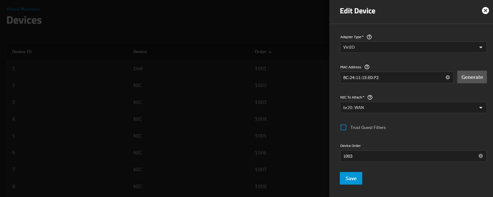

## Intro

Mon réseau homelab est géré par un cluster OPNsense composé de deux nœuds VM. Ces deux VM fonctionnent dans mon cluster Proxmox VE. Vous pouvez trouver les détails dans cet [article]().

Cette configuration fonctionne bien la plupart du temps. Le problème concerne plutôt les rares cas où le cluster Proxmox lui-même est arrêté. Quand cela arrive, les deux nœuds OPNsense sont indisponibles en même temps, ce qui signifie qu’il ne me reste aucun routeur, donc aucun réseau du tout.

Récemment, j’ai installé un serveur TrueNAS dans le lab, que j'ai documenté dans ce [post](). Il est principalement là pour agir comme NAS, mais il pourrait aussi héberger des machines virtuelles. Cela me donne une bonne opportunité d’améliorer la résilience de mon réseau sans changer toute la conception.

💡 L’idée est simple : garder le nœud OPNsense actif sur Proxmox, mais déplacer le nœud passif vers TrueNAS.

De cette façon, si le cluster Proxmox tombe, le nœud OPNsense passif peut toujours prendre le relais et garder le réseau fonctionnel.

---
## Préparer les nœuds OPNsense

Avant de déplacer quoi que ce soit, je veux m’assurer que les VM OPNsense peuvent fonctionner avec moins de mémoire.

Le serveur TrueNAS n’a pas autant de RAM disponible que le cluster Proxmox, donc la première étape est de réduire l’allocation mémoire des nœuds OPNsense au minimum.

Je commence avec le nœud passif, `cerbere-head2` :

- Éteindre le nœud passif
- Réduire son allocation mémoire de 4 à 2GB
- Le redémarrer
- Vérifier la santé du cluster
- Basculer le service vers le nœud passif
- Exécuter des vérifications réseau

Ensuite, je répète la même opération sur le nœud actif, `cerbere-head1`.

Le faire un nœud à la fois me permet de garder le cluster HA en bonne santé tout en validant que l’allocation mémoire réduite est toujours suffisante pour ma configuration.

---
## Préparer le réseau TrueNAS

La partie la plus importante de cette migration n’est pas l’export du disque ni la création de la VM. C’est le réseau.

Une VM OPNsense n’est pas un simple serveur avec une seule interface de management. Elle a besoin d’accéder à plusieurs réseaux, incluant le management, le WAN, les réseaux utilisateurs, l’IoT, pfSync, la DMZ et les réseaux lab.

Du côté TrueNAS, je commence depuis `System` > `Network` et j’ajoute des interfaces VLAN.

La première est le VLAN utilisateur :

- Type : `VLAN`
- Nom : `vlan13`
- Description : `User`
- Interface parente : `enp1s0`
- Tag VLAN : `13`


J’ajoute ensuite les autres VLANs de la même manière.

TrueNAS n’applique pas les changements réseau directement. Il donne l’option de tester les changements d’abord, avec une courte fenêtre de validation. Si la configuration n’est pas confirmée à temps, il revient automatiquement en arrière.

C’est vraiment pratique lorsqu’on change la configuration réseau de la machine à laquelle on est actuellement connecté.


Pour le réseau de management, j’ai créé un bridge appelé `br1`.

Ce bridge porte la configuration IP de management de TrueNAS à la place de l’interface physique `enp1s0`, parce qu’elle doit aussi être partagée avec la VM OPNsense.


Après cela, je retire la configuration IP de l’interface physique et je la garde sur le bridge.


J’ai initialement essayé d’utiliser DHCP pour le bridge de management après avoir mis à jour l’adresse MAC dans Dnsmasq, mais j’ai finalement décidé de garder une adresse IP statique pour TrueNAS. Après certains changements réseau, DHCP a donné une autre adresse du pool, donc l’adressage statique était l’option la plus sûre et la plus simple pour ce serveur.

Pour la VM OPNsense, je crée un bridge pour chaque VLAN. Par exemple, `br13` utilise `vlan13`, je déplace aussi la description, comme `User`, de l’interface VLAN vers le bridge pour plus de clarté.

La configuration réseau finale de TrueNAS :


---
## Créer un dataset d’export temporaire

Pour déplacer le disque de la VM OPNsense passive de Proxmox vers TrueNAS, j’ai d’abord besoin d’un endroit pour exporter l’image disque.

Dans TrueNAS, je crée un dataset nommé `storage/vm/disk`, puis je crée un partage NFS à partir de celui-ci.

Dans les options avancées du partage NFS, j’ai configuré :

- Utilisateur Maproot : `root`
- Hôtes autorisés :
  - `192.168.88.21`
  - `192.168.88.22`
  - `192.168.88.23`

Ce sont les nœuds Proxmox VE autorisés à monter le partage.

Je ne crée pas manuellement de zvol à ce moment-là. Le processus de création de VM dans TrueNAS gère l’import et la conversion du disque.

---
## Exporter le disque de la VM depuis Proxmox

Depuis l’interface web Proxmox VE, je localise le nœud qui héberge la VM OPNsense passive `cerbere-head2`, elle fonctionne sur `Zenith`.

Je me connecte à ce nœud Proxmox en SSH et je monte le partage NFS depuis TrueNAS :

```bash
mount granite.mgmt.vezpi.com:/mnt/storage/vm/disk /mnt
```

Ensuite, j’éteins la VM depuis l’interface Proxmox VE. Je ne l’éteins pas depuis l’intérieur d’OPNsense parce que la VM a la HA activée.

Une fois la VM arrêtée, j’exporte le disque principal en qcow2. Je n’exporte pas le disque EFI.

```bash
qemu-img convert -f raw -O qcow2 -p \
         rbd:ceph-workload/vm-123-disk-1 \
         /mnt/cerbere-head2.qcow2
```

La conversion a pris environ une minute pour un disque de 20 GB.

À ce stade, le disque OPNsense passif est disponible sur TrueNAS et prêt à être importé dans une nouvelle VM.

---
## Recréer la VM OPNsense dans TrueNAS

L’étape suivante consiste à recréer la VM OPNsense passive dans TrueNAS avec des paramètres correspondant aussi étroitement que possible à la VM d’origine.

Depuis l’interface web TrueNAS, je vais dans la section `Virtual Machines`.


Je crée une nouvelle VM avec ces paramètres.

Pour le système d’exploitation :

- Système d’exploitation invité : `FreeBSD`
- Nom : `cerberehead2`
- Horloge système : `Local`
- Méthode de démarrage : `UEFI`
- Activer Secure Boot : désactivé
- Activer Trusted Platform Module : désactivé
- Timeout d’arrêt : `90`
- Démarrer au boot : activé
- Activer l’affichage VNC : désactivé

Le nom de la VM n’utilise pas de tirets parce que TrueNAS ne les autorise pas ici.

Pour le CPU et la mémoire :

- CPU virtuels : `1`
- Cœurs : `2`
- Threads : `1`
- Mode CPU : `Custom`
- Modèle CPU : `qemu64`
- Taille mémoire : `2 GiB`

Pour le disque :

- Créer une nouvelle image disque
- Importer une image : activé
- Source de l’image : `/mnt/storage/vm/files/cerbere-head2.qcow2`
- Type de disque : `VirtIO`
- Emplacement de stockage : `storage/vm`
- Taille : `20 GiB`

Pour la première interface réseau :

- Type d’adaptateur : `VirtIO`
- Adresse MAC : garder celle proposée
- Attacher la NIC : `br1: Mgmt`

Je passe le média d’installation et la configuration GPU, puis je confirme le résumé.


Après confirmation, TrueNAS convertit l’image qcow2 importée en zvol.


Une fois la VM créée, j’ouvre les détails de la VM et j’ajoute les NICs restantes.


Pour chaque NIC supplémentaire, j’ai utilisé VirtIO comme type d’adaptateur et je l’ai attachée au bridge correspondant.

Pour la NIC WAN, je copie l’ancienne adresse MAC parce que j’utilise une astuce avec une seule adresse IP WAN. J’incrémente aussi le chiffre dans l’ordre des périphériques pour garder le même que dans Proxmox.



🎉 Enfin, je peux démarrer la VM OPNsense dans TrueNAS.


---
## Valider le cluster HA

Une fois que le nœud passif fonctionne sur TrueNAS, je dois valider que le cluster HA OPNsense se comporte toujours correctement.

Je commence par des vérifications de base sur le nœud passif :

- Ping de l’interface de management depuis le bastion : `192.168.88.3`
- Ping de l’interface utilisateur depuis un laptop : `192.168.13.3`
- Ping de l’interface IoT : `192.168.37.3`
- Ping pfSync depuis l’autre nœud : `192.168.44.2`
- Ping de l’interface DMZ : `192.168.55.3`
- Ping de l’interface Lab depuis DockerVM : `192.168.66.3`

Je vérifie aussi que le nœud était accessible en SSH depuis mon laptop en utilisant `192.168.13.3`, et que l’interface web était joignable à :

```text
https://192.168.13.3:4443
```

Ensuite, je valide l’état HA d’OPNsense :

- Le statut des VIP CARP doit être `BACKUP` sur toutes les VIP
- La page de statut HA doit montrer que le nœud actif peut se connecter au nœud passif
- Les services doivent fonctionner comme attendu
- La synchronisation des services HA doit fonctionner
- Les vérifications de mise à jour du firmware doivent être accessibles

Depuis le nœud actif, j’utilise la page de statut HA et je force une synchronisation complète avec `Synchronize and reconfigure all`.

---
## Tests de bascule contrôlée

Avant de tester le failover, je démarre une session SSH vers `dockerVM` pour confirmer que les états du firewall sont préservés entre les nœuds. Je démarre aussi un ping depuis un laptop vers `192.168.37.120`.

Pour le test de bascule contrôlée, j’active proprement le mode maintenance sur le nœud master.

Le nouveau nœud passif devient `MASTER`, et je valide les services importants :

- Routage VLAN supplémentaire avec un ping vers `192.168.37.120`
- Accès WAN avec un ping vers `8.8.8.8`
- États du firewall en gardant la session SSH active
- Résolution DNS externe avec `host redhat.com`
- Résolution DNS interne avec `host SLZB-06M.mgmt.vezpi.com`
- Accès à une page internet aléatoire
- Reverse proxy Caddy
- Proxy layer4 Caddy
- Accès Wireguard depuis l’extérieur
- mDNS en vérifiant si l’imprimante est apparue

✅ La bascule contrôlée est réussie.

---
## Tests de failover

Après le test de bascule contrôlée propre, je teste un scénario de failover plus direct en forçant un poweroff du nœud actif.

J’ai répété la même checklist de validation.

✅ Le failover est réussi.

Enfin, je redémarre la VM OPNsense active.

🎯 À ce stade, le cluster HA OPNsense est de nouveau opérationnel, avec le nœud passif qui fonctionne maintenant sur TrueNAS au lieu de Proxmox.

---
## Conclusion

Cette migration est une petite mais importante amélioration pour mon homelab.

Avant, les deux nœuds OPNsense dépendaient du cluster Proxmox VE. Si le cluster était arrêté, toute ma couche de routage réseau était arrêtée avec lui.

Maintenant, le nœud actif fonctionne toujours sur Proxmox, mais le nœud passif fonctionne sur TrueNAS. Cela me donne une meilleure séparation entre le cluster de virtualisation et la couche de failover réseau.

Petit disclaimer, bien que TrueNAS offre des fonctionnalités de virtualisation, il n’est pas comparable à Proxmox VE en termes de clustering et de capacités de gestion d’infrastructure.

Une note à propos de QEMU Guest Agent, la VM OPNsense avait déjà QEMU Guest Agent installé avant l’export. Dans cette configuration, il ne semble pas utile parce que TrueNAS ne l’a pas implémenté comme fonctionnalité d’hyperviseur. Je l’ai gardé installé quand même, parce qu’il est inoffensif.