## Intro

My router is the heart of my homelab. When it’s down, everything is down: internet, DNS, VLAN firewall, reverse proxy… the whole stack.

I’m running an [[OPNsense]] HA cluster made of **two virtual machines** inside my [[Proxmox]] VE cluster. It works great… except for one annoying edge case: when the Proxmox cluster is down (rare, but it happens), I suddenly have **no router left**.

Recently I installed a [[TrueNAS]] server ([[Build my NAS with TrueNAS]]), and TrueNAS can host virtual machines. So I decided to move **only the passive OPNsense node** to TrueNAS, so that if Proxmox goes dark, I still have a node alive that can take over and keep the network running.

The objective of this post is simple: explain what I migrated, why I did it, and what configuration choices made it work reliably.

---

## The Plan: Split the HA Pair Across Two Hypervisors

The goal was:

- Keep the **active** OPNsense node running on Proxmox VE (where it already lives).
- Migrate the **passive** node to TrueNAS.
- Validate that the HA cluster still behaves properly (CARP VIPs, sync, services, failover).

This way, a Proxmox outage no longer means “no routing at all”.

---

## What I Used

Quick overview of the pieces involved:

- **OPNsense**: https://opnsense.org/
- **Proxmox VE** (current home of both OPNsense VMs): https://www.proxmox.com/en/proxmox-virtual-environment/overview
- **TrueNAS** (new home of the passive node, and storage to transfer the VM disk): https://www.truenas.com/

---

## Step 1 — Make OPNsense Lighter (RAM Reduction)

TrueNAS on my side doesn’t have “infinite RAM”, so the first step was to reduce memory usage to something more reasonable.

I reduced the memory allocation of both OPNsense nodes in Proxmox:

- Shutdown passive node `cerbere-head2`
- Reduce RAM, restart, verify HA
- Swap services to the passive temporarily and test networking
- Shutdown active node `cerbere-head1`
- Reduce RAM, restart, verify HA again

This kept the cluster healthy while ensuring the VM would fit comfortably on the NAS.

(Details: [[Reduce the memory allocation of OPNsense nodes]])

---

## Step 2 — Prepare Networking on TrueNAS (Trunk + VLAN Strategy)

To host an OPNsense VM properly, TrueNAS must be able to present the right networks to the VM (Mgmt, VLANs, etc.). In my case, I needed a trunk configuration.

In TrueNAS, I went to `System` > `Network` and created VLAN interfaces (example with VLAN 13):

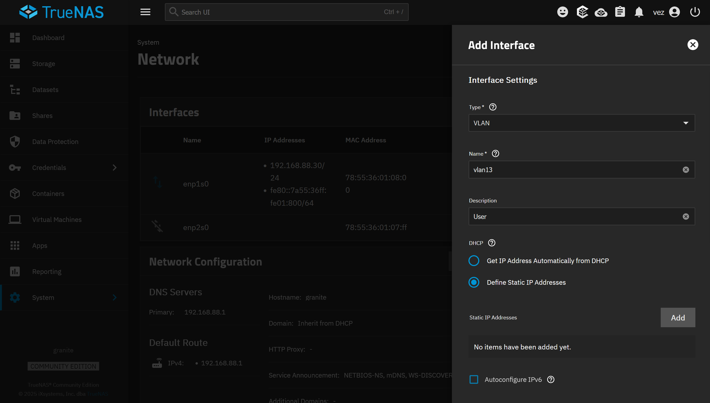

TrueNAS is nice here: changes aren’t applied blindly. You can **test** them and you get a rollback window, which is exactly what you want when you’re touching the network config remotely:

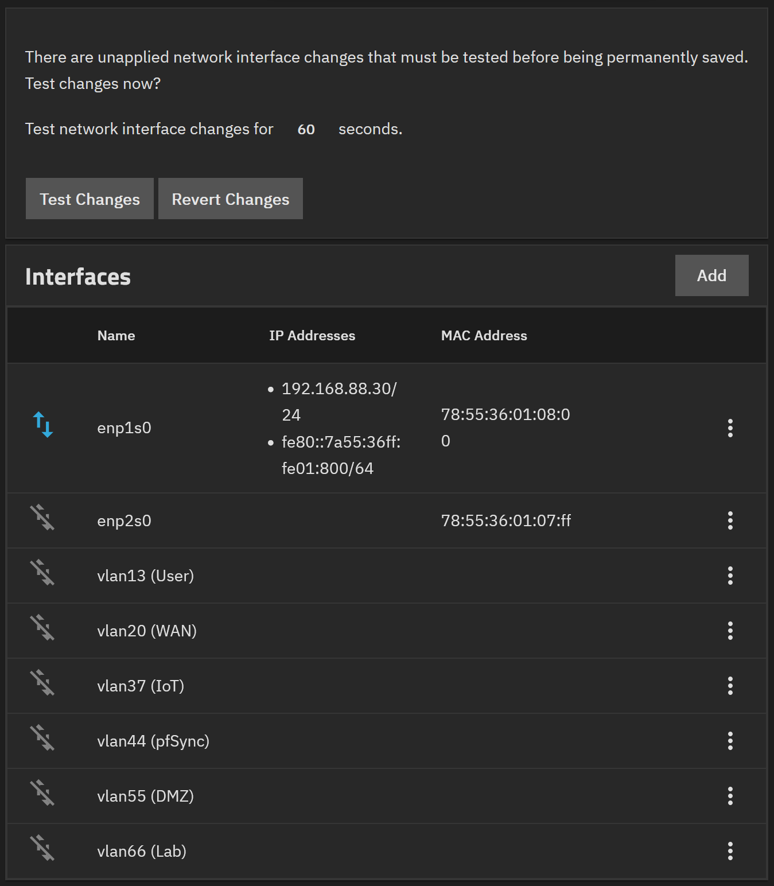

### Management bridge

I created a bridge `br1` for the management interface, shared between:

- TrueNAS itself
- the future OPNsense VM

And moved the IP configuration to the bridge:

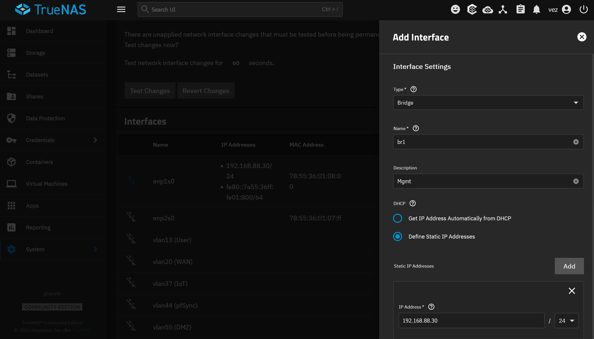

Final view before apply:

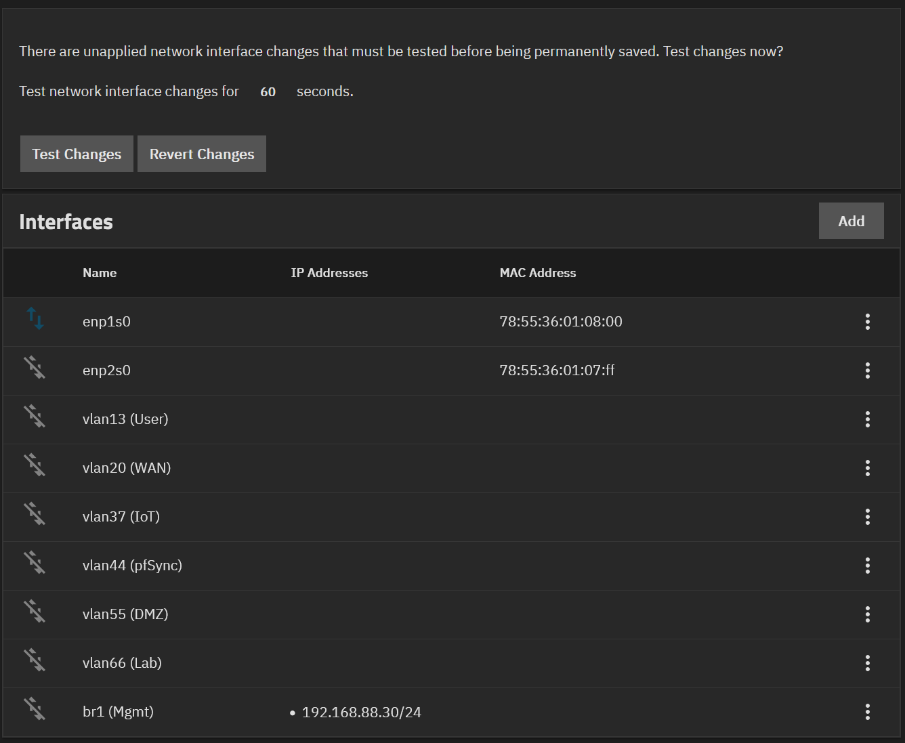

### Static IP vs DHCP (and why I stayed static)

I initially tried switching the management bridge to DHCP by updating the MAC address in OPNsense (Dnsmasq override):

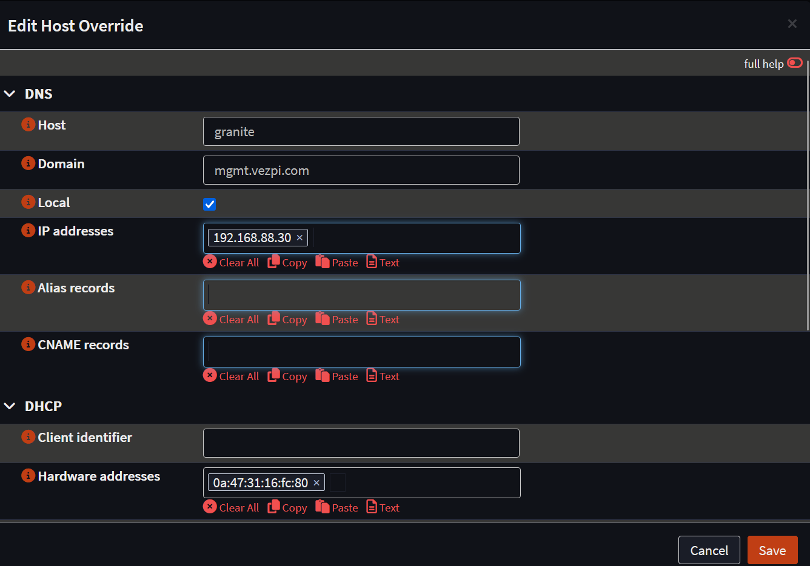

Then I attempted to flip TrueNAS from static to DHCP:

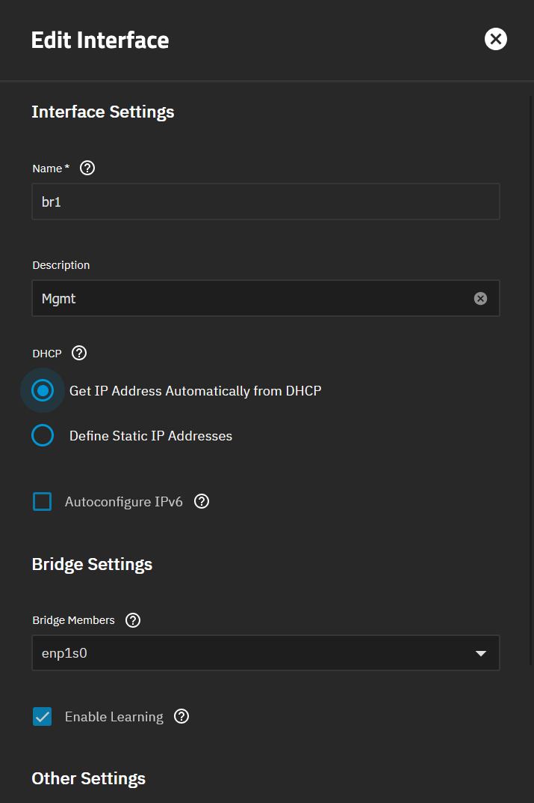

But DHCP didn’t behave as I expected: it kept receiving random IPs from the pool. I suspected existing leases played a role. I even tried manually editing leases and restarting the service, but after another change, it still ended up with a random address again.

In the end, I gave up and kept **a static IP** for TrueNAS. It’s boring, but it’s predictable.

### The key decision: bridge VLANs (not just VLAN interfaces)

This became important later: I originally planned to attach VLAN interfaces directly to the OPNsense VM, but it didn’t behave well.

So I created **one bridge per VLAN** (ex: `br13` with `vlan13` as the only member), and used those bridges for the VM NICs:

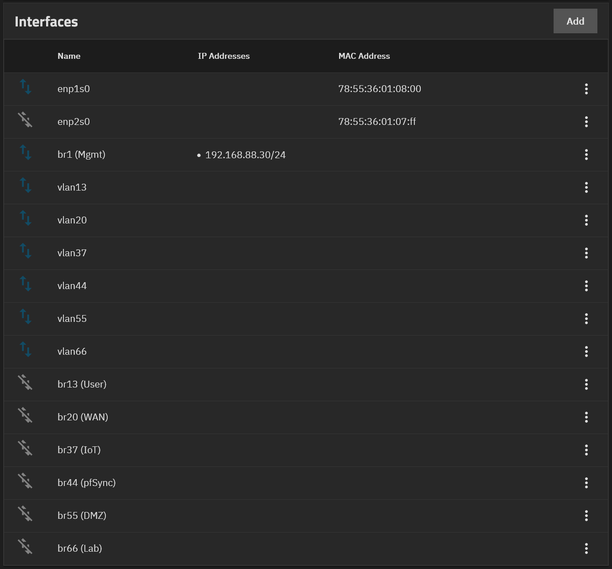

That ended up being the difference between “split-brain chaos” and “stable HA”.

(Full notes: [[Configure the trunk in TrueNAS]])

---

## Step 3 — Move the VM Disk From Proxmox to TrueNAS

To migrate the VM cleanly, I exported the Proxmox disk to TrueNAS.

### Create a dataset and export it via NFS

I created a dataset (initially called `disk`) and exported it with NFS, restricting access to my three Proxmox nodes (by IP):

- 192.168.88.21
- 192.168.88.22
- 192.168.88.23

(Notes: [[Create a new dataset in TrueNAS to export Proxmox VM disk]])

### Export the passive OPNsense disk

On the Proxmox node hosting the passive VM (`cerbere-head2`), I mounted the NFS share:

```bash
mount granite.mgmt.vezpi.com:/mnt/storage/disk /mnt
```

Then I shut down the VM from Proxmox (HA enabled, so I didn’t do it from inside OPNsense), and converted/exported the main disk (not the EFI disk) from Ceph RBD to a qcow2 file:

```bash
qemu-img convert -f raw -O qcow2 -p \
         rbd:ceph-workload/vm-123-disk-1 \
         /mnt/cerbere-head2.qcow2
```

The conversion took around a minute for a 20GB disk.

(Notes: [[Export the passive OPNsense VM disk from Proxmox]])

### Dataset reorg (cleaner layout)

I reorganized datasets on TrueNAS side to something more VM-oriented:

- created `storage/vm`
- renamed `storage/disk` to `storage/vm/files`

Commands used:

```bash
zfs list
sudo zfs create storage/vm
sudo zfs rename storage/disk storage/vm/files
```

(Notes: [[Reorganize the dataset in TrueNAS]])

---

## Step 4 — Create the OPNsense VM on TrueNAS (Import Disk + Rebuild NICs)

Now the fun part: recreating the VM on TrueNAS with the same “spirit” as the Proxmox VM.

From `Virtual Machines`:

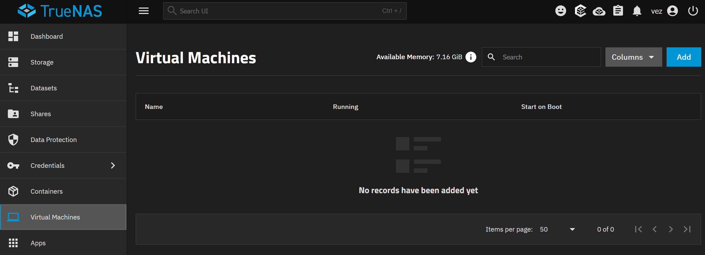

### VM settings I used

I created a new VM with:

**Operating System**
- Guest: FreeBSD
- Name: `cerberehead2` (TrueNAS doesn’t like dashes)
- Boot: UEFI
- Secure Boot: Disabled
- TPM: Disabled
- Start on Boot: Enabled
- VNC: Disabled

**CPU & Memory**
- Virtual CPUs: 1
- Cores: 2
- Threads: 1
- CPU Mode: Custom
- CPU Model: `qemu64`
- Memory: 2 GiB

**Disk**
- Import image enabled
- Source: `/mnt/storage/vm/files/cerbere-head2.qcow2`
- Disk Type: VirtIO
- Location: `storage/vm`
- Size: 20 GiB

**Network**
- Adapter: VirtIO
- Attached to `br1` (Mgmt)
- MAC: kept the generated one here

Summary screen:

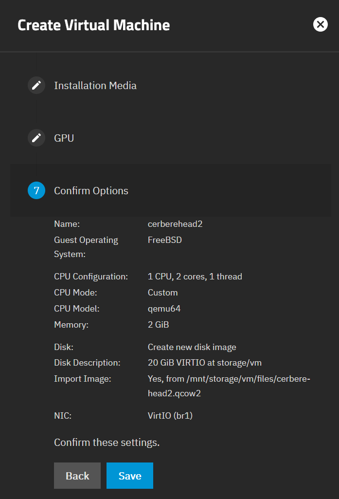

After saving, TrueNAS converted the imported image into a Zvol:

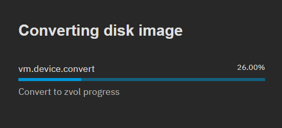

### Adding the additional NICs

After the VM was created, I added the additional NICs in the VM device list:

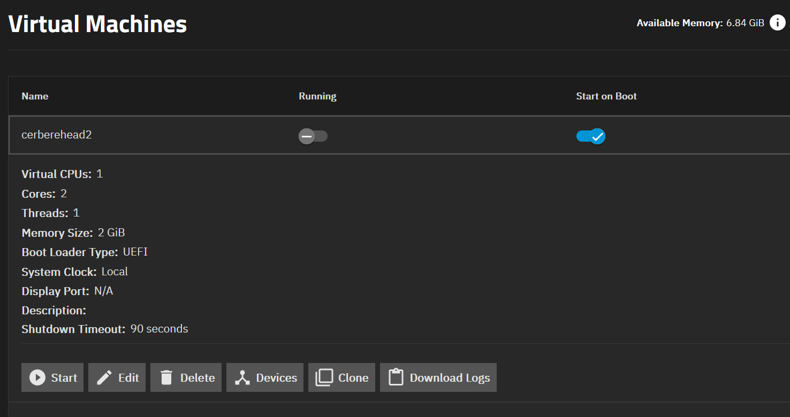

At first, I attached VLAN interfaces directly and started the VM… and instantly broke my network (great success).

The VM itself booted fine though, and seeing OPNsense come up cleanly on TrueNAS was a good sign:

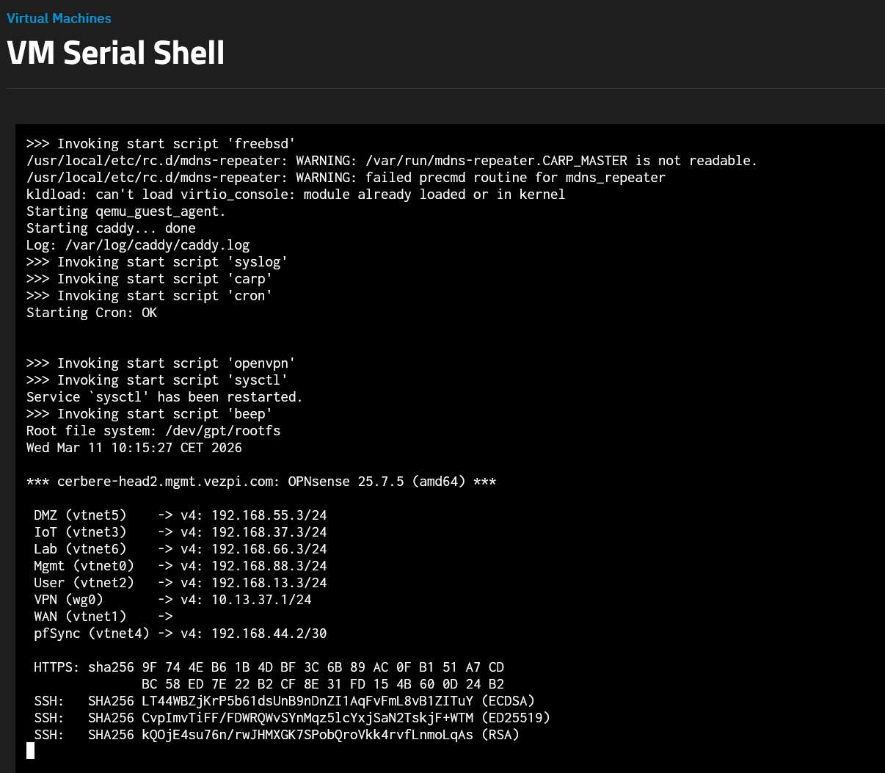

But HA-wise, it was a mess: split-brain symptoms, with the TrueNAS-hosted node thinking it was MASTER on almost everything except Mgmt.

The fix was the VLAN bridging approach mentioned earlier: once I switched the VM NICs to attach to **bridges (`br13`, `br20`, etc.) instead of VLAN interfaces**, the cluster came back to a healthy state.

Second try: stable. ✅

(Notes: [[Create the OPNsense VM in TrueNAS]])

---

## Step 5 — Validate HA: CARP, Sync, Services, Switchover and Failover

Once everything was in place, I validated the new setup with a proper checklist. I wanted to be sure the cluster worked exactly as before.

### Basic checks

- Ping each interface as relevant (Mgmt/User/IoT/pfSync/DMZ/Lab)
- SSH access
- Web UI access
- CARP VIP status must be `BACKUP` on the passive node
- HA status (active must be able to log into passive)
- Services state + “Synchronize and reconfigure all”
- Check updates availability (`System` > `Firmware` > `Check for updates`)

### Switchover test (graceful)

I started:
- a SSH session to DockerVM (to check state keeping)
- a ping to an IoT host from a laptop

Then tested:
- CARP role switch
- inter-VLAN routing
- WAN ping to `8.8.8.8`
- firewall state (SSH session stays alive)
- DNS resolution (external + internal)
- Caddy reverse proxy + layer4 proxy checks
- Wireguard access from outside
- mDNS discovery (printer visibility)

✅ Switchover successful.

### Failover test (hard)

Then I forced power off of the active node and repeated the same functional tests.

✅ Failover successful.

At the end: restarted the active VM, and the HA pair returned to normal operation.

One note: QEMU Guest Agent doesn’t bring value here because TrueNAS doesn’t implement it as a hypervisor (I still left it installed since it’s harmless).

(Full checklist and validation steps: [[Validate the new OPNsense VM and cluster state]])

---

## Conclusion

This project solved a real weakness in my homelab: my “highly available” router cluster was still depending on a single platform (Proxmox). By moving only the **passive OPNsense node** to **TrueNAS**, I now have a router that can survive a full Proxmox outage.

The biggest takeaway for me was networking on TrueNAS: attaching VLAN interfaces directly to the VM was not reliable in my setup, but bridging each VLAN (`br13`, `br20`, etc.) made the HA behavior stable and predictable.

Next step is to monitor the cluster for a few days before doing the cleanup of the migration on the Proxmox side.