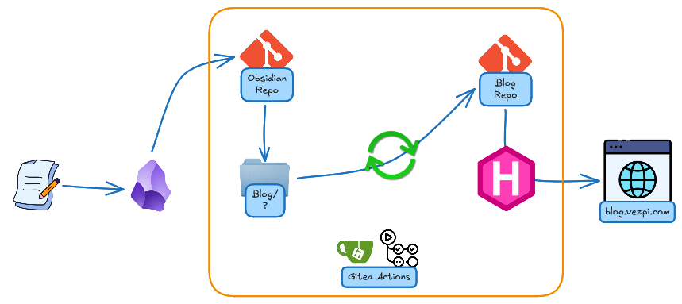
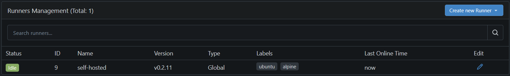
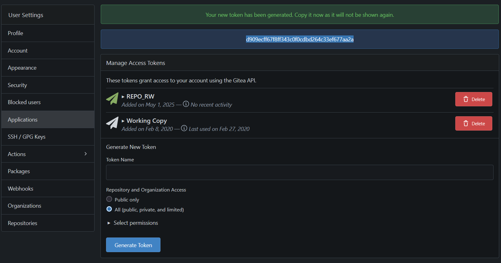
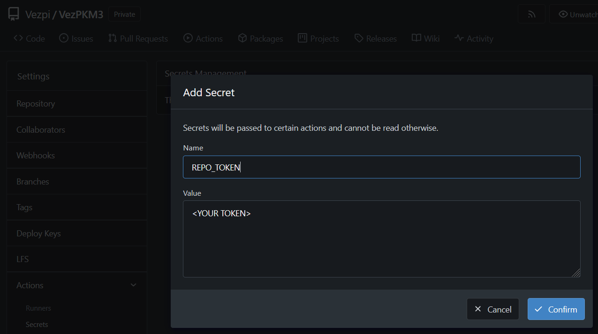

## 💡 Intro

J'ai toujours voulu partager mes expériences pour donner des idées aux autres ou les aider dans leurs projets.

Je suis constamment en train de bidouiller dans mon lab, testant de nouveaux outils et workflows. Plutôt que de conserver toutes ces expériences dans des notes privées, j'ai décidé de créer un blog où je peux les documenter et les publier facilement.

Je souhaitais que l'ensemble du processus soit automatisé, self-hosted et intégré aux outils que j'utilise déjà.

---
## 🔧 Outils
### Obsidian

J'utilisais auparavant [Notion](https://www.notion.com), mais il y a quelques mois, je suis passé à [Obsidian](https://obsidian.md/). C'est une application de prise de notes basée sur Markdown qui stocke tout localement, ce qui me donne plus de flexibilité et de contrôle.

Pour synchroniser mes notes entre mes appareils, j'utilise le [plugin Git Obsidian](https://github.com/denolehov/obsidian-git), qui enregistre les modifications dans un dépôt Git hébergé sur mon instance Gitea self-hosted.

Cette configuration permet non seulement de sauvegarder toutes mes notes avec leurs versions, mais aussi ouvre la porte à l'automatisation.

### Gitea

[Gitea](https://gitea.io/) est un service Git self-hosted similaire à GitHub, mais léger et facile à maintenir. J'y héberge mes dépôts personnels, notamment mon vault Obsidian et mon blog.

Gitea prend désormais en charge [Gitea Actions](https://docs.gitea.com/usage/actions/overview), un mécanisme de pipeline CI/CD compatible avec la syntaxe GitHub Actions.

Pour exécuter ces workflows, j'ai installé un [Gitea runner](https://gitea.com/gitea/act_runner) sur mon serveur, ce qui me permet de créer un workflow automatisé déclenché lorsque je mets à jour le contenu de mes notes, puis de reconstruire et déployer mon blog.

### Hugo

[Hugo](https://gohugo.io/) est un générateur de sites statiques rapide et flexible, écrit en Go. Il est idéal pour générer du contenu à partir de fichiers Markdown. Hugo est hautement personnalisable, prend en charge les thèmes et peut générer un site web complet en quelques secondes.

Il est idéal pour un blog basé sur des notes Obsidian et fonctionne parfaitement dans les pipelines CI/CD grâce à sa rapidité et sa simplicité.


---
## 🔁 Workflow

L'idée est simple :
1. J'écris le contenu de mon blog dans mon vault Obsidian, sous un dossier `Blog`.
2. Une fois le fichier modifié, le plugin Git Obsidian effectue automatiquement les commits et les poussent vers le dépôt Gitea.
3. Lorsque Gitea reçoit ce push, une première Gitea Action est déclenchée.
4. La première action synchronise le contenu du blog mis à jour avec un autre dépôt [Git distinct](https://git.vezpi.com/Vezpi/blog) qui héberge le contenu.
5. Dans ce dépôt, une autre Gitea Action est déclenchée.
6. La deuxième Gitea Action génère les pages web statiques tout en mettant à jour Hugo si nécessaire.
7. Le blog est maintenant mis à jour (celui que vous lisez).

De cette façon, je n'ai plus besoin de copier manuellement de fichiers ni de gérer les déploiements. Tout se déroule, de l'écriture de Markdown dans Obsidian au déploiement complet du site web.



---
## ⚙️ Implémentation

### Étape 1 : Configuration du vault Obsidian

Dans mon vault Obsidian, j'ai créé un dossier `Blog` contenant mes articles de blog en Markdown. Chaque article inclut les pages de garde Hugo (titre, date, brouillon, etc.). Le plugin Git est configuré pour valider et pousser automatiquement les modifications apportées au dépôt Gitea.

### Étape 2 : Lancer Gitea Runner

Le vault Obsidian est un dépôt Git privé self-hosted dans Gitea. J'utilise Docker Compose pour gérer cette instance. Pour activer les Gitea Actions, j'ai ajouté Gitea Runner à la stack.
```yaml
  runner:
    image: gitea/act_runner:latest
    container_name: gitea_runner
    restart: on-failure
    environment:
      - GITEA_INSTANCE_URL=https://git.vezpi.com
      - GITEA_RUNNER_REGISTRATION_TOKEN=${GITEA_RUNNER_REGISTRATION_TOKEN}$
      - GITEA_RUNNER_NAME=self-hosted
      - GITEA_RUNNER_LABELS=ubuntu:docker://node:lts,alpine:docker://node:lts-alpine
      - CONFIG_FILE=/data/config.yml
    volumes:
      - /var/run/docker.sock:/var/run/docker.sock
      - /appli/data/gitea/runner:/data
      - /appli:/appli
    networks:
      - backend
    depends_on:
      - server
```

Le fichier `config.yml` contient uniquement le volume autorisé à monter dans les conteneurs
```yaml
container:
  valid_volumes:
    - /appli*
```

Le runner apparaît dans `Administration Area`, sous `Actions`>`Runners`. Pour obtenir le token d'enrôlement , on clique sur le bouton `Create new Runner` 


### Étape 3 : Configurer les Gitea Actions pour le dépôt Obsidian

J'ai d'abord activé les Gitea Actions. Celles-ci sont désactivées par défaut. Cochez la case `Enable Repository Actions`  dans les paramètres de ce dépôt.

J'ai créé un nouveau PAT (Personal Access Token) avec autorisation RW sur les dépôts.


J'ai ajouté le token comme secret `REPO_TOKEN` dans le dépôt.



J'ai dû créer le workflow qui lancera un conteneur et effectuera les opérations suivantes :
1. Lorsque je crée/met à jour des fichiers du dossier `Blog`
2. Checkout le dépôt actuel (vault Obsidian)
3. Clone le dépôt du blog
4. Transférer le contenu du blog depuis Obsidian
5. Commit les modifications dans le dépôt du blog

**sync_blog.yml**
```yaml
name: Synchronize content with the blog repo
on:
  push:
    paths:
      - 'Blog/**' 

jobs:
  Sync:
    runs-on: ubuntu
    steps:
      - name: Install prerequisites
        run: apt update && apt install -y rsync
        
      - name: Check out repository
        uses: actions/checkout@v4

      - name: Clone the blog repository
        run: git clone https://${{ secrets.REPO_TOKEN }}@git.vezpi.com/Vezpi/blog.git 

      - name: Transfer blog content from Obsidian
        run: |
          echo "Copy Markdown files"
          rsync -av --delete Blog/ blog/content
          # Gather all used images from markdown files
          used_images=$(grep -rhoE '^!\[\[.*\]\]' blog/content | sed -E 's/!\[\[(.*)\]\]/\1/' | sort -u)
          # Create the target image folder
          mkdir -p blog/static/img
          # Loop over each used image"
          while IFS= read -r image; do
            # Loop through all .md files and replace image links
            grep -rl "$image" blog/content/* | while IFS= read -r md_file; do
              sed -i "s|\!\[\[$image\]\]|\!\[${image// /_}\](img/${image// /_})|g" "$md_file"
            done
            echo "Copy the image ${image// /_} to the static folder"
            cp "Images/$image" "blog/static/img/${image// /_}"
          done <<< "$used_images"

      - name: Commit the change to the blog repository
        run: |
          cd blog
          git config --global user.name "Gitea Actions"
          git config --global user.email "actions@local"
          git config --global --add safe.directory /appli/data/blog
          git add .
          git commit -m "Auto-update blog content from Obsidian: $(date '+%F %T')" || echo "Nothing to commit"
          git push -u origin main
```

Obsidian utilise des liens de type wiki pour les images, comme `
- Je trouve toutes les références d'images utilisées dans des fichiers `.md`.
- Pour chaque image référencée, je mets à jour le lien dans les fichiers `.md` correspondants, comme ``.
- Je copie ensuite ces images utilisées dans le répertoire statique du blog en remplaçant les espaces par des underscores.

### Étape 4 : Actions Gitea pour le dépôt du blog

Le dépôt du blog contient l'intégralité du site Hugo, y compris le contenu synchronisé et le thème.

Son workflow :
1. Checkout du dépôt du blog
2. Vérification de la mise à jour d'Hugo. Si disponible, la dernière version est téléchargée.
3. Génération du site web statique avec Hugo.

**deploy_blog.yml**
```yaml
name: Deploy
on: [push]
jobs:
  Deploy:
    runs-on: ubuntu
    env:
      BLOG_FOLDER: /blog
    container:
      volumes:
        - /appli/data/blog:/blog
    steps:
      - name: Check out repository
        run: |
          cd ${BLOG_FOLDER}
          git config --global user.name "Gitea Actions"
          git config --global user.email "actions@local"
          git config --global --add safe.directory ${BLOG_FOLDER}
          git submodule update --init --recursive
          git fetch origin
          git reset --hard origin/main

      - name: Get current Hugo version
        run: |
          current_version=$(${BLOG_FOLDER}/hugo version | grep -oE 'v[0-9]+\.[0-9]+\.[0-9]+')
          echo "current_version=$current_version" | tee -a $GITEA_ENV

      - name: Verify latest Hugo version
        run: |
          latest_version=$(curl -s https://api.github.com/repos/gohugoio/hugo/releases/latest | grep -oP '"tag_name": "\K[^"]+')
          echo "latest_version=$latest_version" | tee -a $GITEA_ENV

      - name: Download latest Hugo version
        if: env.current_version != env.latest_version
        run: |
          rm -f ${BLOG_FOLDER}/{LICENSE,README.md,hugo}
          curl -L https://github.com/gohugoio/hugo/releases/download/$latest_version/hugo_extended_${latest_version#v}_Linux-64bit.tar.gz -o hugo.tar.gz
          tar -xzvf hugo.tar.gz -C ${BLOG_FOLDER}/

      - name: Generate the static files with Hugo
        run: |
          rm -f ${BLOG_FOLDER}/content/posts/template.md
          rm -rf ${BLOG_FOLDER}/private/* ${BLOG_FOLDER}/public/*
          ${BLOG_FOLDER}/hugo -D -b https://blog-dev.vezpi.me -s ${BLOG_FOLDER} -d ${BLOG_FOLDER}/private
          ${BLOG_FOLDER}/hugo -s ${BLOG_FOLDER} -d ${BLOG_FOLDER}/public
          chown 1000:1000 -R ${BLOG_FOLDER}
```

---

## 🚀 Résultats

Ce workflow me permet de me concentrer sur l'essentiel : rédiger et peaufiner mon contenu. En automatisant le processus de publication, de la synchronisation de mes notes Obsidian à la création du blog avec Hugo, je n'ai plus à me soucier de la gestion manuelle du contenu dans un CMS.

Chaque note que je rédige peut évoluer naturellement vers un article clair et structuré, et la partie technique passe au second plan. C'est un moyen simple et efficace de transformer mes connaissances personnelles en documentation partageable.