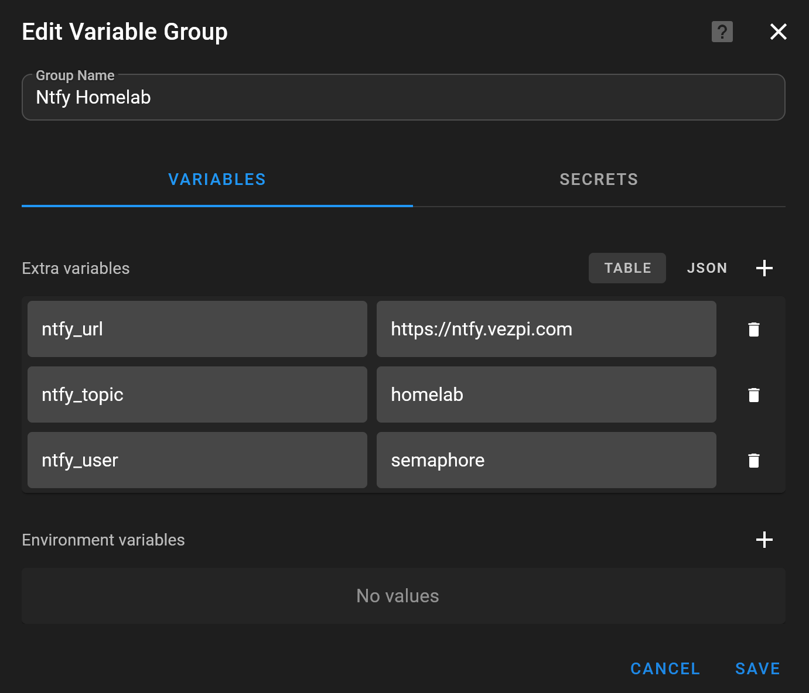
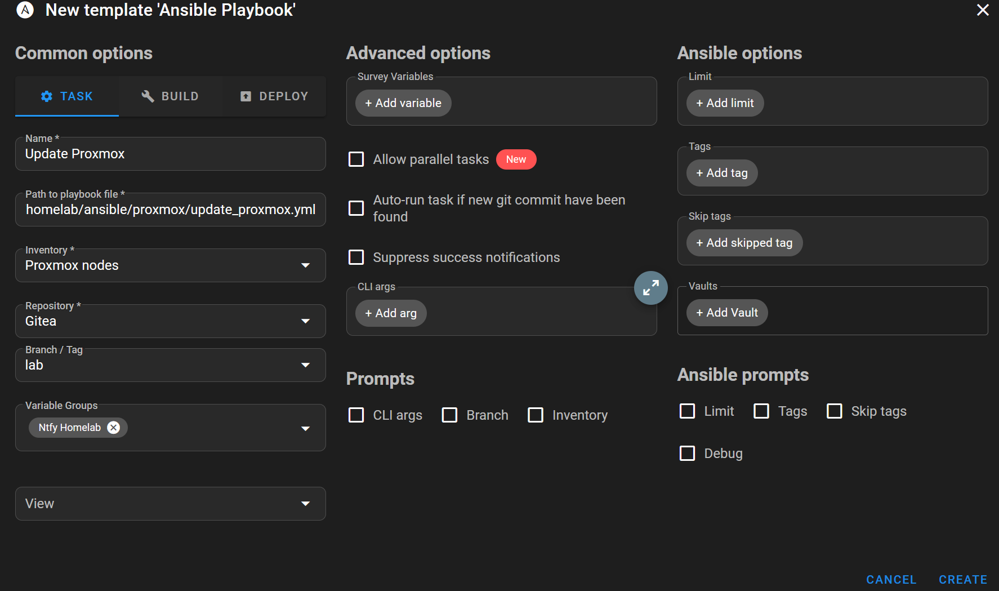
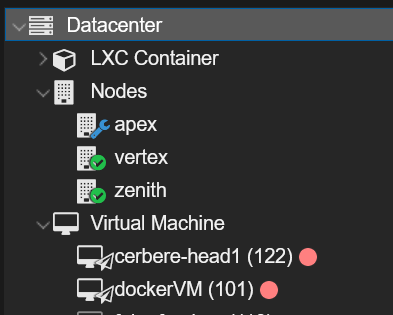
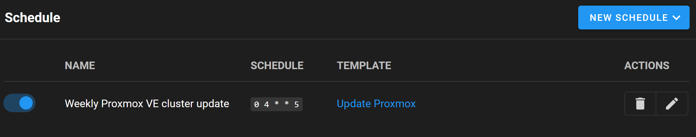

## Intro

In my homelab, updates are one of those things that are easy to postpone.

Not because they are complicated, but because they are manual. I need to connect to the right system, check the state, apply the updates, reboot if needed, verify that everything comes back correctly, and then repeat the same process for the next component.

And because it is manual, I usually keep it for later.

When Proxmox VE 9.1 came out, I already wanted to update my cluster, but not manually. Then Proxmox VE 9.2 became available few days ago, and I still had not built a clean process around it. That was a good trigger to finally start automating updates for the important parts of my homelab.

The larger goal is to simplify and automate patching for several key components:

- Proxmox VE
- OPNsense
- TrueNAS

I decided to start with Proxmox because it is central to the lab, and because a rolling update workflow is a good candidate for automation.

---
## The Tools Involved

The update process is built around a few components I already use in the lab.

[Proxmox VE](https://www.proxmox.com/en/proxmox-virtual-environment/overview) is my virtualization platform. The cluster also uses Ceph, so before touching a node, I want to make sure the cluster is healthy and that Ceph is reporting `HEALTH_OK`.

[Ansible](https://docs.ansible.com/) is used to describe the update workflow as a playbook.

[Semaphore UI](https://semaphoreui.com/) is used to run the playbook from a web interface and schedule it.

[Ntfy](https://ntfy.sh/) is used for notifications. If updates are scheduled, I need to know when something happens, especially if the cluster is not ready or if an update fails.

---
## Creating a Dedicated Ntfy Topic

Before scheduling anything, I wanted a notification channel dedicated to the homelab.

I created a `homelab` topic in Ntfy and a dedicated user named `semaphore` with write-only access to this topic.

```bash
ntfy user add semaphore
ntfy access semaphore homelab wo
```

The idea is that Semaphore only needs to publish messages. It does not need read access.

I also added the topic on my mobile phone so I can receive notifications when the automation runs.

In Semaphore, I created a variable group named `Ntfy Homelab` to store the values needed by the playbooks:

- `ntfy_url`
- `ntfy_topic`
- `ntfy_user`
- `NTFY_PASSWORD`

The password is stored as an environment variable in the `Secrets` tab.



---
## Designing the Proxmox Update Workflow

For Proxmox, I did not want a playbook that simply runs `apt upgrade` on all nodes. Instead, it doing the following:

- Check cluster health
- Stop and send a Ntfy notification if the cluster is not ready
- For each node, check if updates are available, if so:
  - Enable maintenance mode
  - Wait for LXCs and VMs to leave the node
  - Update packages
  - Disable Ceph rebalancing
  - Reboot the node
  - Enable Ceph rebalancing
  - Disable maintenance mode
  - Wait for Ceph to be healthy
- Send a final Ntfy report

The full playbook is available on my [Homelab repo](https://github.com/Vezpi/Homelab/blob/main/ansible/proxmox/update_proxmox.yml)

---
## Workflow Details

Before starting the rolling update, the playbook checks:

- Proxmox cluster quorum
- Ceph health

If one of these checks fails, the playbook stops and sends a Ntfy notification instead of trying to continue.

```yaml
- name: Verify cluster quorum
  ansible.builtin.command: pvecm status
  register: quorum_status
  changed_when: false
  failed_when: quorum_status.stdout is not search('Quorate:\\s*Yes')

- name: Verify Ceph health
  ansible.builtin.command: ceph health
  register: ceph_health
  changed_when: false
  failed_when: "'HEALTH_OK' not in ceph_health.stdout"
```

This is an important part of the automation. A scheduled update should not blindly continue if the cluster is not in a good state.

The playbook updates the Proxmox nodes with `serial: 1`.

That means only one node is handled at a time, which is exactly what I want for a cluster update.

For each node, the playbook first refreshes the repositories and checks if updates are available using Ansible check mode.

```yaml
- name: Refresh repositories
  ansible.builtin.apt:
    update_cache: true

- name: Check if updates are available
  ansible.builtin.apt:
    upgrade: dist
  check_mode: true
  register: apt_check
```

If no updates are available for a node, the heavy part of the workflow is skipped.

If updates are available, the playbook stores the current Proxmox version, enables maintenance mode, waits for guests to leave the node, applies the updates, reboots the node, and then waits for Ceph to be healthy again.

```yaml
- name: Enable maintenance mode
  ansible.builtin.command: >
    ha-manager crm-command node-maintenance enable {{ inventory_hostname_short }}
```

After maintenance mode is enabled, the playbook waits until no running LXC remains on the node:

```yaml
- name: Wait for LXCs to leave node
  ansible.builtin.shell: |
    pct list | awk 'NR>1 && $2=="running" {count++} END {print count+0}'
  register: lxc_count
  changed_when: false
  until: lxc_count.stdout | int == 0
  retries: 60
  delay: 15
```

It does the same for running VMs:

```yaml
- name: Wait for VMs to leave node
  ansible.builtin.shell: |
    qm list | awk 'NR>1 && $3=="running" {count++} END {print count+0}'
  register: vm_count
  changed_when: false
  until: vm_count.stdout | int == 0
  retries: 60
  delay: 15
```

Once the node is empty, the package upgrade can run:

```yaml
- name: Update packages
  ansible.builtin.apt:
    upgrade: full
    autoremove: true
    autoclean: true
```

Before rebooting, the playbook sets Ceph OSD `noout`:

```yaml
- name: Disable Ceph rebalancing
  ansible.builtin.command: ceph osd set noout
```

Then the node is rebooted:

```yaml
- name: Reboot node
  ansible.builtin.reboot:
    reboot_timeout: 900
    post_reboot_delay: 30
```

After the reboot, Ceph rebalancing is enabled again, maintenance mode is disabled, and the playbook waits for Ceph to return to `HEALTH_OK`.

```yaml
- name: Enable Ceph rebalancing
  ansible.builtin.command: ceph osd unset noout

- name: Disable maintenance mode
  ansible.builtin.command: >
    ha-manager crm-command node-maintenance disable {{ inventory_hostname_short }}

- name: Wait for Ceph to be healthy
  ansible.builtin.command: ceph health
  register: ceph_status
  changed_when: false
  until: "'HEALTH_OK' in ceph_status.stdout"
  retries: 60
  delay: 15
  delegate_to: "{{ groups['nodes'][0] }}"
```

The result is a controlled rolling update instead of a manual node-by-node procedure.

---
## Sending an Update Report

At the end of the workflow, the playbook sends a report through Ntfy. It first determines if at least one node was updated:

```yaml
- name: Determine if updates occurred
  ansible.builtin.set_fact:
    updates_performed: "{{ groups['nodes'] | map('extract', hostvars) | selectattr('update_report', 'defined') | list | length > 0 }}"
```

Then it sends a message to the `homelab` topic.

If no updates were available, the notification says so and uses a lower priority.

If updates were applied, the notification lists the updated nodes and shows the Proxmox version before and after the update.

The report logic is based on the `update_report` fact saved during the node update:

```yaml
- name: Save update report
  ansible.builtin.set_fact:
    update_report:
      old: "{{ pve_old_version.stdout }}"
      new: "{{ pve_new_version.stdout }}"
```

The notification body then builds a summary from all nodes:

```yaml
body: |
  
  
    
      
    
  
  
  No updates available on the cluster.
  
  The following nodes were updated:
  
  
  - {{ hostvars[node].inventory_hostname_short }}: version {{ hostvars[node].update_report.old }} (unchanged)
  
  - {{ hostvars[node].inventory_hostname_short }}: version {{ hostvars[node].update_report.old }} → {{ hostvars[node].update_report.new }}
  
  
  
```

This makes the scheduled job much easier to trust. I do not need to open Semaphore every time to know what happened.

---
## Running the Playbook from Semaphore

Once the playbook was ready, I pushed it to the repository and configured a Semaphore task template to run it.



From there, I could launch the workflow and watch it act on the cluster.

During execution, the target node enters maintenance mode and the running workloads are migrated away from it.



This is the point where the automation becomes really useful. The playbook is not only applying updates. It is also taking care of the operational steps around the update.

---
## Scheduling the Update

After refining the playbook and validating the workflow, I created a schedule in Semaphore.

In `Schedule`, I clicked `New Schedule`, selected `Cron`, gave it a name, selected a weekly schedule, and picked Friday at 4:00 AM UTC.



At this point, the Proxmox update process is no longer something I need to remember to do manually.

It runs on a schedule, checks the state of the cluster before doing anything, updates one node at a time, and sends a notification with the result.

---
## Conclusion

This project started with a simple problem: I was not updating my homelab regularly because the process was still too manual.

Automating Proxmox updates was the first milestone. The important part was not only running package upgrades, but wrapping them in the checks and operational steps that make sense for a Proxmox cluster with Ceph.

Semaphore gives me a clean way to run and schedule the playbook. Ansible describes the process in a repeatable way. Ntfy closes the loop by telling me what happened.

The next logical steps are to continue the same approach for the other key components of the lab: OPNsense and TrueNAS.