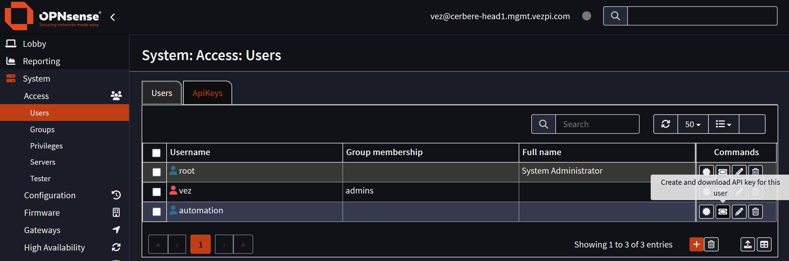
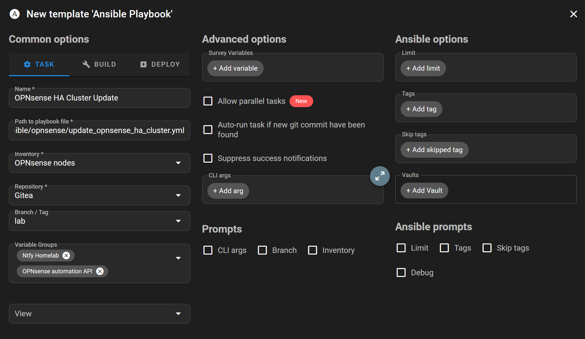
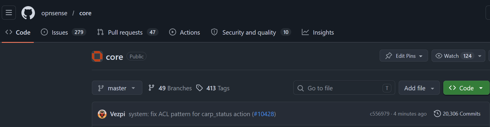
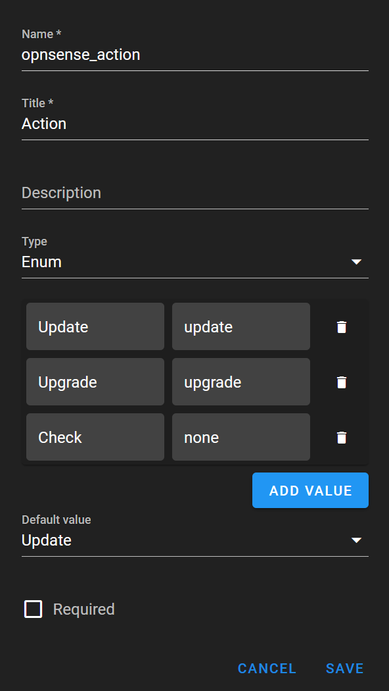

## Intro

Dans mon homelab, la plupart des composants de l'infrastructure sont déjà suffisamment redondants pour tolérer les opérations de maintenance, mais le processus de mise à jour lui-même restait encore trop manuel. Proxmox a été le premier élément que j'ai automatisé dans ce [billet](). Une fois ce workflow exécuté par Semaphore selon un calendrier, OPNsense est devenu la prochaine cible logique.

Mon installation OPNsense est un cluster HA composé de deux nœuds. Le nœud maître, `cerbere-head1`, fonctionne sur Proxmox. Le nœud de secours, `cerbere-head2`, fonctionne sur TrueNAS. Cette séparation est volontaire, car je veux que le réseau puisse survivre à une maintenance ou à une panne du cluster Proxmox.

L'objectif est simple : créer un playbook Ansible capable de mettre à jour ou de faire évoluer le cluster HA OPNsense de manière sûre, dans le bon ordre, avec des vérifications avant toute modification et une notification à la fin.

---
## Stratégie de mise à jour

OPNsense expose une API qui permet de vérifier l'état du système, l'état du firmware, les services et l'état des adresses IP virtuelles CARP. Ansible pilote l'automatisation au moyen d'appels API, tandis que Semaphore UI sert de contrôleur pour exécuter le playbook manuellement ou selon un calendrier. Ntfy est utilisé pour le rapport final et les notifications d'échec.

Pour le nœud hébergé sur Proxmox, j'utilise également la [collection Ansible community.proxmox](https://docs.ansible.com/projects/ansible/latest/collections/community/proxmox/index.html). Elle permet au playbook de créer un snapshot de la VM avant de mettre à jour le nœud maître du firewall et de revenir à ce snapshot si nécessaire.

Le point important est que les deux nœuds OPNsense ne sont pas traités exactement de la même manière. Le nœud de secours fonctionne sur TrueNAS, le playbook le met donc à jour sans créer de snapshot d'hyperviseur. Le nœud maître fonctionne sur Proxmox, le playbook crée donc un snapshot avant de démarrer l'opération sur le firmware.

---
## Création d'un utilisateur API dans OPNsense

Pour permettre à Ansible d'interagir avec OPNsense, je crée un utilisateur dédié sur le nœud maître.

Cet utilisateur s'appelle `automation`, avec un mot de passe aléatoire et uniquement les privilèges nécessaires au playbook :

- `Interface: Virtual IPS: Status`
- `System: Firmware`
- `System: Status`
- `Status: Services`

Comme il s'agit d'un cluster HA, la synchronisation entre les deux nœuds OPNsense gère la création de l'utilisateur sur le nœud de secours.

Après avoir créé l'utilisateur, je génère une clé API.


La clé API OPNsense est générée depuis l'utilisateur dédié à l'automatisation.

Le fichier téléchargé contient la `key` et le `secret` de l'API. Dans l'interface OPNsense, la clé reste visible dans l'onglet `ApiKeys`, mais le secret ne l'est plus.

Je teste d'abord les appels API avec Bruno depuis VS Code. Une fois les appels de base fonctionnels, je charge les identifiants dans Semaphore.

---
## Préparation de Semaphore UI

Dans Semaphore, je crée une entrée dans le magasin de clés nommée `OPNsense automation`, qui contient la clé et le secret de l'API.

Je crée ensuite un inventaire pour les nœuds OPNsense :

```yaml
---
all:
  children:
    opnsense:
      vars:
        ansible_connection: local
      children:
        opnsense_backup:
          hosts:
            cerbere-head2:
              ansible_host: 192.168.88.3
              main_role: BACKUP
              hypervisor: TrueNAS
        opnsense_master:
          hosts:
            cerbere-head1:
              ansible_host: 192.168.88.2
              main_role: MASTER
              hypervisor: Proxmox
              proxmox_vmid: 122
```

Le playbook s'exécute localement depuis Semaphore et communique avec chaque firewall via l'API OPNsense.

Je crée également un groupe de variables nommé `OPNsense automation API`, avec les identifiants API et quelques variables partagées :

- `OPNSENSE_API_KEY`
- `OPNSENSE_API_SECRET`
- `opnsense_api_key`
- `opnsense_api_secret`
- `opnsense_https_port`
- `opnsense_host`

Le port HTTPS est configuré sur `4443`, et l'hôte est construit à partir de l'adresse présente dans l'inventaire et de ce port.

Enfin, je crée le modèle de tâche Semaphore.


Le modèle de tâche Semaphore utilisé pour exécuter le playbook de mise à jour OPNsense.

Avant d'aller plus loin, je vérifie qu'Ansible peut interroger les deux nœuds :

```yaml
- name: Check node availability
  ansible.builtin.uri:
    url: "https://{{ opnsense_host }}/api/core/system/status"
    method: GET
    user: "{{ opnsense_api_key }}"
    password: "{{ opnsense_api_secret }}"
    force_basic_auth: true
    validate_certs: false
```

À ce stade, l'automatisation peut atteindre les deux nœuds et s'authentifier auprès de leur API.

---
## Rendre la maintenance CARP utilisable depuis l'API

La maintenance CARP est un élément important du workflow.

Avant de mettre à jour un nœud, je veux le placer en mode maintenance afin que les adresses IP virtuelles ne soient pas actives sur le nœud en cours de mise à jour. C'est particulièrement important lors de la mise à jour du nœud maître, car le nœud de secours doit prendre le relais proprement avant le début de l'opération.

Pendant les tests de l'API, l'endpoint de maintenance CARP renvoyait `403 Forbidden` :

```text
POST https://{{opnsense_host}}/api/diagnostics/interface/carp_status/maintenance
```

Les privilèges avaient bien été accordés dans l'interface Web, le problème semblait donc lié à la définition de l'ACL. J'ai modifié manuellement le fichier ACL d'OPNsense afin d'ajouter le wildcard au motif de l'API :

```xml
<pattern>api/diagnostics/interface/carp_status/*</pattern>
```

Après avoir redémarré le système, l'endpoint a renvoyé une réponse correcte.

J'ai créé une petite [PR](https://github.com/opnsense/core/pull/10428) dans le projet OPNsense pour corriger le problème. Elle a été rapidement fusionnée dans la branche `master` de `opnsense/core`. C'était ma première contribution à ce projet.


La petite correction de l'ACL OPNsense a été fusionnée en amont.

Plus tard, OPNsense [26.1.11](https://forum.opnsense.org/index.php?topic=52257.0) est sorti avec cette correction. J'ai alors pu tester le playbook complet sans dépendre de la modification manuelle de l'ACL.

---
## Conception du workflow du playbook

Le playbook suit un ordre simple :

- Vérifier l'état des deux nœuds
- Mettre d'abord à jour le nœud de secours
- Mettre ensuite à jour le nœud maître
- Envoyer une notification finale

Cet ordre est important. Le nœud de secours est mis à jour en premier, car le maître reste actif. Ensuite, avant de mettre à jour le maître, le playbook active le mode maintenance CARP afin de permettre au nœud de secours de prendre le relais.

Le playbook prend également en charge plusieurs actions au moyen d'un sondage Semaphore.


Le sondage Semaphore me permet de choisir entre une vérification, une mise à jour et une évolution de version.

C'est nécessaire, car OPNsense n'expose pas les mises à jour et les évolutions de version exactement de la même manière. Les variables correspondant à la version cible et au redémarrage requis diffèrent selon l'action choisie. Le playbook résout ces différences avant de déterminer quoi faire.

---
## Vérifications du firmware et de CARP

La première phase s'exécute sur les deux nœuds OPNsense.

Elle récupère des informations au moyen de plusieurs appels API :

- État du système
- Vérification du firmware
- État du firmware
- État des adresses IP virtuelles CARP

Le playbook enregistre le résultat sous forme de facts réutilisables plus tard :

```yaml
- name: Store node facts
  ansible.builtin.set_fact:
    firmware_action: "{{ opnsense_action | default('update')}}"
    firmware_status: "{{ _firmware_status.json.status }}"
    firmware_status_msg: "{{ _firmware_status.json.status_msg }}"
    firmware_current_version: "{{ _firmware_status.json.product.product_version | default('unknown') }}"
    firmware_product_series: "{{ _firmware_status.json.product.product_series | default('unknown') }}"
    firmware_update_version: "{{ _firmware_status.json.upgrade_packages | selectattr('name', 'equalto', 'opnsense') | map(attribute='new_version') | first | default('') }}"
    firmware_upgrade_version: "{{ _firmware_status.json.upgrade_major_version | default('unknown') }}"
    firmware_upgrade_message: "{{ _firmware_status.json.upgrade_major_message | regex_replace('<[^>]+>', ' ') | regex_replace('\\s{2,}', ' ') | trim | default('') }}"
    firmware_up_to_date: "{{ _firmware_status.json.status_msg == 'There are no updates available on the selected mirror.' }}"
    needs_reboot: "{{ (_firmware_status.json.upgrade_needs_reboot == '1') if _firmware_status.json.status == 'upgrade' else (_firmware_status.json.needs_reboot == '1') }}"
    total_vips: "{{ _vip_status.json.rowCount }}"
    mismatched_vips: "{{ _vip_status.json.rows | rejectattr('status', 'equalto', main_role) | list | length }}"
    in_maintenance: "{{ _vip_status.json.carp.maintenancemode }}"
```

Le playbook détermine ensuite s'il s'agit d'une version précise ou d'une série de versions :

```yaml
- name: Resolve update-vs-upgrade specifics
  ansible.builtin.set_fact:
    firmware_target_kind: "{{ 'series' if firmware_status == 'upgrade' else 'version' }}"
    firmware_target_value: "{{ firmware_upgrade_version if firmware_status == 'upgrade' else firmware_update_version }}"
```

Cela simplifie la gestion du reste du playbook. Il peut ensuite vérifier que le nœud a atteint la `version` ou la `series` attendue sans dupliquer toute la logique.

La première phase valide également plusieurs conditions avant de continuer :

- Le nœud ne doit pas être déjà en mode maintenance CARP
- Les adresses IP virtuelles doivent correspondre au rôle attendu
- Au moins une adresse IP virtuelle doit être gérée

Si l'une de ces vérifications échoue, le playbook s'arrête et envoie une notification Ntfy.

## Gestion correcte des conditions de non-exécution

L'un des aspects les plus délicats n'est pas la mise à jour elle-même, mais la décision de ne pas mettre à jour.

Après une première exécution réussie, il est possible que le nœud de secours soit déjà à jour alors que le maître ne l'est pas encore. L'exécution suivante ne doit donc pas mettre à jour le nœud de secours une nouvelle fois s'il possède déjà la version ciblée par le maître.

J'ajoute une condition de non-exécution pour ce cas :

```yaml
- name: Backup already updated
  ansible.builtin.set_fact:
    skip_update: true
    firmware_status: "skipped"
  delegate_to: "{{ groups['opnsense_backup'][0] }}"
  delegate_facts: true
  run_once: true
  when: >-
    (hostvars[groups['opnsense_backup'][0]].firmware_current_version
    if hostvars[groups['opnsense_master'][0]].firmware_target_kind == 'version'
    else hostvars[groups['opnsense_backup'][0]].firmware_product_series)
    == hostvars[groups['opnsense_master'][0]].firmware_target_value
```

Je généralise ensuite ce comportement.

Le playbook ignore un nœud dans les cas suivants :

- Aucune mise à jour n'est disponible
- Une évolution de version est disponible, mais l'action demandée est une mise à jour
- Une mise à jour est disponible, mais l'action demandée est une évolution de version
- Le nœud de secours possède déjà la version ou la série ciblée par le maître

La notification finale est ainsi beaucoup plus claire, car un nœud ignoré n'est pas considéré comme une erreur. Elle indique simplement qu'aucune action n'était nécessaire.

## Mise à jour du nœud de secours

Le nœud de secours fonctionne sur TrueNAS, cette phase ne crée donc pas de snapshot d'hyperviseur.

Le playbook active le mode maintenance CARP, déclenche l'opération sur le firmware, attend le début de la mise à jour, attend le redémarrage du nœud si nécessaire, puis attend que celui-ci soit de nouveau disponible.

La partie correspondante ressemble à ceci :

```yaml
- name: Trigger firmware {{ firmware_action }}
  ansible.builtin.uri:
    url: "https://{{ opnsense_host }}/api/core/firmware/{{ firmware_action }}"
    method: POST
    user: "{{ opnsense_api_key }}"
    password: "{{ opnsense_api_secret }}"
    force_basic_auth: true
    validate_certs: false
```

Si un redémarrage est nécessaire, le playbook attend que le port HTTPS ne soit plus accessible :

```yaml
- name: Wait for node to reboot after the {{ firmware_action }}
  ansible.builtin.wait_for:
    host: "{{ ansible_host }}"
    port: "{{ opnsense_https_port }}"
    state: stopped
    timeout: 3600
  when: needs_reboot
```

Il attend ensuite que le nœud soit de nouveau accessible :

```yaml
- name: Wait for node to come back online
  ansible.builtin.wait_for:
    host: "{{ ansible_host }}"
    port: "{{ opnsense_https_port }}"
    state: started
    timeout: 5400
    delay: 30
  when: needs_reboot
```

Enfin, il vérifie que la version du firmware ou la série du produit correspond à la cible attendue.

```yaml
- name: Check firmware version
  ansible.builtin.uri:
    url: "https://{{ opnsense_host }}/api/core/firmware/status"
    method: GET
    user: "{{ opnsense_api_key }}"
    password: "{{ opnsense_api_secret }}"
    force_basic_auth: true
    validate_certs: false
  register: _post_firmware_status
  until: _post_firmware_status.json.product['product_' ~ firmware_target_kind] | default('unknown') == firmware_target_value
  retries: 240
  delay: 15
```

Cette vérification permet de confirmer de manière fiable que la mise à jour ou l'évolution de version a bien atteint la cible attendue.

## Mise à jour du nœud maître avec un snapshot Proxmox

Le nœud maître bénéficie de protections supplémentaires.

Comme il fonctionne sur Proxmox, le playbook crée un snapshot de la VM avant d'activer le mode maintenance CARP et de démarrer l'opération sur le firmware.

Pour cela, je crée un utilisateur et un token Proxmox dédiés à Semaphore :

```bash
pveum user add semaphore@pve
pveum user token add semaphore@pve opnsense -expire 0 -privsep 0
```

Je crée ensuite un rôle limité :

```bash
pveum role add SemaphoreOpnsenseUpdate -privs "\
  VM.Audit \
  VM.PowerMgmt \
  VM.Snapshot \
  VM.Snapshot.Rollback \
"
```

Le rôle est attribué uniquement à la VM OPNsense :

```bash
pveum aclmod /vms/122 -user semaphore@pve -role SemaphoreOpnsenseUpdate
```

J'aime cette approche, car Semaphore ne peut agir que sur la VM concernée par ce workflow. Il ne dispose pas de permissions étendues sur l'ensemble de l'environnement Proxmox.

Dans Semaphore, j'ajoute un autre groupe de variables pour les identifiants de l'API Proxmox :

- `PROXMOX_HOST`
- `PROXMOX_PORT`
- `PROXMOX_TOKEN_ID`
- `PROXMOX_USER`
- `PROXMOX_TOKEN_SECRET`

Pour utiliser les modules Proxmox, j'ajoute un fichier `requirements.yml` à côté du playbook :

```yaml
---
collections:
  - name: community.proxmox
    version: "2.0.0"
```

La collection Proxmox nécessite également la bibliothèque Python `proxmoxer`. J'ajoute donc un fichier `requirements.txt` à côté du fichier `docker-compose.yml` de Semaphore :

```text
proxmoxer>=2.3
```

Je le monte ensuite dans le conteneur Semaphore :

```yaml
volumes:
  - /appli/docker/semaphore/requirements.txt:/etc/semaphore/requirements.txt
```

Après avoir redéployé Semaphore, le playbook peut créer le snapshot :

```yaml
- name: Take Proxmox VM snapshot
  community.proxmox.proxmox_snap:
    vmid: "{{ proxmox_vmid }}"
    state: present
    snapname: "{{ proxmox_snap_name }}"
    description: "Pre-firmware-{{ firmware_action }}: {{ firmware_current_version }} → {{ firmware_target_value }}"
```

Si quelque chose échoue pendant la mise à jour du maître, le bloc de récupération restaure la VM depuis le snapshot créé avant la mise à jour et envoie une notification Ntfy de priorité élevée.

## Notification finale

Au début, j'utilisais trop d'assertions pour piloter la logique de notification. Cela fonctionne pour les échecs, mais ce n'est pas le bon modèle pour les situations normales comme l'absence de mise à jour disponible.

Le bloc de récupération doit uniquement gérer les véritables échecs. Les situations normales doivent atteindre la phase de notification finale.

La phase finale s'exécute sur `localhost` et compare les facts collectés sur les nœuds maître et de secours. Elle gère les deux cas suivants :

- Les deux nœuds ont effectué la même opération
- Chaque nœud possède un résultat différent

Le corps de la notification est généré à partir des variables d'hôte des nœuds maître et de secours :

```yaml
body: |
  
  
  Les deux nœuds sont déjà en {{ m.firmware_current_version }}, aucune action effectuée.
  
  Cluster OPNsense : {{ m.firmware_current_version }} → {{ m.firmware_target_value }} ({{ m.firmware_status }})
  
  
  
  MAÎTRE ({{ master }}) : déjà en {{ m.firmware_current_version }}, aucune action effectuée.
  
  MAÎTRE ({{ master }}) : {{ m.firmware_current_version }} → {{ m.firmware_target_value }} ({{ m.firmware_status }})
  
  
  SECOURS ({{ backup }}) : déjà en {{ b.firmware_current_version }}, aucune action effectuée.
  
  SECOURS ({{ backup }}) : {{ b.firmware_current_version }} → {{ b.firmware_target_value }} ({{ b.firmware_status }})
  
  
```

La priorité et le tag de la notification changent également selon qu'une action a été effectuée ou que les deux nœuds sont déjà à jour.

J'obtiens ainsi un rapport utile sans transformer une exécution sans action en erreur.

## Workflow final

Le workflow terminé est divisé en quatre phases :

- Vérification du firmware sur tous les nœuds
- Mise à jour du nœud de secours sur TrueNAS
- Mise à jour du nœud maître sur Proxmox avec un snapshot
- Envoi d'une notification Ntfy

Le nœud de secours est mis à jour en premier. Le nœud maître est mis à jour en second, avec la création d'un snapshot Proxmox avant l'opération sur le firmware. L'état CARP est vérifié avant le début du workflow et le mode maintenance est utilisé pendant les mises à jour des nœuds.

Le playbook prend en charge les scénarios de mise à jour, d'évolution de version et de vérification au moyen du sondage Semaphore. Il sait également ignorer un nœud lorsqu'il n'y a rien à faire ou lorsque l'action demandée ne correspond pas à ce que signale OPNsense.

Plus important encore, le workflow s'exécute désormais de bout en bout et signale le résultat.

Le playbook Ansible est disponible [ici](https://github.com/Vezpi/Homelab/blob/main/ansible/opnsense/update_opnsense_ha_cluster.yml).

## Conclusion

Cette automatisation est partie d'une idée simple : ne plus mettre OPNsense à jour manuellement.

En pratique, le sujet s'est révélé plus intéressant qu'un simple appel à l'endpoint du firmware. Le playbook devait comprendre l'état HA, gérer différemment les mises à jour et les évolutions de version, mettre les nœuds à jour dans le bon ordre, protéger le maître hébergé sur Proxmox avec un snapshot et signaler l'état final sans considérer les exécutions sans action comme des échecs.

Le résultat s'intègre beaucoup mieux au reste de l'automatisation de mon homelab. Semaphore fournit un point d'entrée reproductible, Ansible gère la logique, OPNsense expose son état via son API, Proxmox fournit un point de restauration pour le maître et Ntfy m'indique ce qui s'est passé.

C'est une tâche de maintenance manuelle de moins à oublier, et un élément de plus du homelab capable de prendre soin de lui-même.
