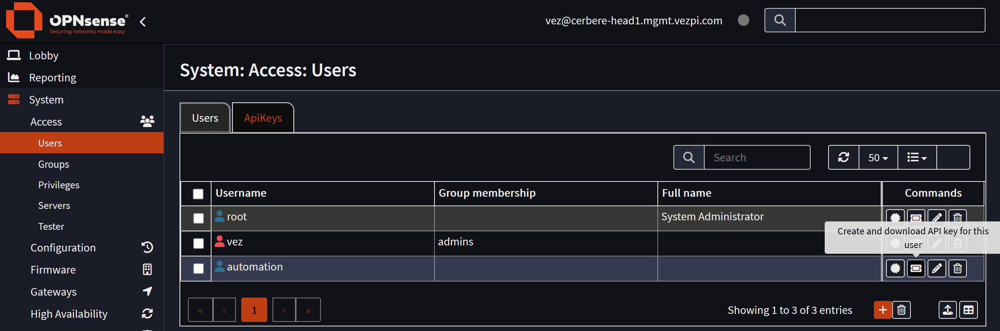
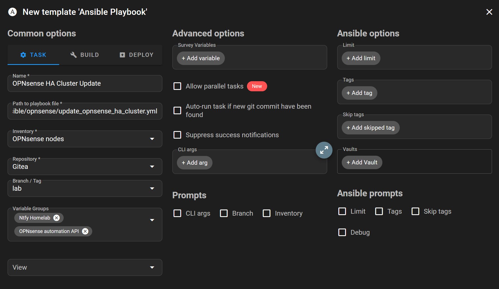
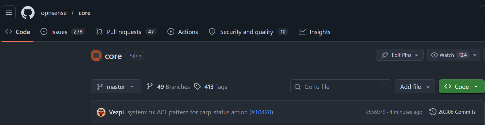
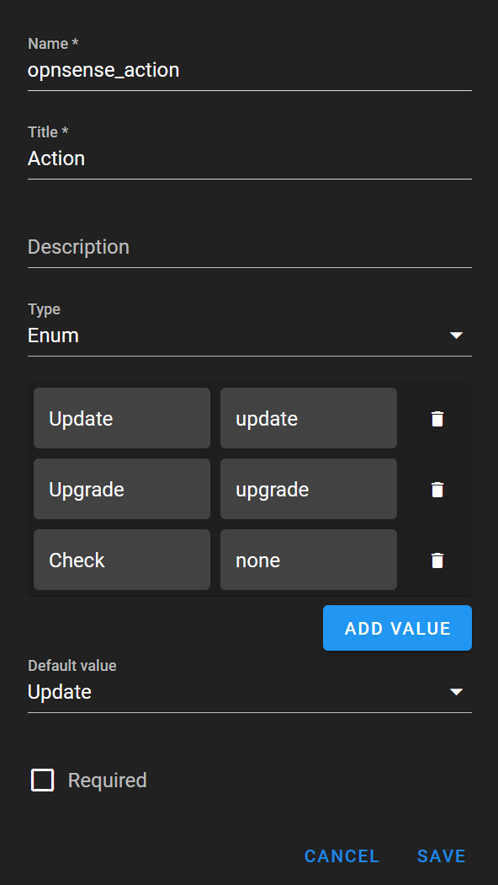

## Intro

In my homelab, most of the infrastructure is already redundant enough to tolerate maintenance, but the update process itself was still too manual. Proxmox was the first part I automated in that [post](), and once that workflow was running from Semaphore on a schedule, the next logical target was OPNsense.

My OPNsense setup is an HA cluster with two nodes. The master node, `cerbere-head1`, runs on Proxmox. The backup node, `cerbere-head2`, runs on TrueNAS. That split is intentional, because I want the network to survive maintenance or outages on the Proxmox cluster.

The goal is simple: create an Ansible playbook able to update or upgrade the OPNsense HA cluster safely, in the right order, with checks before touching anything, and a notification at the end.

---
## Update Strategy

OPNsense exposes an API that can be used to check system status, firmware status, services and CARP virtual IP state. Ansible drives the automation with API calls, while Semaphore UI is used as the controller to run the playbook manually or from a schedule. Ntfy is used for the final report and for failure notifications.

For the Proxmox hosted node, I also use the [community.proxmox Ansible collection](https://docs.ansible.com/projects/ansible/latest/collections/community/proxmox/index.html). This allows the playbook to create a VM snapshot before updating the master firewall node and roll back to it if needed.

The important detail is that both OPNsense nodes are not treated exactly the same. The backup node runs on TrueNAS, so the playbook updates it without taking a hypervisor snapshot. The master node runs on Proxmox, so the playbook takes a snapshot before starting the firmware operation.

---
## Creating an API User in OPNsense

To let Ansible interact with OPNsense, I create a dedicated user on the master node.

The user is called `automation`, with a scrambled password and only the privileges needed by the playbook:

- `Interface: Virtual IPS: Status`
- `System: Firmware`
- `System: Status`
- `Status: Services`

Because this is an HA cluster, the synchronization between both OPNsense nodes handles the user creation on the backup node.

After creating the user, I generate an API key.


The OPNsense API key is generated from the dedicated automation user.

The downloaded file contains the API `key` and `secret`. In the OPNsense UI, the key remains visible in the `ApiKeys` tab, but the secret does not.

I first test the API calls with Bruno from VS Code. Once the basic calls are working, I load the credentials into Semaphore.

## Preparing Semaphore

In Semaphore, I create a key store entry named `OPNsense automation`, containing the API key and secret.

Then I create an inventory for the OPNsense nodes:

```yaml
---
all:
  children:
    opnsense:
      vars:
        ansible_connection: local
      children:
        opnsense_backup:
          hosts:
            cerbere-head2:
              ansible_host: 192.168.88.3
              main_role: BACKUP
              hypervisor: TrueNAS
        opnsense_master:
          hosts:
            cerbere-head1:
              ansible_host: 192.168.88.2
              main_role: MASTER
              hypervisor: Proxmox
              proxmox_vmid: 122
```

The playbook runs locally from Semaphore and talks to each firewall through the OPNsense API.

I also create a variable group named `OPNsense automation API` with the API credentials and a few shared variables:

- `OPNSENSE_API_KEY`
- `OPNSENSE_API_SECRET`
- `opnsense_api_key`
- `opnsense_api_secret`
- `opnsense_https_port`
- `opnsense_host`

The HTTPS port is set to `4443`, and the host is built from the inventory address and this port.

Finally, I create the Semaphore task template.


The Semaphore task template used to run the OPNsense HA update playbook.

Before going further, I validate that Ansible could query both nodes:

```yaml
- name: Check node availability
  ansible.builtin.uri:
    url: "https://{{ opnsense_host }}/api/core/system/status"
    method: GET
    user: "{{ opnsense_api_key }}"
    password: "{{ opnsense_api_secret }}"
    force_basic_auth: true
    validate_certs: false
```

At that point, the automation can reach both nodes and authenticate against the API.

## Making CARP maintenance usable from the API

One important part of the workflow is CARP maintenance mode.

Before updating a node, I want to put it into maintenance mode so the virtual IPs are not active on the node being updated. This is especially important when updating the master node, because the backup must take over cleanly before the update starts.

During API testing, the CARP maintenance endpoint returned `403 Forbidden`:

```text
POST https://{{opnsense_host}}/api/diagnostics/interface/carp_status/maintenance
```

The privileges were granted in the WebUI, so the issue looked related to the ACL definition. I manually adjusted the OPNsense ACL file by changing the API pattern to include the wildcard:

```xml
<pattern>api/diagnostics/interface/carp_status/*</pattern>
```

After rebooting the system, the endpoint returned a proper response.

I created a small PR in the OPNsense project to fix this, and it was merged quickly into the `opnsense/core` `master` branch.


The small OPNsense ACL fix was merged upstream.

Later, OPNsense `26.1.11` was released and included the fix. That allowed me to test the full playbook without relying on the manual ACL change.

## Designing the playbook flow

The playbook follows a simple order:

- Check both nodes first
- Update the backup node first
- Update the master node second
- Send a final notification

That order is important. The backup node is updated first because the master is still active. Then, before updating the master, the playbook enables CARP maintenance mode to let the backup take over.

The playbook also supports different actions through a Semaphore survey.


The Semaphore survey lets me choose between check, update and upgrade.

This was needed because OPNsense does not expose updates and upgrades in exactly the same way. The variables for the target version and the reboot requirement differ between an update and an upgrade, so the playbook resolves those differences before deciding what to do.

## Phase 1: firmware and CARP checks

The first phase runs on both OPNsense nodes.

It gathers information from several API calls:

- System status
- Firmware check
- Firmware status
- CARP virtual IP status

The playbook stores the result as facts that can be reused later:

```yaml
- name: Store node facts
  ansible.builtin.set_fact:
    firmware_action: "{{ opnsense_action | default('update')}}"
    firmware_status: "{{ _firmware_status.json.status }}"
    firmware_status_msg: "{{ _firmware_status.json.status_msg }}"
    firmware_current_version: "{{ _firmware_status.json.product.product_version | default('unknown') }}"
    firmware_product_series: "{{ _firmware_status.json.product.product_series | default('unknown') }}"
    firmware_update_version: "{{ _firmware_status.json.upgrade_packages | selectattr('name', 'equalto', 'opnsense') | map(attribute='new_version') | first | default('') }}"
    firmware_upgrade_version: "{{ _firmware_status.json.upgrade_major_version | default('unknown') }}"
    firmware_upgrade_message: "{{ _firmware_status.json.upgrade_major_message | regex_replace('<[^>]+>', ' ') | regex_replace('\\s{2,}', ' ') | trim | default('') }}"
    firmware_up_to_date: "{{ _firmware_status.json.status_msg == 'There are no updates available on the selected mirror.' }}"
    needs_reboot: "{{ (_firmware_status.json.upgrade_needs_reboot == '1') if _firmware_status.json.status == 'upgrade' else (_firmware_status.json.needs_reboot == '1') }}"
    total_vips: "{{ _vip_status.json.rowCount }}"
    mismatched_vips: "{{ _vip_status.json.rows | rejectattr('status', 'equalto', main_role) | list | length }}"
    in_maintenance: "{{ _vip_status.json.carp.maintenancemode }}"
```

Then it resolves whether the target is a regular version or a product series:

```yaml
- name: Resolve update-vs-upgrade specifics
  ansible.builtin.set_fact:
    firmware_target_kind: "{{ 'series' if firmware_status == 'upgrade' else 'version' }}"
    firmware_target_value: "{{ firmware_upgrade_version if firmware_status == 'upgrade' else firmware_update_version }}"
```

This makes the rest of the playbook easier to manage. It can later check whether the node reached the expected `version` or `series` without duplicating the whole logic.

The first phase also validates a few conditions before proceeding:

- The node must not already be in CARP maintenance mode
- The VIPs must match the expected role
- At least one VIP must be managed

If one of these checks fails, the playbook aborts and sends a Ntfy notification.

## Handling skip logic properly

One of the trickiest parts was not the update itself, but deciding when not to update.

After the first successful test, the backup node was already updated while the master was not. The next run should not update the backup again if it is already at the version the master is targeting.

I added skip logic for that case:

```yaml
- name: Backup already updated
  ansible.builtin.set_fact:
    skip_update: true
    firmware_status: "skipped"
  delegate_to: "{{ groups['opnsense_backup'][0] }}"
  delegate_facts: true
  run_once: true
  when: >-
    (hostvars[groups['opnsense_backup'][0]].firmware_current_version
    if hostvars[groups['opnsense_master'][0]].firmware_target_kind == 'version'
    else hostvars[groups['opnsense_backup'][0]].firmware_product_series)
    == hostvars[groups['opnsense_master'][0]].firmware_target_value
```

Then I generalized the skip behavior.

The playbook skips a node when:

- No updates are available
- An upgrade is available but the requested action is update
- An update is available but the requested action is upgrade
- The backup node is already at the target version or series of the master

This made the final notification much cleaner, because a skipped node is not treated as an error. It is simply reported as no action needed.

## Updating the backup node

The backup node runs on TrueNAS, so this phase does not create a hypervisor snapshot.

The playbook enables CARP maintenance mode, triggers the firmware action, waits for the update to start, waits for the node to reboot if required, then waits for it to come back online.

The relevant part looks like this:

```yaml
- name: Trigger firmware {{ firmware_action }}
  ansible.builtin.uri:
    url: "https://{{ opnsense_host }}/api/core/firmware/{{ firmware_action }}"
    method: POST
    user: "{{ opnsense_api_key }}"
    password: "{{ opnsense_api_secret }}"
    force_basic_auth: true
    validate_certs: false
```

If a reboot is required, the playbook waits for the HTTPS port to go down:

```yaml
- name: Wait for node to reboot after the {{ firmware_action }}
  ansible.builtin.wait_for:
    host: "{{ ansible_host }}"
    port: "{{ opnsense_https_port }}"
    state: stopped
    timeout: 3600
  when: needs_reboot
```

Then it waits for the node to come back:

```yaml
- name: Wait for node to come back online
  ansible.builtin.wait_for:
    host: "{{ ansible_host }}"
    port: "{{ opnsense_https_port }}"
    state: started
    timeout: 5400
    delay: 30
  when: needs_reboot
```

Finally, it checks that the firmware version or product series matches the expected target.

```yaml
- name: Check firmware version
  ansible.builtin.uri:
    url: "https://{{ opnsense_host }}/api/core/firmware/status"
    method: GET
    user: "{{ opnsense_api_key }}"
    password: "{{ opnsense_api_secret }}"
    force_basic_auth: true
    validate_certs: false
  register: _post_firmware_status
  until: _post_firmware_status.json.product['product_' ~ firmware_target_kind] | default('unknown') == firmware_target_value
  retries: 240
  delay: 15
```

That check is what gives the playbook a reliable confirmation that the update or upgrade actually reached the expected target.

## Updating the master node with a Proxmox snapshot

The master node is handled with more protection.

Because it runs on Proxmox, the playbook creates a VM snapshot before enabling CARP maintenance mode and starting the firmware action.

For this, I created a dedicated Proxmox user and token for Semaphore:

```bash
pveum user add semaphore@pve
pveum user token add semaphore@pve opnsense -expire 0 -privsep 0
```

Then I created a limited role:

```bash
pveum role add SemaphoreOpnsenseUpdate -privs "\
  VM.Audit \
  VM.PowerMgmt \
  VM.Snapshot \
  VM.Snapshot.Rollback \
"
```

The role is assigned only to the OPNsense VM:

```bash
pveum aclmod /vms/122 -user semaphore@pve -role SemaphoreOpnsenseUpdate
```

I like this approach because Semaphore can only operate on the one VM involved in this workflow. It does not get broad permissions on the whole Proxmox environment.

In Semaphore, I added another variable group for the Proxmox API credentials:

- `PROXMOX_HOST`
- `PROXMOX_PORT`
- `PROXMOX_TOKEN_ID`
- `PROXMOX_USER`
- `PROXMOX_TOKEN_SECRET`

To use the Proxmox modules, I added a `requirements.yml` next to the playbook:

```yaml
---
collections:
  - name: community.proxmox
    version: "2.0.0"
```

The Proxmox collection also requires the `proxmoxer` Python library, so I added a `requirements.txt` next to the Semaphore `docker-compose.yml`:

```text
proxmoxer>=2.3
```

Then I mounted it into the Semaphore container:

```yaml
volumes:
  - /appli/docker/semaphore/requirements.txt:/etc/semaphore/requirements.txt
```

After redeploying Semaphore, the playbook could create the snapshot:

```yaml
- name: Take Proxmox VM snapshot
  community.proxmox.proxmox_snap:
    vmid: "{{ proxmox_vmid }}"
    state: present
    snapname: "{{ proxmox_snap_name }}"
    description: "Pre-firmware-{{ firmware_action }}: {{ firmware_current_version }} → {{ firmware_target_value }}"
```

If something fails during the master update, the rescue block rolls the VM back to the pre-update snapshot and sends a high priority Ntfy notification.

## Final notification

At first, I used assertions too much to drive the reporting logic. That worked for failures, but it was not the right model for normal cases like no updates available.

The rescue block should only handle real failures. Normal situations should reach the final notification phase.

The final phase runs on `localhost` and compares the facts collected from the master and backup nodes. It handles both cases:

- Both nodes had the same operation
- Each node had a different result

The notification body is generated from the master and backup host variables:

```yaml
body: |
  
  
  Both nodes already on {{ m.firmware_current_version }}, no action taken.
  
  OPNsense cluster: {{ m.firmware_current_version }} → {{ m.firmware_target_value }} ({{ m.firmware_status }})
  
  
  
  MASTER ({{ master }}): already on {{ m.firmware_current_version }}, no action taken.
  
  MASTER ({{ master }}): {{ m.firmware_current_version }} → {{ m.firmware_target_value }} ({{ m.firmware_status }})
  
  
  BACKUP ({{ backup }}): already on {{ b.firmware_current_version }}, no action taken.
  
  BACKUP ({{ backup }}): {{ b.firmware_current_version }} → {{ b.firmware_target_value }} ({{ b.firmware_status }})
  
  
```

The notification priority and tag also change depending on whether an action was performed or both nodes were already up to date.

This gives me a useful report without turning a no-op run into an error.

## The final workflow

The finished workflow is split into four phases:

- Firmware check on all nodes
- Update the backup node on TrueNAS
- Update the master node on Proxmox with a snapshot
- Send a Ntfy notification

The backup node is updated first. The master node is updated second, with a Proxmox snapshot taken before the firmware action. CARP status is checked before the workflow starts, and maintenance mode is used during node updates.

The playbook can handle update, upgrade and check scenarios through the Semaphore survey. It also knows when to skip a node because there is nothing to do or because the requested action does not match what OPNsense reports.

Most importantly, the workflow now completes end to end and reports the result.

## Conclusion

This automation started as a simple idea: stop updating OPNsense manually.

In practice, it became more interesting than just calling the firmware endpoint. The playbook needed to understand the HA state, handle updates and upgrades differently, update nodes in the right order, protect the Proxmox hosted master with a snapshot, and report the final state without treating normal no-op cases as failures.

The result is a workflow that fits much better with the rest of my homelab automation. Semaphore gives me a repeatable entry point, Ansible handles the logic, OPNsense exposes the state through its API, Proxmox provides a rollback point for the master node, and Ntfy tells me what happened.

It is one less manual maintenance task to forget, and one more piece of the homelab that can take care of itself.