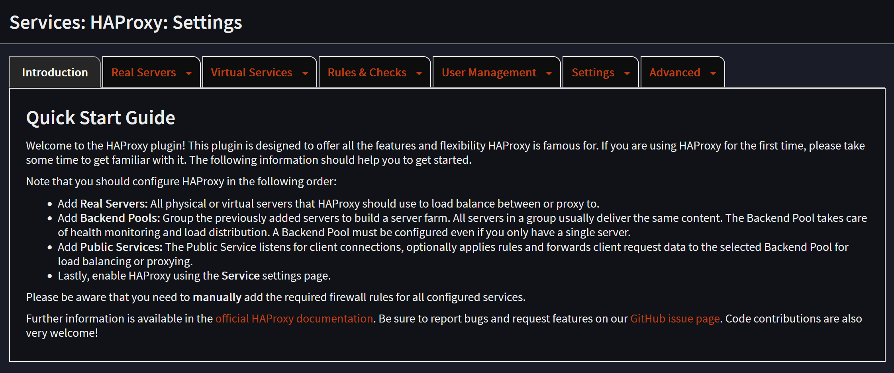
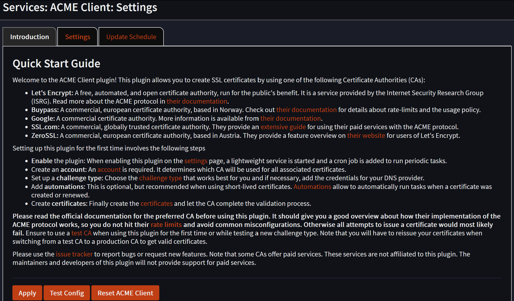

## 💡 Intro

**OPNsense** is the frontend for HTTPS routing in my homelab. Until recently, that job was handled by the Caddy plugin.

Caddy was doing a perfectly good job, which is usually when a homelab project starts going wrong. After upgrading OPNsense to version 26.1, I began to hit `SSL_ERROR_INTERNAL_ERROR_ALERT` at random when reaching services managed by Traefik.

At the same time, I wanted to recreate an endpoint for my Kubernetes cluster. I could have built it with Caddy, but the TLS errors gave me a reason to try **HAProxy**, which I had already used for a Kubernetes endpoint in the past.

The goal was simple: replace Caddy, keep HTTPS routing working, and make the error disappear. The configuration was less simple.

## 🔁 From Caddy to HAProxy

The first step was installing the community plugin `os-haproxy` on the master OPNsense node.



Unlike Caddy, HAProxy did not manage my certificates automatically in this setup. I therefore installed the `os-acme-client` plugin as well and configured it separately.

That separation is worth keeping in mind. HAProxy handles the traffic, while the ACME client obtains and renews the certificates.

## ⚙️ Building the HAProxy Configuration

I started by defining the real servers behind the proxy. The important ones were:

- DockerVM on ports `80` and `443`
- The local OPNsense WebGUI on `127.0.0.1:4443`
- The three Proxmox nodes on port `8006`
- TrueNAS on port `443`
- A local frontend on `127.0.0.1:8443`, used later to forward traffic after TLS inspection

I then grouped these servers into backend pools. DockerVM HTTPS used TCP mode and Proxy Protocol version 2. The Proxmox and TrueNAS pools used HTTP mode with SSL offloading.

The first test exposed an unexpected problem. The TrueNAS interface stayed on “Connecting to TrueNAS” for a long time, and Proxmox showed a similar loading issue. Disabling HTTP/2 in both backend pools fixed it.

That was my first reminder that a reverse proxy is not only about pointing one port at another. The details of the connection mode matter too.

### 🔀 One Port, Several Services

Initially, I tried to create one public service per hostname and use different ports. That worked, but it was not a satisfying final design. I wanted all HTTPS services to remain available on port `443`.

For services where HAProxy terminates TLS, I created conditions based on the HTTP `Host` header. The rules then select the appropriate backend pool. This allowed Proxmox and TrueNAS to share one listener.

Some services already had their own reverse proxy on DockerVM. For those, HAProxy must not terminate TLS. It needs to inspect the TLS ClientHello, read the SNI hostname, and forward the encrypted connection without modifying it.

For that, I created a TCP dispatcher with an inspection delay:

```text
tcp-request inspect-delay 5s
```

The dispatcher uses SNI conditions to distinguish the services. Requests for Proxmox and TrueNAS are sent to a local HTTPS frontend, while services such as the blog and Gitea are passed through to DockerVM.

The resulting configuration had two different paths:

1. TLS termination for services handled directly by HAProxy.
2. TCP passthrough for services whose TLS is managed by Traefik on DockerVM.

That combination is what made the migration more complicated than simply replacing one reverse proxy plugin with another.

### 🔐 Access Control

Some services should only be reachable from internal networks or through the VPN. I added an internal source list containing these networks:

```text
192.168.13.0/24 192.168.88.0/24 10.13.37.0/24 192.168.66.0/24
```

The first version used individual conditions and rules for every protected service. It worked, but maintaining around thirty hostnames that way would quickly become unpleasant.

I replaced the growing list of rules with a map. Each hostname is associated with a policy rather than directly with a backend:

```text
cloud.vezpi.com      EXTERNAL_DOCKERVM
git.vezpi.com        EXTERNAL_DOCKERVM
pdf.vezpi.com        INTERNAL_DOCKERVM
proxmox.vezpi.com    INTERNAL_INFRA
nas.vezpi.com        INTERNAL_INFRA
```

The TCP dispatcher reads the SNI value from the map. It rejects unknown services, blocks internal services when the source is external, and selects the backend according to the policy.

The relevant part looks like this:

```text
tcp-request inspect-delay 5s

acl FROM_INTERNAL src 192.168.13.0/24 192.168.88.0/24 10.13.37.0/24 192.168.66.0/24

acl SERVICE_DEFINED req.ssl_sni,lower,map_dom(/tmp/haproxy/mapfiles/6a97dc93222c69.76162835.txt) -m found
acl SERVICE_EXTERNAL_DOCKERVM req.ssl_sni,lower,map_dom(/tmp/haproxy/mapfiles/6a97dc93222c69.76162835.txt) -m str EXTERNAL_DOCKERVM
acl SERVICE_INTERNAL_DOCKERVM req.ssl_sni,lower,map_dom(/tmp/haproxy/mapfiles/6a97dc93222c69.76162835.txt) -m str INTERNAL_DOCKERVM
acl SERVICE_INTERNAL_INFRA req.ssl_sni,lower,map_dom(/tmp/haproxy/mapfiles/6a97dc93222c69.76162835.txt) -m str INTERNAL_INFRA

tcp-request content reject if !SERVICE_DEFINED
tcp-request content reject if SERVICE_INTERNAL_DOCKERVM !FROM_INTERNAL
tcp-request content reject if SERVICE_INTERNAL_INFRA !FROM_INTERNAL

use_backend BP_DOCKERVM_HTTPS if SERVICE_EXTERNAL_DOCKERVM || SERVICE_INTERNAL_DOCKERVM
use_backend BP_INFRA_FORWARDER if SERVICE_INTERNAL_INFRA
```

The OPNsense HAProxy interface made map-based SNI routing difficult to express. I ended up using the frontend's advanced mode and writing these dispatcher rules as pass-through configuration. It is flexible, but it also means that part of the configuration is no longer represented by friendly form fields.

I also created an HTTP dispatcher for port `80`. Its job is deliberately limited: route ACME HTTP challenges to DockerVM and reject requests that do not match the expected hosts or path.

### ☸️ A Kubernetes API Endpoint

The migration also gave me the opportunity to recreate my Kubernetes API endpoint with HAProxy. I defined three real servers, one for each control-plane node, all listening on TCP port `6443`:

```text
RS_KUB_PROD_M1_API   kub-prod-m1.lab.vezpi.com:6443
RS_KUB_PROD_M2_API   kub-prod-m2.lab.vezpi.com:6443
RS_KUB_PROD_M3_API   kub-prod-m3.lab.vezpi.com:6443
```

I grouped them in the `BP_KUB_PROD_API` backend pool using TCP mode and round-robin load balancing. A health monitor checks TCP port `6443` every two seconds.

The public service listens on `192.168.66.1:6443`, and a local Dnsmasq entry maps `k8s-prod.lab.vezpi.com` to that address. I also added the firewall rule allowing the Lab network to reach the endpoint.

## 🔑 Managing Certificates with ACME

For certificates, I installed `os-acme-client` from `System` > `Firmware` > `Plugins`.

I first created an account against the Let's Encrypt staging CA. The DNS-01 challenge uses the OVH API, so I created an OVH API key and configured the corresponding challenge type in OPNsense.



Before using production certificates, I issued a staging certificate for `proxmox.vezpi.com` and verified that the complete process worked. Once that test succeeded, I created a production account and issued certificates for:

- `proxmox.vezpi.com`
- `cerbere.vezpi.com`
- `nas.vezpi.com`

I also created an automation that restarts HAProxy after certificate renewal. A cron job checks certificate renewal every day, so the process no longer depends on manually replacing certificates.

Finally, I added the certificates to the `PS_INFRA_FORWARDER` frontend. At that point, the certificate warnings disappeared.

## 🚀 The Migration

The final switch needed to be quick. Once Caddy was disabled, none of the services would be available until HAProxy took over.

I logged into the OPNsense master using its direct IP address rather than a hostname routed through Caddy. In HAProxy, I changed the test listeners to their final ports:

- `PS_TCP_DISPATCHER`: from `8446` to `443`
- `PS_HTTP_DISPATCHER`: from `8480` to `80`

Then I disabled Caddy, applied the HAProxy configuration, and tested the services.

The internal services were not reachable from outside, but remained accessible through the VPN. I removed the temporary firewall rule for port `8446`.

The migration was successful. Most importantly, the random `SSL_ERROR_INTERNAL_ERROR_ALERT` was gone.

## 🛡️ Keeping the OPNsense Pair Highly Available

The reverse proxy would be a poor improvement if it only worked on one firewall. I installed `os-haproxy` on the backup OPNsense node, enabled the service, and configured OPNsense to synchronize the HAProxy Load Balancer service from the master.

The ACME client does not support HA in this configuration. That is not ideal, but certificates are renewed only periodically, while HAProxy configuration changes need to follow the active node. I synchronized the HAProxy configuration through OPNsense High Availability and tested both a switchover and a failover.

Both tests worked as expected.

## Conclusion

🚀 HAProxy solved the TLS problem, but it was not a drop-in replacement for Caddy.

Caddy was much easier to configure and I was happy with it before the upgrade to OPNsense 26.1 introduced the random SSL error. HAProxy required significantly more work: real servers, backend pools, TLS termination, SNI inspection, access rules, maps, certificate automation and a separate HTTP dispatcher.

The result is more explicit and gives me the routing behavior I need, including the Kubernetes endpoint and the distinction between TLS passthrough and SSL offloading. It is also running on both OPNsense nodes and survives a failover.

I would still prefer to avoid free-form rules for the dispatchers and use conditions and rules wherever possible. Unfortunately, the GUI did not expose everything I needed, especially for map-based SNI routing.

So the verdict is fairly balanced: Caddy wins on simplicity, HAProxy wins for this particular setup. And, for now, my mysterious TLS error has finally stopped haunting the homelab.
