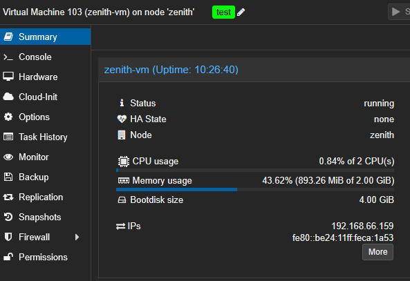

## Intro

Dans un [article précédent](), j’expliquais comment déployer des **machines virtuelles** sur **Proxmox** à l’aide de **Terraform**, en partant d’un [template cloud-init]().

Dans ce post, nous allons transformer ce code en un **module Terraform** réutilisable. Ensuite, je montrerai comment utiliser ce module dans d'autres projets pour simplifier et faire évoluer vos déploiements d'infrastructure.

---

## Qu’est-ce qu’un Module Terraform ?

Les modules Terraform sont des composants réutilisables qui permettent d’organiser et de simplifier votre code d’infrastructure en regroupant des ressources liées dans une seule unité. Au lieu de répéter la même configuration à plusieurs endroits, vous pouvez la définir une fois dans un module, puis l’utiliser là où vous en avez besoin, comme une fonction en programmation.

Les modules peuvent être locaux (dans votre projet) ou distants (depuis le Terraform Registry ou un dépôt Git), ce qui facilite le partage et la standardisation des patterns d’infrastructure entre les équipes ou projets. Grâce aux modules, votre code devient plus lisible, maintenable et évolutif.

---

## Transformer le Projet en Module

Nous allons maintenant extraire le code Terraform du [projet précédent]() pour en faire un module réutilisable nommé `pve_vm`.

> 📌 Vous pouvez retrouver le code source complet dans mon [dépôt Homelab](https://github.com/Vezpi/Homelab/). Le code spécifique à cet article se trouve [ici](https://github.com/Vezpi/Homelab/tree/3a991010d5e9de30e12cbf365d1a1ca1ff1f6436/terraform). Pensez à adapter les variables à votre environnement.

### Structure du Code

Notre module vivra à côté des projets, dans un dossier séparé.
```plaintext
terraform
`-- modules
    `-- pve_vm
        |-- main.tf
        |-- provider.tf
        `-- variables.tf
```
### Code du Module

📝 Les fichiers du module sont essentiellement les mêmes que ceux du projet que nous transformons. Les providers y sont déclarés, mais non configurés.

Le module `pve_vm` sera composé de 3 fichiers :
- **main** : la logique principale, identique à celle du projet.
- **provider** : déclare les providers requis, sans les configurer.
- **variables** : déclare les variables du module, en excluant celles propres au provider.


#### `main.tf`

```hcl
# Retrieve VM templates available in Proxmox that match the specified name
data "proxmox_virtual_environment_vms" "template" {
  filter {
    name   = "name"
    values = ["${var.vm_template}"] # The name of the template to clone from
  }
}

# Create a cloud-init configuration file as a Proxmox snippet
resource "proxmox_virtual_environment_file" "cloud_config" {
  content_type = "snippets"        # Cloud-init files are stored as snippets in Proxmox
  datastore_id = "local"           # Local datastore used to store the snippet
  node_name    = var.node_name     # The Proxmox node where the file will be uploaded

  source_raw {
    file_name = "${var.vm_name}.cloud-config.yaml" # The name of the snippet file
    data      = <<-EOF
    #cloud-config
    hostname: ${var.vm_name}
    package_update: true
    package_upgrade: true
    packages:
      - qemu-guest-agent           # Ensures the guest agent is installed
    users:
      - default
      - name: ${var.vm_user}
        groups: sudo
        shell: /bin/bash
        ssh-authorized-keys:
          - "${var.vm_user_sshkey}" # Inject user's SSH key
        sudo: ALL=(ALL) NOPASSWD:ALL
    runcmd:
      - systemctl enable qemu-guest-agent 
      - reboot                     # Reboot the VM after provisioning
    EOF
  }
}

# Define and provision a new VM by cloning the template and applying initialization
resource "proxmox_virtual_environment_vm" "vm" {
  name      = var.vm_name           # VM name
  node_name = var.node_name         # Proxmox node to deploy the VM
  tags      = var.vm_tags           # Optional VM tags for categorization

  agent {
    enabled = true                  # Enable the QEMU guest agent
  }

  stop_on_destroy = true            # Ensure VM is stopped gracefully when destroyed

  clone {
    vm_id     = data.proxmox_virtual_environment_vms.template.vms[0].vm_id     # ID of the source template
    node_name = data.proxmox_virtual_environment_vms.template.vms[0].node_name # Node of the source template
  }

  bios    = var.vm_bios             # BIOS type (e.g., seabios or ovmf)
  machine = var.vm_machine          # Machine type (e.g., q35)

  cpu {
    cores = var.vm_cpu              # Number of CPU cores
    type  = "host"                  # Use host CPU type for best compatibility/performance
  }

  memory {
    dedicated = var.vm_ram          # RAM in MB
  }

  disk {
    datastore_id = var.node_datastore # Datastore to hold the disk
    interface    = "scsi0"             # Primary disk interface
    size         = 4                   # Disk size in GB
  }

  initialization {
    user_data_file_id = proxmox_virtual_environment_file.cloud_config.id # Link the cloud-init file
    datastore_id      = var.node_datastore
    interface         = "scsi1"             # Separate interface for cloud-init
    ip_config {
      ipv4 {
        address = "dhcp"            # Get IP via DHCP
      }
    }
  }

  network_device {
    bridge  = "vmbr0"               # Use the default bridge
    vlan_id = var.vm_vlan           # VLAN tagging if used
  }

  operating_system {
    type = "l26"                    # Linux 2.6+ kernel
  }

  vga {
    type = "std"                    # Standard VGA type
  }

  lifecycle {
    ignore_changes = [              # Ignore initialization section after first depoloyment for idempotency
      initialization
    ]
  }
}

# Output the assigned IP address of the VM after provisioning
output "vm_ip" {
  value       = proxmox_virtual_environment_vm.vm.ipv4_addresses[1][0] # Second network interface's first IP
  description = "VM IP"
}
```

#### `provider.tf`

```hcl
terraform {
  required_providers {
    proxmox = {
      source = "bpg/proxmox"
    }
  }
}
```

#### `variables.tf`

> ⚠️ The defaults are based on my environment, adapt them to yours.

```hcl
variable "node_name" {
  description = "Proxmox host for the VM"
  type        = string
}

variable "node_datastore" {
  description = "Datastore used for VM storage"
  type        = string
  default     = "ceph-workload"
}

variable "vm_template" {
  description = "Template of the VM"
  type        = string
  default     = "ubuntu-cloud"
}

variable "vm_name" {
  description = "Hostname of the VM"
  type        = string
}

variable "vm_user" {
  description = "Admin user of the VM"
  type        = string
  default     = "vez"
}

variable "vm_user_sshkey" {
  description = "Admin user SSH key of the VM"
  type        = string
  default     = "ssh-ed25519 AAAAC3NzaC1lZDI1NTE5AAAAID62LmYRu1rDUha3timAIcA39LtcIOny1iAgFLnxoBxm vez@bastion"
}

variable "vm_cpu" {
  description = "Number of CPU cores of the VM"
  type        = number
  default     = 1
}

variable "vm_ram" {
  description = "Number of RAM (MB) of the VM"
  type        = number
  default     = 2048
}

variable "vm_bios" {
  description = "Type of BIOS used for the VM"
  type        = string
  default     = "ovmf"
}

variable "vm_machine" {
  description = "Type of machine used for the VM"
  type        = string
  default     = "q35"
}

variable "vm_vlan" {
  description = "VLAN of the VM"
  type        = number
  default     = 66
}

variable "vm_tags" {
  description = "Tags for the VM"
  type        = list(any)
  default     = ["test"]
}
```

---

## Déployer une VM à l’aide du Module

Maintenant que nous avons extrait toute la logique dans le module `pve_vm`, notre projet n’a plus qu’à appeler ce module en lui passant les variables nécessaires. Cela rend la configuration bien plus propre et facile à maintenir.

### Structure du Code

Voici à quoi cela ressemble :
```plaintext
terraform
|-- modules
|   `-- pve_vm
|       |-- main.tf
|       |-- provider.tf
|       `-- variables.tf
`-- projects
    `-- simple-vm-with-module
        |-- credentials.auto.tfvars
        |-- main.tf
        |-- provider.tf
        `-- variables.tf
```

### Code du projet

Dans cet exemple, je fournis manuellement les valeurs lors de l’appel du module. Le provider est configuré au niveau du projet.

#### `main.tf`

```hcl
module "pve_vm" {
  source            = "../../modules/pve_vm"
  node_name         = "zenith"
  vm_name           = "zenith-vm"
  vm_cpu            = 2
  vm_ram            = 2048
  vm_vlan           = 66
}

output "vm_ip" {
  value = module.pve_vm.vm_ip
}
```

#### `provider.tf`

```hcl
terraform {
  required_providers {
    proxmox = {
      source = "bpg/proxmox"
    }
  }
}

provider "proxmox" {
  endpoint  = var.proxmox_endpoint
  api_token = var.proxmox_api_token
  insecure  = false
  ssh {
    agent       = false
    private_key = file("~/.ssh/id_ed25519")
    username    = "root"
  }
}
```

#### `variables.tf`

```hcl
variable "proxmox_endpoint" {
  description = "Proxmox URL endpoint"
  type        = string
}

variable "proxmox_api_token" {
  description = "Proxmox API token"
  type        = string
  sensitive   = true
}
```
#### `credentials.auto.tfvars`

```hcl
proxmox_endpoint  = <your Proxox endpoint>
proxmox_api_token = <your Proxmox API token for the user terraformer>
```

### Initialiser le Workspace Terraform

Dans notre nouveau projet, il faut d’abord initialiser l’environnement Terraform avec `terraform init` :
```bash
$ terraform init
Initializing the backend...
Initializing modules...
- pve_vm in ../../modules/pve_vm
Initializing provider plugins...
- Finding latest version of bpg/proxmox...
- Installing bpg/proxmox v0.78.2...
- Installed bpg/proxmox v0.78.2 (self-signed, key ID F0582AD6AE97C188)
Partner and community providers are signed by their developers.
If you'd like to know more about provider signing, you can read about it here:
https://www.terraform.io/docs/cli/plugins/signing.html
Terraform has created a lock file .terraform.lock.hcl to record the provider
selections it made above. Include this file in your version control repository
so that Terraform can guarantee to make the same selections by default when
you run "terraform init" in the future.

Terraform has been successfully initialized!

You may now begin working with Terraform. Try running "terraform plan" to see
any changes that are required for your infrastructure. All Terraform commands
should now work.

If you ever set or change modules or backend configuration for Terraform,
rerun this command to reinitialize your working directory. If you forget, other
commands will detect it and remind you to do so if necessary.
```


### Déployer la VM

Avant le déploiement, vérifiez que tout est correct avec `terraform plan`.

Une fois prêt, lancez le déploiement avec `terraform apply` :
```bash
$ terraform apply
module.pve_vm.data.proxmox_virtual_environment_vms.template: Reading...
module.pve_vm.data.proxmox_virtual_environment_vms.template: Read complete after 0s [id=89b444be-7501-4538-9436-08609b380d39]

Terraform used the selected providers to generate the following execution plan. Resource actions are indicated with the following symbols:
  + create

Terraform will perform the following actions:

  # module.pve_vm.proxmox_virtual_environment_file.cloud_config will be created
  + resource "proxmox_virtual_environment_file" "cloud_config" {
      + content_type           = "snippets"
      + datastore_id           = "local"
      + file_modification_date = (known after apply)
      + file_name              = (known after apply)
      + file_size              = (known after apply)
      + file_tag               = (known after apply)
      + id                     = (known after apply)
      + node_name              = "zenith"
      + overwrite              = true
      + timeout_upload         = 1800

      + source_raw {
          + data      = <<-EOT
                #cloud-config
                hostname: zenith-vm
                package_update: true
                package_upgrade: true
                packages:
                  - qemu-guest-agent
                users:
                  - default
                  - name: vez
                    groups: sudo
                    shell: /bin/bash
                    ssh-authorized-keys:
                      - "ssh-ed25519 AAAAC3NzaC1lZDI1NTE5AAAAID62LmYRu1rDUha3timAIcA39LtcIOny1iAgFLnxoBxm vez@bastion"
                    sudo: ALL=(ALL) NOPASSWD:ALL
                runcmd:
                  - systemctl enable qemu-guest-agent
                  - reboot
            EOT
          + file_name = "zenith-vm.cloud-config.yaml"
          + resize    = 0
        }
    }

  # module.pve_vm.proxmox_virtual_environment_vm.vm will be created
  + resource "proxmox_virtual_environment_vm" "vm" {
      + acpi                    = true
      + bios                    = "ovmf"
      + id                      = (known after apply)
      + ipv4_addresses          = (known after apply)
      + ipv6_addresses          = (known after apply)
      + keyboard_layout         = "en-us"
      + mac_addresses           = (known after apply)
      + machine                 = "q35"
      + migrate                 = false
      + name                    = "zenith-vm"
      + network_interface_names = (known after apply)
      + node_name               = "zenith"
      + on_boot                 = true
      + protection              = false
      + reboot                  = false
      + reboot_after_update     = true
      + scsi_hardware           = "virtio-scsi-pci"
      + started                 = true
      + stop_on_destroy         = true
      + tablet_device           = true
      + tags                    = [
          + "test",
        ]
      + template                = false
      + timeout_clone           = 1800
      + timeout_create          = 1800
      + timeout_migrate         = 1800
      + timeout_move_disk       = 1800
      + timeout_reboot          = 1800
      + timeout_shutdown_vm     = 1800
      + timeout_start_vm        = 1800
      + timeout_stop_vm         = 300
      + vm_id                   = (known after apply)

      + agent {
          + enabled = true
          + timeout = "15m"
          + trim    = false
          + type    = "virtio"
        }

      + clone {
          + full      = true
          + node_name = "apex"
          + retries   = 1
          + vm_id     = 900
        }

      + cpu {
          + cores      = 2
          + hotplugged = 0
          + limit      = 0
          + numa       = false
          + sockets    = 1
          + type       = "host"
          + units      = 1024
        }

      + disk {
          + aio               = "io_uring"
          + backup            = true
          + cache             = "none"
          + datastore_id      = "ceph-workload"
          + discard           = "ignore"
          + file_format       = (known after apply)
          + interface         = "scsi0"
          + iothread          = false
          + path_in_datastore = (known after apply)
          + replicate         = true
          + size              = 4
          + ssd               = false
        }

      + initialization {
          + datastore_id         = "ceph-workload"
          + interface            = "scsi1"
          + meta_data_file_id    = (known after apply)
          + network_data_file_id = (known after apply)
          + type                 = (known after apply)
          + user_data_file_id    = (known after apply)
          + vendor_data_file_id  = (known after apply)

          + ip_config {
              + ipv4 {
                  + address = "dhcp"
                }
            }
        }

      + memory {
          + dedicated      = 2048
          + floating       = 0
          + keep_hugepages = false
          + shared         = 0
        }

      + network_device {
          + bridge      = "vmbr0"
          + enabled     = true
          + firewall    = false
          + mac_address = (known after apply)
          + model       = "virtio"
          + mtu         = 0
          + queues      = 0
          + rate_limit  = 0
          + vlan_id     = 66
        }

      + operating_system {
          + type = "l26"
        }

      + vga {
          + memory = 16
          + type   = "std"
        }
    }

Plan: 2 to add, 0 to change, 0 to destroy.

Changes to Outputs:
  + vm_ip = (known after apply)

Do you want to perform these actions?
  Terraform will perform the actions described above.
  Only 'yes' will be accepted to approve.

  Enter a value: yes

module.pve_vm.proxmox_virtual_environment_file.cloud_config: Creating...
module.pve_vm.proxmox_virtual_environment_file.cloud_config: Creation complete after 1s [id=local:snippets/zenith-vm.cloud-config.yaml]
module.pve_vm.proxmox_virtual_environment_vm.vm: Creating...
module.pve_vm.proxmox_virtual_environment_vm.vm: Still creating... [10s elapsed]
module.pve_vm.proxmox_virtual_environment_vm.vm: Still creating... [20s elapsed]
module.pve_vm.proxmox_virtual_environment_vm.vm: Still creating... [30s elapsed]
module.pve_vm.proxmox_virtual_environment_vm.vm: Still creating... [40s elapsed]
module.pve_vm.proxmox_virtual_environment_vm.vm: Still creating... [50s elapsed]
module.pve_vm.proxmox_virtual_environment_vm.vm: Still creating... [1m0s elapsed]
module.pve_vm.proxmox_virtual_environment_vm.vm: Still creating... [1m10s elapsed]
module.pve_vm.proxmox_virtual_environment_vm.vm: Still creating... [1m20s elapsed]
module.pve_vm.proxmox_virtual_environment_vm.vm: Still creating... [1m30s elapsed]
module.pve_vm.proxmox_virtual_environment_vm.vm: Still creating... [1m40s elapsed]
module.pve_vm.proxmox_virtual_environment_vm.vm: Still creating... [1m50s elapsed]
module.pve_vm.proxmox_virtual_environment_vm.vm: Still creating... [2m0s elapsed]
module.pve_vm.proxmox_virtual_environment_vm.vm: Still creating... [2m10s elapsed]
module.pve_vm.proxmox_virtual_environment_vm.vm: Still creating... [2m20s elapsed]
module.pve_vm.proxmox_virtual_environment_vm.vm: Still creating... [2m30s elapsed]
module.pve_vm.proxmox_virtual_environment_vm.vm: Still creating... [2m40s elapsed]
module.pve_vm.proxmox_virtual_environment_vm.vm: Still creating... [2m50s elapsed]
module.pve_vm.proxmox_virtual_environment_vm.vm: Still creating... [3m0s elapsed]
module.pve_vm.proxmox_virtual_environment_vm.vm: Still creating... [3m10s elapsed]
module.pve_vm.proxmox_virtual_environment_vm.vm: Creation complete after 3m13s [id=103]

Apply complete! Resources: 2 added, 0 changed, 0 destroyed.

Outputs:

vm_ip = "192.168.66.159"
```

✅ La VM est maintenant prête !



🕗 _Ne faites pas attention à l’uptime, j’ai pris la capture d’écran le lendemain._

---

## Déployer Plusieurs VMs à la fois

Très bien, on a déployé une seule VM. Mais maintenant, comment passer à l’échelle ? Comment déployer plusieurs instances de ce template, avec des noms différents, sur des nœuds différents, et avec des tailles différentes ? C’est ce que je vais vous montrer.

### Une VM par Nœud

Dans l’exemple précédent, nous avons passé des valeurs fixes au module. À la place, nous pouvons définir un objet local contenant les caractéristiques de la VM, puis s’en servir lors de l’appel au module. Cela facilite l’évolution du code de déploiement :
```hcl
module "pve_vm" {
  source    = "../../modules/pve_vm"
  node_name = local.vm.node_name
  vm_name   = local.vm.vm_name
  vm_cpu    = local.vm.vm_cpu
  vm_ram    = local.vm.vm_ram
  vm_vlan   = local.vm.vm_vlan
}

locals {
  vm = {
    node_name = "zenith"
    vm_name   = "zenith-vm"
    vm_cpu    = 2
    vm_ram    = 2048
    vm_vlan   = 66
  }
}
```

Nous pouvons également appeler le module en itérant sur une liste d’objets définissant les VMs à déployer :
```hcl
module "pve_vm" {
  source    = "../../modules/pve_vm"
  for_each  = local.vm_list
  node_name = each.value.node_name
  vm_name   = each.value.vm_name
  vm_cpu    = each.value.vm_cpu
  vm_ram    = each.value.vm_ram
  vm_vlan   = each.value.vm_vlan
}

locals {
  vm_list = {
    zenith = {
      node_name = "zenith"
      vm_name   = "zenith-vm"
      vm_cpu    = 2
      vm_ram    = 2048
      vm_vlan   = 66
    }
  }
}
```

Bien que cela n'ait pas de sens avec une seule VM, je pourrais utiliser cette syntaxe de module, par exemple, pour déployer une machine virtuelle par nœud :
```hcl
module "pve_vm" {
  source    = "../../modules/pve_vm"
  for_each  = local.vm_list
  node_name = each.value.node_name
  vm_name   = each.value.vm_name
  vm_cpu    = each.value.vm_cpu
  vm_ram    = each.value.vm_ram
  vm_vlan   = each.value.vm_vlan
}

locals {
  vm_list = {
    for vm in flatten([
      for node in data.proxmox_virtual_environment_nodes.pve_nodes.names : {
        node_name = node
        vm_name   = "${node}-vm"
        vm_cpu    = 2
        vm_ram    = 2048
        vm_vlan   = 66
      }
    ]) : vm.vm_name => vm
  }
}

data "proxmox_virtual_environment_nodes" "pve_nodes" {}

output "vm_ip" {
  value = { for k, v in module.pve_vm : k => v.vm_ip }
}
```

✅ Cela permet de déployer automatiquement 3 VM dans mon cluster, une par nœud.

### Plusieurs VMs par Nœud

Enfin, poussons l’idée plus loin : déployons plusieurs VMs avec des configurations différentes par nœud. Pour cela, on définit un ensemble de rôles et on utilise une boucle imbriquée pour générer toutes les combinaisons possibles pour chaque nœud Proxmox.
```hcl
module "pve_vm" {
  source    = "../../modules/pve_vm"
  for_each  = local.vm_list
  node_name = each.value.node_name
  vm_name   = each.value.vm_name
  vm_cpu    = each.value.vm_cpu
  vm_ram    = each.value.vm_ram
  vm_vlan   = each.value.vm_vlan
}

locals {
  vm_attr = {
    "master" = { ram = 2048, cpu = 2, vlan = 66 }
    "worker" = { ram = 1024, cpu = 1, vlan = 66 }
  }

  vm_list = {
    for vm in flatten([
      for node in data.proxmox_virtual_environment_nodes.pve_nodes.names : [
        for role, config in local.vm_attr : {
          node_name = node
          vm_name   = "${node}-${role}"
          vm_cpu    = config.cpu
          vm_ram    = config.ram
          vm_vlan   = config.vlan
        }
      ]
    ]) : vm.vm_name => vm
  }
}

data "proxmox_virtual_environment_nodes" "pve_nodes" {}

output "vm_ip" {
  value = { for k, v in module.pve_vm : k => v.vm_ip }
}
```

🚀 Une fois le `terraform apply` lancé, j'obtiens ça :
```bash
Apply complete! Resources: 6 added, 0 changed, 0 destroyed.

Outputs:

vm_ip = {
  "apex-master" = "192.168.66.167"
  "apex-worker" = "192.168.66.168"
  "vertex-master" = "192.168.66.169"
  "vertex-worker" = "192.168.66.170"
  "zenith-master" = "192.168.66.166"
  "zenith-worker" = "192.168.66.172"
}
```

---

## Conclusion

Nous avons transformé notre déploiement de VM Proxmox en un module Terraform réutilisable, et nous l’avons utilisé pour faire évoluer facilement notre infrastructure sur plusieurs nœuds.

Dans un prochain article, j’aimerais combiner Terraform avec Ansible afin de gérer le déploiement des VMs, et même explorer l’utilisation de différents workspaces Terraform pour gérer plusieurs environnements.

A la prochaine !