## Intro

Après avoir construit mon propre cluster Kubernetes dans mon homelab avec `kubeadm` dans [cet article](), mon prochain défi est d’exposer un pod simple à l’extérieur, accessible via une URL et sécurisé avec un certificat TLS validé par Let’s Encrypt.

Pour y parvenir, j’ai besoin de configurer plusieurs composants :
- **Service** : Expose le pod à l’intérieur du cluster et fournit un point d’accès.
- **Ingress** : Définit des règles de routage pour exposer des services HTTP(S) à l’extérieur.
- **Ingress Controller** : Surveille les ressources Ingress et gère réellement le routage du trafic.
- **Certificats TLS** : Sécurisent le trafic en HTTPS grâce à des certificats délivrés par Let’s Encrypt.

Cet article vous guide pas à pas pour comprendre comment fonctionne l’accès externe dans Kubernetes dans un environnement homelab.

C'est parti.

---
## Helm

J’utilise **Helm**, le gestionnaire de paquets de facto pour Kubernetes, afin d’installer des composants externes comme l’Ingress Controller ou cert-manager.

### Pourquoi Helm

Helm simplifie le déploiement et la gestion des applications Kubernetes. Au lieu d’écrire et de maintenir de longs manifestes YAML, Helm permet d’installer des applications en une seule commande, en s’appuyant sur des charts versionnés et configurables.

### Installer Helm

J’installe Helm sur mon hôte bastion LXC, qui dispose déjà d’un accès au cluster Kubernetes :
```bash
curl https://baltocdn.com/helm/signing.asc | gpg --dearmor | sudo tee /usr/share/keyrings/helm.gpg > /dev/null
echo "deb [arch=$(dpkg --print-architecture) signed-by=/usr/share/keyrings/helm.gpg] https://baltocdn.com/helm/stable/debian/ all main" | sudo tee /etc/apt/sources.list.d/helm-stable-debian.list
sudo apt update
sudo apt install helm
```

---
## Services Kubernetes

Avant de pouvoir exposer un pod à l’extérieur, il faut d’abord le rendre accessible à l’intérieur du cluster. C’est là qu’interviennent les **Services Kubernetes**.

Les Services agissent comme un pont entre les pods et le réseau, garantissant que les applications restent accessibles même si les pods sont réordonnés ou redéployés.

Il existe plusieurs types de Services Kubernetes, chacun avec un objectif différent :
- **ClusterIP** expose le Service sur une IP interne au cluster, uniquement accessible depuis l’intérieur.
- **NodePort** expose le Service sur un port statique de l’IP de chaque nœud, accessible depuis l’extérieur du cluster.
- **LoadBalancer** expose le Service sur une IP externe, généralement via une intégration cloud (ou via BGP dans un homelab).

---

## Exposer un Service `LoadBalancer` avec BGP

Au départ, j’ai envisagé d’utiliser **MetalLB** pour exposer les adresses IP des services sur mon réseau local. C’est ce que j’utilisais auparavant quand je dépendais de la box de mon FAI comme routeur principal. Mais après avoir lu cet article, [Use Cilium BGP integration with OPNsense](https://devopstales.github.io/kubernetes/cilium-opnsense-bgp/), je réalise que je peux obtenir le même résultat (voire mieux) en utilisant **BGP** avec mon routeur **OPNsense** et **Cilium**, mon CNI.

### Qu’est-ce que BGP ?

BGP (_Border Gateway Protocol_) est un protocole de routage utilisé pour échanger des routes entre systèmes. Dans un homelab Kubernetes, BGP permet à tes nœuds Kubernetes d’annoncer directement leurs IPs à ton routeur ou firewall. Ton routeur sait alors exactement comment atteindre les adresses IP gérées par ton cluster.

Au lieu que MetalLB gère l’allocation d’IP et les réponses ARP, tes nœuds disent directement à ton routeur : « Hé, c’est moi qui possède l’adresse 192.168.1.240 ».

### L’approche MetalLB classique

Sans BGP, MetalLB en mode Layer 2 fonctionne comme ceci :
- Il assigne une adresse IP `LoadBalancer` (par exemple `192.168.1.240`) depuis un pool.
- Un nœud répond aux requêtes ARP pour cette IP sur ton LAN.

Oui, MetalLB peut aussi fonctionner avec BGP, mais pourquoi l’utiliser si mon CNI (Cilium) le gère déjà nativement ?

### BGP avec Cilium

Avec Cilium + BGP, tu obtiens :
- L’agent Cilium du nœud annonce les IPs `LoadBalancer` via BGP.
- Ton routeur apprend ces routes et les envoie au bon nœud.
- Plus besoin de MetalLB.

### Configuration BGP

BGP est désactivé par défaut, aussi bien sur OPNsense que sur Cilium. Activons-le des deux côtés.

#### Sur OPNsense

D’après la [documentation officielle OPNsense](https://docs.opnsense.org/manual/dynamic_routing.html#bgp-section), l’activation de BGP nécessite d’installer un plugin.

Va dans `System` > `Firmware` > `Plugins` et installe le plugin **os-frr** :  
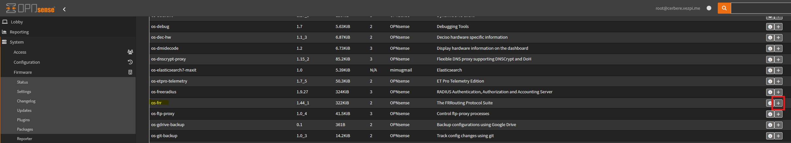
Installer le plugin `os-frr` dans OPNsense

Une fois installé, active le plugin dans `Routing` > `General` :  
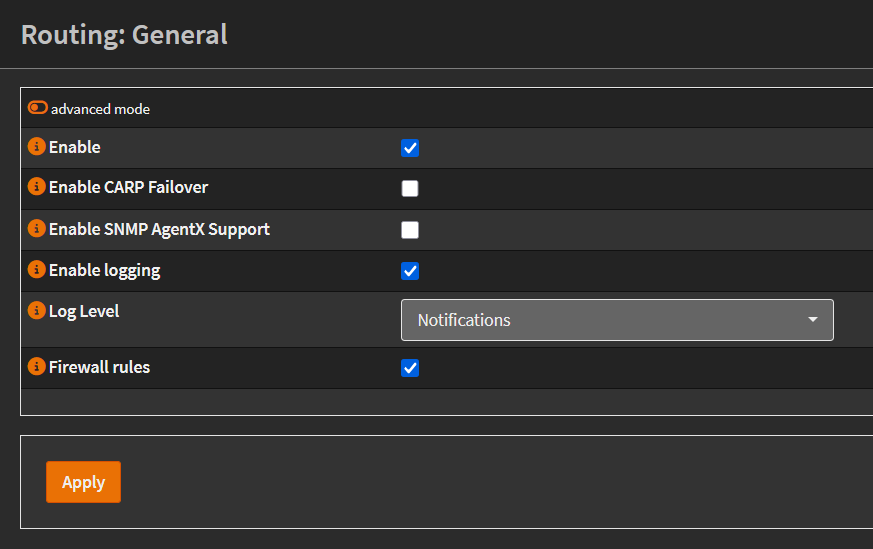
Activer le routage dans OPNsense

Ensuite, rends-toi dans la section **BGP**. Dans l’onglet **General** :
- Coche la case pour activer BGP.
- Défini ton **ASN BGP**. J’ai choisi `64512`, le premier ASN privé de la plage réservée (voir [ASN table](https://en.wikipedia.org/wiki/Autonomous_system_\(Internet\)#ASN_Table)) :  
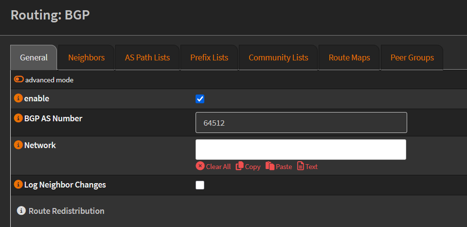

Ajoute ensuite tes voisins BGP. Je ne fais le peering qu’avec mes **nœuds workers** (puisque seuls eux hébergent des workloads). Pour chaque voisin :
- Mets l’IP du nœud dans `Peer-IP`.
- Utilise `64513` comme **Remote AS** (celui de Cilium).
- Configure `Update-Source Interface` sur `Lab`.
- Coche `Next-Hop-Self`.  
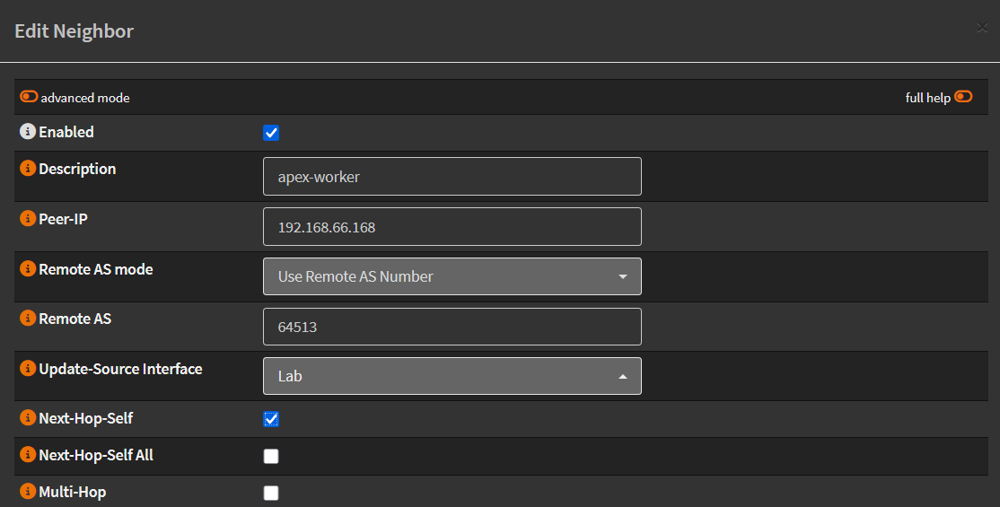

Voici la liste de mes voisins une fois configurés :  
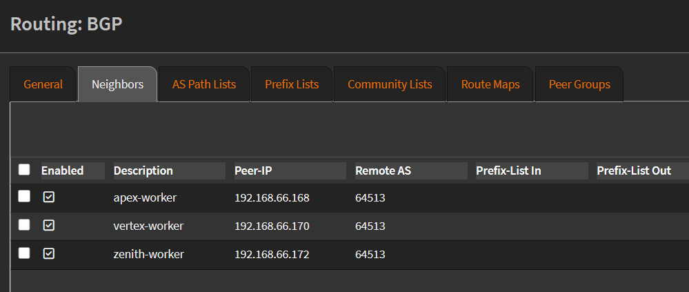
Liste des voisins BGP

N’oublie pas la règle firewall pour autoriser BGP (port `179/TCP`) depuis le VLAN **Lab** vers le firewall :  
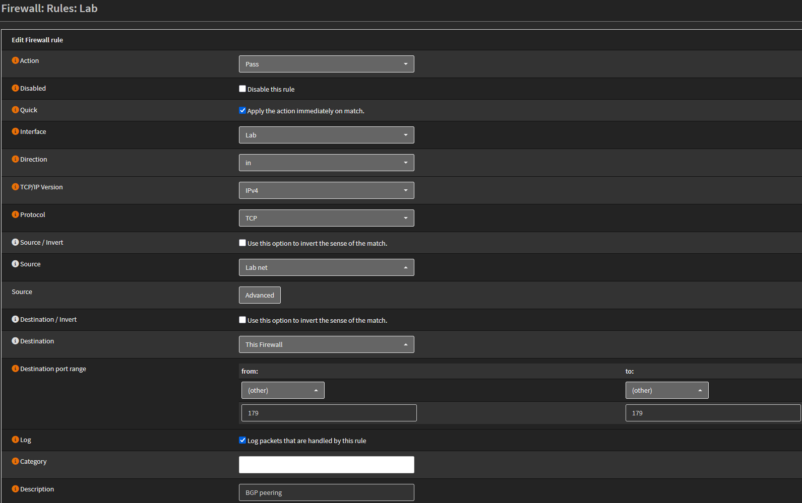
Autoriser TCP/179 de Lab vers OPNsense

#### Dans Cilium

J’ai déjà Cilium installé et je n’ai pas trouvé comment activer BGP avec la CLI, donc je l’ai simplement réinstallé avec l’option BGP :

```bash
cilium uninstall
cilium install --set bgpControlPlane.enabled=true
```

Je configure uniquement les **nœuds workers** pour établir le peering BGP en les labellisant avec un `nodeSelector` :
```bash
kubectl label node apex-worker node-role.kubernetes.io/worker=""
kubectl label node vertex-worker node-role.kubernetes.io/worker=""
kubectl label node zenith-worker node-role.kubernetes.io/worker=""
```
```plaintext
NAME            STATUS   ROLES           AGE    VERSION
apex-master     Ready    control-plane   5d4h   v1.32.7
apex-worker     Ready    worker          5d1h   v1.32.7
vertex-master   Ready    control-plane   5d1h   v1.32.7
vertex-worker   Ready    worker          5d1h   v1.32.7
zenith-master   Ready    control-plane   5d1h   v1.32.7
zenith-worker   Ready    worker          5d1h   v1.32.7
```

Pour la configuration BGP complète, j’ai besoin de :
- **CiliumBGPClusterConfig** : paramètres BGP pour le cluster Cilium, incluant son ASN local et son pair.
- **CiliumBGPPeerConfig** : définit les timers, le redémarrage gracieux et les routes annoncées.
- **CiliumBGPAdvertisement** : indique quels services Kubernetes annoncer via BGP.
- **CiliumLoadBalancerIPPool** : définit la plage d’IPs attribuées aux services `LoadBalancer`.

```yaml
---
apiVersion: cilium.io/v2alpha1
kind: CiliumBGPClusterConfig
metadata:
  name: bgp-cluster
spec:
  nodeSelector:
    matchLabels:
      node-role.kubernetes.io/worker: "" # Only for worker nodes
  bgpInstances:
  - name: "cilium-bgp-cluster"
    localASN: 64513 # Cilium ASN
    peers:
    - name: "pfSense-peer"
      peerASN: 64512 # OPNsense ASN
      peerAddress: 192.168.66.1  # OPNsense IP
      peerConfigRef:
        name: "bgp-peer"
---
apiVersion: cilium.io/v2alpha1
kind: CiliumBGPPeerConfig
metadata:
  name: bgp-peer
spec:
  timers:
    holdTimeSeconds: 9
    keepAliveTimeSeconds: 3
  gracefulRestart:
    enabled: true
    restartTimeSeconds: 15
  families:
    - afi: ipv4
      safi: unicast
      advertisements:
        matchLabels:
          advertise: "bgp"
---
apiVersion: cilium.io/v2alpha1
kind: CiliumBGPAdvertisement
metadata:
  name: bgp-advertisement
  labels:
    advertise: bgp
spec:
  advertisements:
    - advertisementType: "Service"
      service:
        addresses:
          - LoadBalancerIP
      selector:
        matchExpressions:
          - { key: somekey, operator: NotIn, values: [ never-used-value ] }
---
apiVersion: "cilium.io/v2alpha1"
kind: CiliumLoadBalancerIPPool
metadata:
  name: "dmz"
spec:
  blocks:
  - start: "192.168.55.20" # LB Range Start IP
    stop: "192.168.55.250" # LB Range End IP
```

Applique la configuration :
```bash
kubectl apply -f bgp.yaml 

ciliumbgpclusterconfig.cilium.io/bgp-cluster created
ciliumbgppeerconfig.cilium.io/bgp-peer created
ciliumbgpadvertisement.cilium.io/bgp-advertisement created
ciliumloadbalancerippool.cilium.io/dmz created
```

Si tout fonctionne, tu devrais voir les sessions BGP **établies** avec tes workers :
```bash
cilium bgp peers

Node            Local AS   Peer AS   Peer Address   Session State   Uptime   Family         Received   Advertised
apex-worker     64513      64512     192.168.66.1   established     6m30s    ipv4/unicast   1          2    
vertex-worker   64513      64512     192.168.66.1   established     7m9s     ipv4/unicast   1          2    
zenith-worker   64513      64512     192.168.66.1   established     6m13s    ipv4/unicast   1          2
```

### Déployer un Service `LoadBalancer` avec BGP

Validons rapidement que la configuration fonctionne en déployant un `Deployment` de test et un `Service` de type `LoadBalancer` :
```yaml
---
apiVersion: v1
kind: Service
metadata:
  name: test-lb
spec:
  type: LoadBalancer
  ports:
  - port: 80
    targetPort: 80
    protocol: TCP
    name: http
  selector:
    svc: test-lb
---
apiVersion: apps/v1
kind: Deployment
metadata:
  name: nginx
spec:
  selector:
    matchLabels:
      svc: test-lb
  template:
    metadata:
      labels:
        svc: test-lb
    spec:
      containers:
      - name: web
        image: nginx
        imagePullPolicy: IfNotPresent
        ports:
        - containerPort: 80
        readinessProbe:
          httpGet:
            path: /
            port: 80
```

Vérifions si le service obtient une IP externe :
```bash
kubectl get services test-lb

NAME         TYPE           CLUSTER-IP       EXTERNAL-IP     PORT(S)        AGE
test-lb      LoadBalancer   10.100.167.198   192.168.55.20   80:31350/TCP   169m
```

Le service a récupéré la première IP du pool défini : `192.168.55.20`.

Depuis n’importe quel appareil du LAN, on peut tester l’accès sur le port 80 :  
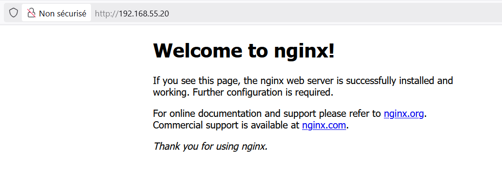

✅ Notre pod est joignable via une IP `LoadBalancer` routée en BGP. Première étape réussie !

---
## Kubernetes Ingress

Nous avons réussi à exposer un pod en externe en utilisant un service `LoadBalancer` et une adresse IP attribuée via BGP. Cette approche fonctionne très bien pour les tests, mais elle ne fonctionne pas à l’échelle.

Imagine avoir 10, 20 ou 50 services différents. Est-ce que je voudrais vraiment allouer 50 adresses IP et encombrer mon firewall ainsi que mes tables de routage avec 50 entrées BGP ? Certainement pas.

C’est là qu’intervient **Ingress**.

### Qu’est-ce qu’un Kubernetes Ingress ?

Un Kubernetes **Ingress** est un objet API qui gère **l’accès externe aux services** d’un cluster, généralement en HTTP et HTTPS, le tout via un point d’entrée unique.

Au lieu d’attribuer une IP par service, on définit des règles de routage basées sur :
- **Des noms d’hôtes** (`app1.vezpi.me`, `blog.vezpi.me`, etc.)
- **Des chemins** (`/grafana`, `/metrics`, etc.)
    

Avec Ingress, je peux exposer plusieurs services via la même IP et le même port (souvent 443 pour HTTPS), et Kubernetes saura comment router la requête vers le bon service backend.

Voici un exemple simple d’`Ingress`, qui route le trafic de `test.vezpi.me` vers le service `test-lb` sur le port 80 :
```yaml
---
apiVersion: networking.k8s.io/v1
kind: Ingress
metadata:
  name: test-ingress
spec:
  rules:
    - host: test.vezpi.me
      http:
        paths:
          - path: /
            pathType: Prefix
            backend:
              service:
                name: test-lb
                port:
                  number: 80
```

### Ingress Controller

Un Ingress, en soi, n’est qu’un ensemble de règles de routage. Il ne traite pas réellement le trafic. Pour le rendre fonctionnel, il faut un **Ingress Controller**, qui va :
- Surveiller l’API Kubernetes pour détecter les ressources `Ingress`.
- Ouvrir les ports HTTP(S) via un service `LoadBalancer` ou `NodePort`.
- Router le trafic vers le bon `Service` selon les règles de l’Ingress.

Parmi les contrôleurs populaires, on retrouve NGINX, Traefik, HAProxy, et d’autres encore. Comme je cherchais quelque chose de simple, stable et largement adopté, j’ai choisi le **NGINX Ingress Controller**.

### Installer NGINX Ingress Controller

J’utilise Helm pour installer le contrôleur, et je définis `controller.ingressClassResource.default=true` pour que tous mes futurs ingress l’utilisent par défaut :
```bash
helm install ingress-nginx \
  --repo=https://kubernetes.github.io/ingress-nginx \
  --namespace=ingress-nginx \
  --create-namespace ingress-nginx \
  --set controller.ingressClassResource.default=true \
  --set controller.config.strict-validate-path-type=false
```

Le contrôleur est déployé et expose un service `LoadBalancer`. Dans mon cas, il récupère la deuxième adresse IP disponible dans la plage BGP :
```bash
NAME                       TYPE           CLUSTER-IP      EXTERNAL-IP     PORT(S)                      AGE   SELECTOR
ingress-nginx-controller   LoadBalancer   10.106.236.13   192.168.55.21   80:31195/TCP,443:30974/TCP   75s   app.kubernetes.io/component=controller,app.kubernetes.io/instance=ingress-nginx,app.kubernetes.io/name=ingress-nginx
```

### Réserver une IP statique pour le contrôleur

Je veux m’assurer que l’Ingress Controller reçoive toujours la même adresse IP. Pour cela, j’ai créé deux pools d’IP Cilium distincts :
- Un réservé pour l’Ingress Controller avec une seule IP.
- Un pour tout le reste.
```yaml
---
# Pool for Ingress Controller
apiVersion: cilium.io/v2alpha1
kind: CiliumLoadBalancerIPPool
metadata:
  name: ingress-nginx
spec:
  blocks:
    - cidr: 192.168.55.55/32
  serviceSelector:
    matchLabels:
      app.kubernetes.io/name: ingress-nginx
      app.kubernetes.io/component: controller
---
# Default pool for other services
apiVersion: cilium.io/v2alpha1
kind: CiliumLoadBalancerIPPool
metadata:
  name: default
spec:
  blocks:
    - start: 192.168.55.100
      stop: 192.168.55.250
  serviceSelector:
    matchExpressions:
      - key: app.kubernetes.io/name
        operator: NotIn
        values:
          - ingress-nginx
```

Après avoir remplacé le pool partagé par ces deux pools, l’Ingress Controller reçoit bien l’IP dédiée `192.168.55.55`, et le service `test-lb` obtient `192.168.55.100` comme prévu :
```bash
NAMESPACE       NAME                                 TYPE           CLUSTER-IP       EXTERNAL-IP      PORT(S)                      AGE
default         test-lb                              LoadBalancer   10.100.167.198   192.168.55.100   80:31350/TCP                 6h34m
ingress-nginx   ingress-nginx-controller             LoadBalancer   10.106.236.13    192.168.55.55    80:31195/TCP,443:30974/TCP   24m
```
### Associer un Service à un Ingress

Maintenant, connectons un service à ce contrôleur.

Je commence par mettre à jour le service `LoadBalancer` d’origine pour le convertir en `ClusterIP` (puisque c’est désormais l’Ingress Controller qui l’exposera en externe) :
```yaml
---
apiVersion: v1
kind: Service
metadata:
  name: test-lb
spec:
  ports:
    - port: 80
      targetPort: 80
      protocol: TCP
      name: http
  selector:
    svc: test-lb
---
apiVersion: networking.k8s.io/v1
kind: Ingress
metadata:
  name: test-ingress
spec:
  rules:
    - host: test.vezpi.me
      http:
        paths:
          - path: /
            pathType: Prefix
            backend:
              service:
                name: test-lb
                port:
                  number: 80  
```

Ensuite, j’applique le manifeste `Ingress` pour exposer le service en HTTP.

Comme j’utilise le plugin **Caddy** dans OPNsense, j’ai encore besoin d’un routage local de type Layer 4 pour rediriger le trafic de `test.vezpi.me` vers l’adresse IP de l’Ingress Controller (`192.168.55.55`). Je crée donc une nouvelle règle dans le plugin Caddy.

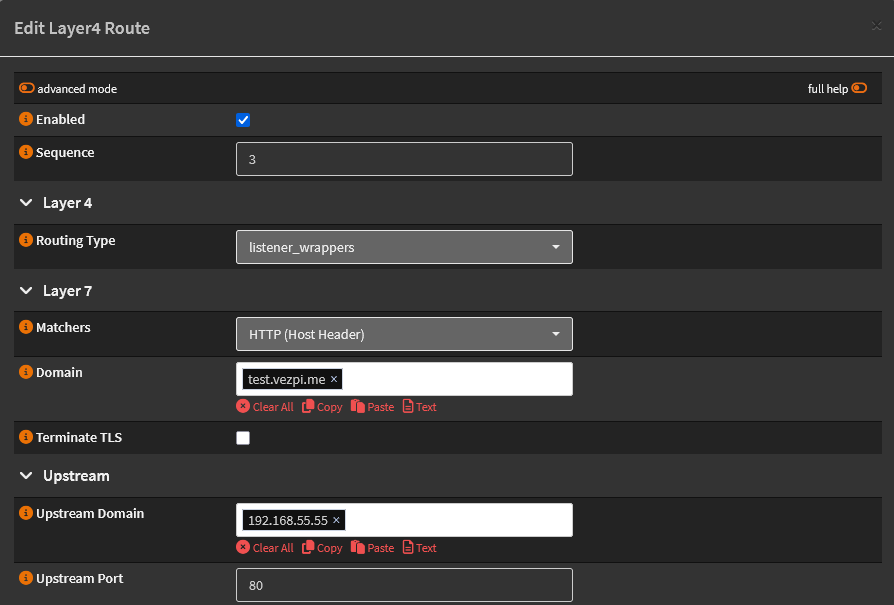

Puis je teste l’accès dans le navigateur :  
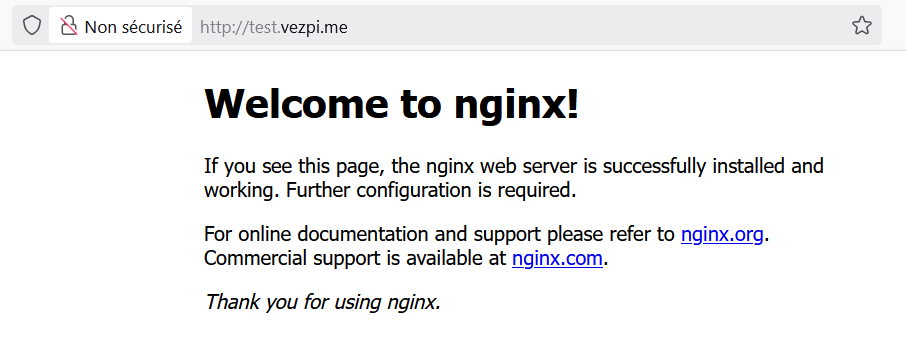
Test d’un Ingress en HTTP

✅ Mon pod est désormais accessible via son URL HTTP en utilisant un Ingress. Deuxième étape complétée !

---
## Connexion sécurisée avec TLS

Exposer des services en HTTP simple est suffisant pour des tests, mais en pratique nous voulons presque toujours utiliser **HTTPS**. Les certificats TLS chiffrent le trafic et garantissent l’authenticité ainsi que la confiance pour les utilisateurs.

### Cert-Manager

Pour automatiser la gestion des certificats dans Kubernetes, nous utilisons **Cert-Manager**. Il peut demander, renouveler et gérer les certificats TLS sans intervention manuelle.

#### Installer Cert-Manager

Nous le déployons avec Helm dans le cluster :
```bash
helm repo add jetstack https://charts.jetstack.io
helm repo update
helm install cert-manager jetstack/cert-manager \
  --namespace cert-manager \
  --create-namespace \
  --set crds.enabled=true
```

#### Configurer Cert-Manager

Ensuite, nous configurons un **ClusterIssuer** pour Let’s Encrypt. Cette ressource indique à Cert-Manager comment demander des certificats :
```yaml
---
apiVersion: cert-manager.io/v1
kind: ClusterIssuer
metadata:
  name: letsencrypt-staging
spec:
  acme:
    server: https://acme-staging-v02.api.letsencrypt.org/directory
    email: <email>
    privateKeySecretRef:
      name: letsencrypt-staging-key
    solvers:
    - http01:
        ingress:
          ingressClassName: nginx
```

ℹ️ Ici, je définis le serveur **staging** de Let’s Encrypt ACME pour les tests. Les certificats de staging ne sont pas reconnus par les navigateurs, mais ils évitent d’atteindre les limites strictes de Let’s Encrypt lors du développement.

Appliquez-le :
```bash
kubectl apply -f clusterissuer.yaml
```

Vérifiez si votre `ClusterIssuer` est `Ready` :
```bash
kubectl get clusterissuers.cert-manager.io                                                    
NAME                  READY   AGE
letsencrypt-staging   True    14m
```

S’il ne devient pas `Ready`, utilisez `kubectl describe` sur la ressource pour le diagnostiquer.

### Ajouter TLS dans un Ingress

Nous pouvons maintenant sécuriser notre service avec TLS en ajoutant une section `tls` dans la spécification `Ingress` et en référençant le `ClusterIssuer` :
```yaml
---
apiVersion: networking.k8s.io/v1
kind: Ingress
metadata:
  name: test-ingress-https
  annotations:
    nginx.ingress.kubernetes.io/rewrite-target: /
    cert-manager.io/cluster-issuer: letsencrypt-staging
spec:
  tls:
    - hosts:
      - test.vezpi.me
      secretName: test-vezpi-me-tls
  rules:
    - host: test.vezpi.me
      http:
        paths:
          - path: /
            pathType: Prefix
            backend:
              service:
                name: test-lb
                port:
                  number: 80
```

En arrière-plan, Cert-Manager suit ce flux pour émettre le certificat :
- Détecte l’`Ingress` avec `tls` et le `ClusterIssuer`.
- Crée un CRD **Certificate** décrivant le certificat souhaité + l’emplacement du Secret.
- Crée un CRD **Order** pour représenter une tentative d’émission avec Let’s Encrypt.
- Crée un CRD **Challenge** (par ex. validation HTTP-01).
- Met en place un Ingress/Pod temporaire pour résoudre le challenge.
- Crée un CRD **CertificateRequest** et envoie le CSR à Let’s Encrypt.
- Reçoit le certificat signé et le stocke dans un Secret Kubernetes.
- L’Ingress utilise automatiquement ce Secret pour servir en HTTPS.

✅ Une fois ce processus terminé, votre Ingress est sécurisé avec un certificat TLS.  
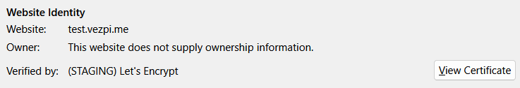

### Passer aux certificats de production

Une fois que le staging fonctionne, nous pouvons passer au serveur **production** ACME pour obtenir un certificat Let’s Encrypt reconnu :
```yaml
---
apiVersion: cert-manager.io/v1
kind: ClusterIssuer
metadata:
  name: letsencrypt
spec:
  acme:
    server: https://acme-v02.api.letsencrypt.org/directory
    email: <email>
    privateKeySecretRef:
      name: letsencrypt-key
    solvers:
    - http01:
        ingress:
          ingressClassName: nginx
```

Mettez à jour l’`Ingress` pour pointer vers le nouveau `ClusterIssuer` :
```yaml
---
apiVersion: networking.k8s.io/v1
kind: Ingress
metadata:
  name: test-ingress-https
  annotations:
    cert-manager.io/cluster-issuer: letsencrypt
spec:
  tls:
    - hosts:
      - test.vezpi.me
      secretName: test-vezpi-me-tls
  rules:
    - host: test.vezpi.me
      http:
        paths:
          - path: /
            pathType: Prefix
            backend:
              service:
                name: test-lb
                port:
                  number: 80
```

Comme le certificat de staging est encore stocké dans le Secret, je le supprime pour forcer une nouvelle demande en production :
```bash
kubectl delete secret test-vezpi-me-tls
```

🎉 Mon `Ingress` est désormais sécurisé avec un certificat TLS valide délivré par Let’s Encrypt. Les requêtes vers `https://test.vezpi.me` sont chiffrées de bout en bout et routées par le NGINX Ingress Controller jusqu’à mon pod `nginx` :  
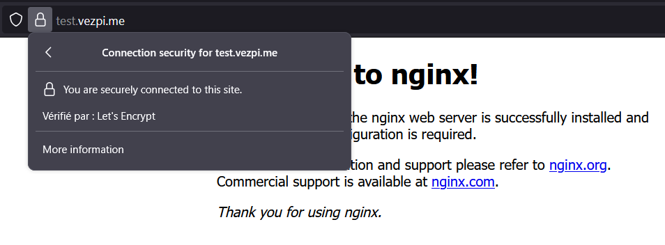


---
## Conclusion

Dans ce parcours, je suis parti des bases, en exposant un simple pod avec un service `LoadBalancer`, puis j’ai construit étape par étape une configuration prête pour la production :
- Compréhension des **Services Kubernetes** et de leurs différents types.
- Utilisation du **BGP avec Cilium** et OPNsense pour attribuer des IP externes directement depuis mon réseau.
- Introduction des **Ingress** pour mieux passer à l’échelle, en exposant plusieurs services via un point d’entrée unique.
- Installation du **NGINX Ingress Controller** pour gérer le routage.
- Automatisation de la gestion des certificats avec **Cert-Manager**, afin de sécuriser mes services avec des certificats TLS Let’s Encrypt.

🚀 Résultat : mon pod est maintenant accessible via une véritable URL, sécurisé en HTTPS, comme n’importe quelle application web moderne.

C’est une étape importante dans mon aventure Kubernetes en homelab. Dans le prochain article, je souhaite explorer le stockage persistant et connecter mon cluster Kubernetes à mon setup **Ceph** sous **Proxmox**.

A la prochaine !